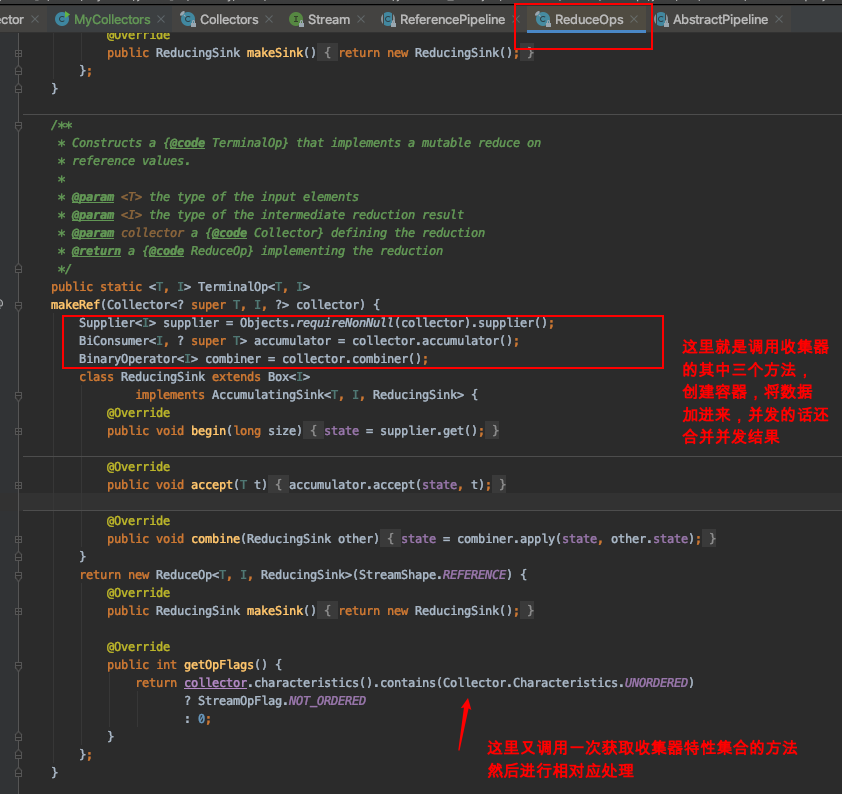
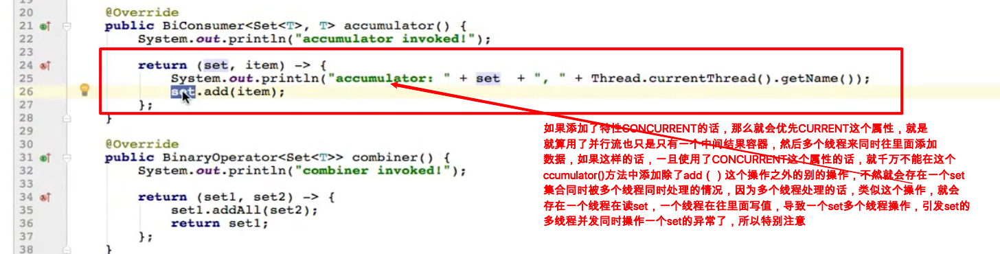
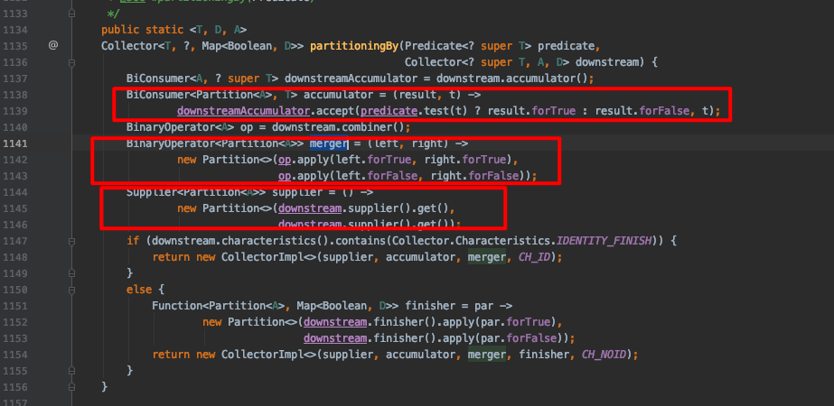

# Collector收集器

> 这个收集器可厉害了，就是将我们在流管道中的数据，聚合处理之后，将其收集器起来，转换成我们想要的格式的数据，在java8中提供的一个收集器工具类Collectors基本上可以满足我们所有的开发的数据收集场景了
>
> Collector作为java 的流stream的一个核心操作收集器collect()的入参，是非常重要的，内部提供了很多的多集合的操作，各种类似计算，统计，分组，分区，等各种各样的功能(因为Collector是个接口，功能的实现是由其子类Collectors来实现，很多的方法都是Collectors的静态方法)

### 一.Collector官方文档简单解读

这个javadoc文档实在是有点长，而且有些专业术语，不太好懂所以多花点时间去看看，大概了解一下就好，更多的可能还是网上查询些资料，以及自己熟悉使用之后才去读比较好；**大概这个文档说了三个点，第一个就是用处是什么，一个收集器对象的构成？第二个就是一个收集器的实现有哪些约定？第三个就是收集器接口几个方法的用处以及特点？**


> 上面的图就是，介绍了一个收集器对象的用处，将数据进行汇聚操作，收集到我们的流中的数据，将其整合汇聚成我们要的数据，可以做数据整理，也可以将流中的数据进行业务相关的处理等操作，同时还支持串型以及并行操作；还有就是一个收集器对象的构成主要是4个方法，第一个方法就是supplier(), accumulator(), combiner(), finisher() 这四个方法，分别的用处是创建一个容器对象，数据源的数据（也就是流中的数据）添加到容器中，如果是并行流的话，还会通过combiner方法将数据合并成一个，最后根据容器的数据类型是否等同于结果类型判断是否调用finisher方法


> 这里就是上面说的第二部分了，主要是说了因为Stream有串型跟并行流，为了确保串型跟并行的操作结果是一致的，需要遵循一些约定，这个就不细说了，不是很重要，而且都是一些尝试性的描述


> 最后一点就是介绍一个收集器对象的使用以及要点，基本上就是一个元素从Stream中来，经过accumulator()方法收集到我们定义的的容器对象中，一个元素进来收集器就是经过4个方法处理或者处理后返回给调用者，经过finisher之后如果等到的结果类型对象不等于进入收集器的类型，这个获取的值就不能再再收集器中使用，在收集器的combiner方法就是用于并发情况下多个容器经过汇聚操作后的结果，进行合并的。收集器的并发跟非并发都是可选的，这个主要看当前的收集器的实现带的characteristics()方法中的值是否有**CONCURRENT**这个常量的属性，如果有的话，就会有多个容器一起处理。
>
> 关于characteristics()这个方法的返回值Set集合的值，也是限制为Collector收集器接口的内部枚举中的三个值的
>
> 
>
> 这三个值表示的意思也是非常直接的，第一个**CONCURRENT**就是并发多线程执行，就是我们的收集器会有多个容器，然后每个容器对应一个线程来获取数据源的数据，然后都获取到对应的容器中后经过combiner合并到一个容器中，最后输出；**UMORDERED**这个特征值说明这个集合的操作的元素是无序的，假如收集器里面是无序的；**IDENTITY_FINISH**这个特征值是判断这个收集器的容器数据类型是不是等于我们要的结果类型，如果一个收集器实现类有这个属性就会调用finisher方法来将收集器容器中的数据经过finisher转换成我们要的目标类型数据

### 二.Collectors收集器工具类使用

收集器接口在java中有且只有一个实现类在Collectors的内部类中，为什么这样做呢？收集器实现的功能是非常多的，而且各种类型的支持非常复杂的，只有一个实现类而且还是内部类是怎么支撑起来它的那么多功能？

#### 1.为什么收集器的实现类只有一个而且是Collectors的内部类？

要认识到一点就是，函数式编程跟我们传统的OOP编程是不一样的，尽管我们是实现了一个接口，但是这个实现类的具体功能还不能确定的，它的具体行为不是实现类确定的，而是调用者的入参传递行为确定的，也就是说就算我们只有一个收集器接口Collector的实现类，但是我们通过传递具体的行为去给该收集器进行收集，不管是容器，还是accumulator，还是combiner，还是finisher我们都是可以在具体调用的时候进行传递的，所以说一个实现就足以了

那么为什么这个实现类要定义在Collectors这个工具类的内部类中呢？

关于内部类这个，我觉得是没必要专门写给实现类给Collectors来调用，因为这个收集器的实现类就是给Collectors来使用的，所以内部类即可，不需要再整一个公共的类。而且基本上我们能想到的集合的操作Collector都能实现了，因为很多的方法的入参就是一个函数式接口，也就是lambda表达式，在调用Collectors的方法的时候传递进来进行我们的数据处理就可以了。总而言之就是两点：第一点就是在java中这个收集器的实现类目前只是提供给Collectors使用的，第二点就是我们收集器是面向函数式接口编程了，也就是我们可以利用现有的方法加上我们自定义的数据操作的lambda行为就能够实现基本上所有的操作了。其实就是一个特点，我们这个接口的实现是函数式接口的编程，一个实现类，并不是确定这个实现类的行为而是确定这个实现类的执行动作而已。如果我们自己传递行为都无法满足了，就只能我们自定义一个特殊的收集器来处理我们要的处理业务了，不过正常开发，这个基本上用不着。这也体现了**函数式编程的特点就是提示我们要做什么而不是怎么做的细节，二面向对象编程则是相反具体到我们怎么做的细节**

**函数式编程的特点就是提示我们要做什么而不是怎么做的细节，二面向对象编程则是相反具体到我们怎么做的细节**

#### 2.Collectors的javadoc文档介绍


其实文档没什么介绍的，就是收集器的实现类，还有就是内部提供了一系列的方法提供我们使用，提供的这些汇聚操作的方法最后都是去调用Collector的实现类CollectorImpl这个类的构造方法，返回的结果就是收集器对象的实现类，然后我们通过收集器就能获取到我们想要的输出了；里面提供的各种方法，有入参的也有不入参的，不入参的都是一些固定的方法比较简单，有入参的是传递我们要行为，去产生我们要的结果

#### 3.一些方法展示

尽管在javadoc中就有好些方法使用的展示了，这里再补充一些，更加详细具体的，都要知道有哪些方法即可，具体使用的话，可以使用的时候看下方法源码即可


> 补充一下上图（上图的一些方法省略了Collectors这个前缀，因为在类的包统一引入了，这里就是直接调用方法了，注意一下如groupingBy()= Collectors.groupingBy()），我们大部分的情况下都是对流中的元素的其中一个字段进行分组，返回值是一个List<Object>，但是我们可以可以多一个入参入参可以是再次分组，还可以是Collectors.counting()这样就是分组的数量总和，或者对分组结果再次分组或者收集器Collectors中的其他方法，对分组结果再次处理（如分组或者其他的方法），可以通过入参再次进行数据收集器处理

### 三.比较器学习

比较器这个，不是java8引入的，但是经过java8的改造之后，也变成了一个函数式接口了，同时还提供很多实用默认方法值得我们去使用，这个的用处主要是用在数据的排序上，对一些数据集顺序处理使用

#### 1.比较器的方法以及接口


直接看比较器这个函数式接口的接口定义，不能忘了函数式接口的定义有且只有一个抽象方法（除了Object默认方法外），这里就是包含了一个equals()方法，这个方法就是重写了Object中的抽象方法，所以例外，这个接口的唯一一个抽象接口就是compare()方法；除此之外就是reversed()方法就是对排序后的结果进行倒叙，thenComparing()方法就是二次比较，就是链式编程模式，使用的场景是一次排序还没有完全排序然后按照另一个维度对还没有完成排序的再次排序；nullsFirst()/nullsLast()顾名思义就是空的在最前面/空的在最后面；comparing() 这个系列的方法就是通过接口直接调用的静态方法，用来指定比较值的类型以及比较器表达式的，有具体类型的comparingToInt()这种就是知道比较字段类型是整数类型，然后只需要再入参比较的lambda表达式即可。总之就是对compare()方法的进一步封装，不然，我们需要(object1, object2) -> object1.getFile() - object2.getFile(); 这样一个整体作为比较器传递，如果我们使用comparing()的话就是 Comparator.comparing(object.getFile())就可以了，或者也可以将具体比较算法作为参数进行传递进去，如果是知道比较类型的就用具体类型的更好一点。但是貌似用这种方式还不如直接Collections.sort()方法

#### 2.比较器的使用

比较器的使用方式，目前用的比较多的就是用来给集合排序，目前使用的比较多的就是通过集合工具类Collections对象直接调用Collections.sort(List)/Collections.sort(List, Comparator);这种方式来使用，或者就是直接调用List集合中的sort(Comparator)方法来对集合进行排序；


为什么```Collections.*sort*(list,(item1,item2)->item1.length()-item2.length());```方法可以正常执行呢？这个对比上面的类型推断，这个就涉及到比较细节的地方了，java的类型推断的远近的问题？

> 因为这个的list集合是直接执行后面的lambda表达式的，也就是这个lambda表达式是这个集合执行的，所以能知道这两个入参是什么类型的，但是，上图的那个入参的是一个比较器，这个比较器尽管也是集合直接使用的，但是他们没有直接的关系，就是两个对象的关系了，而如果是lambda表达式就是直接执行的关系？这样解释或许是对的？毕竟把那个reversed()方法调用去掉之后就能识别了，如果加上了reversed()方法就不能识别了，不能推断出比较器的类型了,有点模糊暂时不太深入了，这个排序的使用熟悉就好，这种默认的比较器的比较实现都是比较简单的排序使用，因为里面的排序算法都是固定的，我们只是传递一个判断条件来影响排序参照物

---

**thenComparing()方法**

为什么我们可以重复调用thenComparing()方法呢？因为每次Compatator.XXX方法比较之后，返回的结果还是一个Comparator也就是该对象的设计就是链式编程的方式，可以一直调用，但是有一个需要注意的是，必须是前面一个比较的结果是相等的情况下执行的，因为进入thenComparing()方法之前会判断是不是相等，如果相等时不会进入这个比较方法


下面举一些demo，注意最后一个thenComparing()是不会被调用的，因为前一个比较的结果是不等的，还有就是，我们在进行集合的数据比较的时候，大都是知道要比较的具体细节的，基本上都是可以直接使用Compatator.comparingToInt(具体字段类型或者长度值)；这种静态方法的方式创建一个比较器对象，当然用传统的方式（t1, t2）->t1-t2，这种方式也可以，就是不太优雅


#### 3.比较器的原理

前面的案例中，我们是使用Collections.sort()方法来进行排序的，但是这个方法的底层还是调用的List.sort(Comparator);方法的


我们看了那么多的比较器，很多的排序都是我们给定说要比较这个字段值的长度，或者a-b的方式作为入参就作为比较器入参排序了，当然这种方式是构造了一个比较器对象，这个是没错，毕竟比较器对象就是一个函数式接口，这样就是构造了这样一个对象了

我们直接看Comparator是看不到什么源码级别的，因为都是一些默认的实现方法。关于比较器的底层实现原理，我大概看了一下，基本上就是一个排序的模版所有的调用比较器的方法最终都会进入到**java.util.TimSort#sort**这个方法进行比较，然后根据我们的入参进行排序，对于我们使用级别来说的话，就是类似模版设计模式？我们传递一个需要比较的数据集合，最后会转换成数组传递进来，然后将该数据调用内置的排序算法进行排序，当然排序的条件是我们比较器的表达式，这个确定排序的顺序的关键核心部分还是我们传递进去的也就是我们写的比较器的函数式接口的实现，我们将一个数据源以及比较器传递进去之后就给我们返回一个排序后的结果。

最终执行排序的比较的方法是：**java.util.TimSort#binarySort** 这里最后使用的二分排序算法进行排序的


所以，要明白在java中调用比较器进行比较数据是有底层排序算法支撑的，我们实现一个比较器接口的实现类最后就是为了给这个底层的排序算法提供一个比较的表达式，这就是为什么，我们排序的时候仅仅是需要写一个（file1-file2）这样的语句就可以了，因为这个这个属性将会用到二分排序算法中，如果是正数就是第一个大，负数就是第二个大，=0就是两者相等

#### 4.Comparator跟Comparable的区别

- **Comparable为可排序的，实现该接口的类的对象自动拥有可排序功能。** 可以理解为，某个实体类实现了这个接口，就需要重写一个compareTo()方法，里面就可以指定我们要排序的方式或者算法
- **Comparator为比较器，实现该接口可以定义一个针对某个类的排序方式。** 这个就是我们可以为某个类或者集合指定一个排序的方式或者算法，这个作为参数传递进去
- **Comparator与Comparable同时存在的情况下，前者优先级高。** Comparable是内部方法，Comparator是外部的，如果都有的话，内部是出来的数据就是排序的，但是外部有的话，会将结果再次排序所以外部的Comparator优先级更高一些
- [Comparable和Comparator](https://my.oschina.net/u/4345058/blog/3269447)

### 四.自定义收集器

首先说一下为什么要做自定义收集器这个事，因为只有自己动手去写了才能够更深刻理解收集器的使用，以及每一个方法的用途，当然也可以就着这个自定义收集器去更深入研究收集器的方法是在哪里执行的？以及更深层次的分析了

#### 1.收集器接口Collector结构


这个收集器接口的方法结构比较简单，毕竟怎么说呢？就是类似比较器接口的存在，实际上就是我们传递几个行为，我们实现接口就是给接口的方法赋予具体行为，然后再跟我们的数据流结合，然后我们作为一个参数传递给流的方法collect()。但是具体整个数据的处理流程都是java8内部处理的，只是处理到获取数据的时候，就调用我们实现的accumulator方法，创建容器的时候调用supplier()方法，根据我们当前收集器实现类的characteristics()方法的常量值跟是否并行流判断是否执行combiner()这个方法，最后也是根据收集器的特性判断是否调用finisher()方法。最后就是一个内置枚举跟两个of构造方法

#### 2.自定义收集器实现类代码

```java
/**
 * 自定义Collector的实现类
 *
 * @author chendecheng
 * @since 2020-06-15 23:32
 */
public class MyCollectors<T> implements Collector<T, Set<T>, Set<T>> {

    @Override
    public Supplier<Set<T>> supplier() {
        System.out.println("supplier invoked");
        return HashSet::new;
    }

    @Override
    public BiConsumer<Set<T>, T> accumulator() {
        System.out.println("accumulator invoked");
        return (Set<T> set, T t) -> set.add(t);
    }

    @Override
    public BinaryOperator<Set<T>> combiner() {
        System.out.println("combiner invoked");
        return (Set<T> set1, Set<T> set2) -> {
            set1.addAll(set2);
            return set1;
        };
    }

    @Override
    public Function<Set<T>, Set<T>> finisher() {
        System.out.println("finisher invoked");
        // 这个方法等同于return t -> t;
        return Function.identity();
    }

    @Override
    public Set<Characteristics> characteristics() {
        System.out.println("characteristics invoked");
      // 留意一下集合工具类Collections的方法Collections.unmodifiableSet()这个是返回一个不可修改的Set集合，这里的Set集合的类型就是Characteristics枚举对象，当然Collections中有非常多这些操作方法，抽空整理一下
        return Collections.unmodifiableSet(EnumSet.of(Characteristics.IDENTITY_FINISH, Characteristics.UNORDERED));
    }

    public static void main(String[] args) {
        List<String> list = Arrays.asList("zhangzhen", "zuishuai", "ganjinshuijiao");
      // 这里为什么是new MyCollectors<>()呢？因为所有的方法都已经实现了，跟Collectors中的实现类不太一样，那边的是作为一个通用的实现，通过入参来确定具体行为，这里的是方法中就确定了行为
        Set<String> collect = list.stream().collect(new MyCollectors<>());
        System.out.println(collect);
    }
}
```

- 首先分析一下类的实现接口的入参，Collector的接口的泛型有三个，通过javadoc文档分析我们可以知道，第一个入参就是我们处理的数据类型的泛型，第二个就是数据处理过程总的容器类型，第三个就是我们返回的数据类型；在这个实现类，在我们这个实现类中，处理的数据类型我们还是泛型，但是中间容器的类型确定为Set集合，返回值也是Set集合，跟我们Collectors中的收集器```java.util.stream.Collectors.CollectorImpl```的泛型类型不太一样的是它还是沿用的Collector的类型，因为它定义的使用更加广泛在通过调用的过程确定，我们这里只是一个demo，为了更方便展示就确定了容器的类型Set
- 
- 
- supplier()这个方法就是跟我们函数式接口的Supplier类一个意思，就是不接受参数返回一个值，这里就是产生一个Set<T>的中间容器对象
- accumulator()方法就是，将我们流中的元素一个个添加到我们Supplier创建的中间容器中，这个可以是并发操作
- combiner()方法就是，如果是并行流parallelStream的话，就会有多个线程同时产生多个中间容器，我们需要将多个中间容器的结果合并成一个，就调用这个方法
- finisher()这个方法就是选择性调用的，主要是我们根据实际业务判断，我们中间容器的类型是不是等于我们要的结果容器类型，这个例子中就是想等的，如果是想等的话我们给这个收集器的实现了赋予一个特性Characteristics.IDENTITY_FINISH，在characteristics()方法的返回值Set容器中只要包含了这个特性值就不会调用这个finisher()方法，直接将中间容器的数据强制转换成我们目标容器类型进行输出
- characteristics()方法就是，返回一个Set类型的集合，这个集合的值是Collector中的枚举类Characteristics中的三个值的组合，这三个值分别是：CONCURRENT，UNORDERED，IDENTITY_FINISH；这三个值表示当前的收集器实现的一些关键特性，如果是CONCURRENT就意味这个这个收集器处理过程是多线程处理的，不过中间容器还是只有一个的，也就是多线程往一个中间容器添加值；如果有UNORDERED就意味着收集器中的中间容器的数据是无序的；IDENTITY_FINISH这个特性就是跟finisher()方法是否调用有关，如果有就不调用finisher()方法没有就会去调用，根据实际需求确定如果中间容器类型!=结果类型，我们赋值了IDENTITY_FINISH的话就会抛异常

#### 3.收集器的调用流程

这个收集器实现类的调用是在流Stream.collect(Collector)；这里进行调用的，我们将一个对象收集器作为参数传递给collect()方法，然后这个收集器的具体方法以及那些特性就会在这个方法中进行调用，这个就是模版设计模式？类似比较器的被调用执行流程一样，将具体的行为传递进去，然后我们实际上的排序算法那些都是固定固定的二分排序法，我们只需传递数据集以及比较方式就可以了。这里也是，整个流程要实现的功能其实都已经固定了，然后根据我们的characteristics()方法的返回值做一些调整，然后执行到每一步就调用我们写的方法，最终就得出结果

- 跟进去collect()方法

  

- 

- 

- 

整理一下上面的图片展示了一个串型流经过这个自定义收集器的处理流程详细大致流程，并行流的应该也是类似，可能就是相对复杂一下涉及到多线程，以及数据集合并等流程。这个处理流程展示了一个数据流的处理流程，没有具体到每一步是怎么做的，整个流程是怎么样的特别细节的地方但是也能体现流这个收集器的用处以及怎么使用

- 收集器的实现类其实也是作为一个传递行为的实现对象，将我们要处理的数据要怎么处理，用什么容器，有哪些特征值这些结合起来对我们的数据流进行处理
- 我们看到一个集合list.stream().collect(XXX),这个XXX的入参是一个Collector对象，我们通过写一个Collector的实现类去这样调用的话，这个收集器的用处就知道是干什么了，主要就是在collect(XXX)这个方法中，进行系统的模版模式编程，就是将当前的list数据，先是调用我们的Collector的实现类创建一个容器，然后将集合元素的所有对象添加到对应类型的容器中，如果是并发模式就再将其合并到一个容器中，数据在添加进入容器的过程中可能存在一些逻辑操作，总之就是将数据从流元素获取之后通过对应的逻辑处理之后，然后将单个数据添加进容器中，最后就是看特性配置需不需要调用finisher方法将容器对象转成我们的要的目的对象，大部分情况都是不需要调用的，将容器对象直接在模版模式里面进行了处理，强制转换成了我们的目标对象，这个是通过特性配置的，也就是Collector中的枚举对象的属性构造成characteristics()方法的返回值，根据里面的值在整个流程中判断一些关键步骤的操作，是否调用finisher方法以及combiner方法之类的
- 我们java8内置的Collectors的Collector的实现类*java.util.stream.Collectors.CollectorImpl*这个的实现，就很巧妙了，通过提供构造方法，我们调用静态方法的时候，通过静态方法给收集器的CollectorImpl各个方法赋值，就是通过传递行为这种方式确定收集器的实现类具体实现，这个就可以简化我们使用了，我们使用的时候知道我们数据的类型以及结构后，就可以通过调用提供的静态方法来确定要对数据的操作行为，然后经过collect（）方法处理后，就会返回一个我们目标数据集，非常的灵活，所以内部提供了一些通用静态方法，基本上可以满足我们对数据的很大部分的操作了，我们调用方法的时候就通过入参的方式给方法传递行为，然后这个参数行为经过内置的静态方法的处理封装成具体数据处理的lambda表达式，然后创建成一个CollectorImpl实现类的具体行为，最后被调用来处理我们的数据
- 补充一点，我们对流中的数据为什么经过收集器就能变成我们想要的类型数据类型了呢？主要的操作是在我们使用accumulator()这个方法的时候我们可以对数据进行我们想要的处理，就是将数据处理成我们中间容器能够装的对象类型，同时这个数据处理也可以在finisher()中处理，因为我们想要的结果如果不等于中间容器类型的话，就需要通过finisher()来进行数据的类型转换一下

#### 4.流的类型与收集器特性说明

我们知道收集器有个特性值：**COMCURRENT**，对于流我们有串型流Stream也有并行流parallelStream(),那么我们并行流跟收集器的并发特性有什么区别？

- **COMCURRENT**这个特性表明收集器收集数据的时候是多线程并发执行的，但是中间容器只有一个，所以在这种情况下我们收集器的combiner()方法是不会执行的

- 如果是并行流**parallelStream()**这种流的数据就是多线程的，也就是进入收集器的数据就是多个的，所以收集器里面的中间容器会有多个，这种情况下是会调用combiner()方法来进行数据的合并

- 如果是并行流parallelStream同时这个数据流的收集器又有COMCURRENT这个特性的话，因为数据是进入收集器处理的这个值当然是当前收集器的特性优先，就是就算有多个数据流进来收集器，还是会只有一个中间容器进行收集数据，当然收集器底层还是多线程接收数据；

- 一个猜测：如果收集器没有COMCURRENT这个特性的话，流的线程数量=收集器中间容器的数量=收集器收集数据的线程数；

- 我们使用收集器的**COMCURRENT**特性的时候，如果是自定义一个收集器的话，一定要注意的一个点就是在实现往中间容器添加数据的时候也就是accmulator()方法实现的时候，在往中间容器添加数据的时候，不要有其他的相关的操作，因为java的底层限制了一个集合同时只能有一个线程进行操作，如果有多个线程操作的话，会抛异常并发操作异常**java.util.ConcurrentModificationException**，这种情况在仅仅是是收集器并发特性**COMCURRENT**而不是并行流的时候出现概率很低（底层做了控制？）但是如果是并行流，同时还是**COMCURRENT**的话，因为线程不是由我们收集器内部控制了，就非常容易出现多个线程操作一个集合的情况了，如果这个集合的添加元素前还有其他操作的话，所以并行流同时该流的收集器还是COMCURRENT的话，操作一定要谨慎（同时以后开发也要注意多线程操作集合的时候要避免这种不安全的情况）

  

- 我们收集器如果包含**COMCURRENT**这个特性的话，前面说了就不会去执行***combiner()***这个方法了，但是不代表这个方法不会被调用，因为前面说了，收集器的底层就是模版设计模式，跟netty的设计一样的，就是我们按照框架提供的接口实现对应的数据处理方法即可，具体的整个数据的以及是否多线程以及什么时候执行创建容器方法什么时候执行添加元素方法，什么时候执行合并方法，什么时候执行finsiner方法，所以我们就算有**COMCURRENT**这个属性我们对应的收集器实现类的combiner()方法还是会被加载进模版的执行属性中，只是这个方法不会被执行

  

---

第二个说明关于流的类型串型流还是并行流的类型

- 串型流跟并行流其实定义的时候唯一区别就是一个属性的标识是并行还是串型流，所以串型流可以随时通过调用方法变更成流，同理并行流也可以通过调用方法变更成串型流

- list.stream().parallel() = list.parallelStream()这两种写法是等价的，同时list.stream() = list.stream().sequential()，这两种的写法还是一样的

- 而且流还是链式调用的，所以可以链式转换流的类型，最终的流类型是由最后一个类型方法确定

  

  

  如上图，变更成串型还是并行流的区别就是在于一个属性的区别，所以最后一个方法调用才是确定流的类型

- 在并行流的默认的线程数量，是由我们机器确定的，并行流的线程数量=机器的核心数（大部分的机器都有超线程，所以实际以超线程为主，例如四核八线程就当作8个核心数，当前前提是需要用到8个核心的情况，也就是数据量足够多），当然这个属性是可以配置的，这个就修改就比较少了，所以就不深入研究了，只有数据量非常大才用得着多线程并行流

### 五.Collectors方法内置方法分析

Collectors这个是收集器的工具类，跟集合的Collections工具类一样，提供了很多静态方法让我们可以方便操作数据，不同的是Collectors是操作流数据，Collections是操作集合数据，这里简单分析一下Collectors的静态方法实现

#### 1.Collector实现类CollectorImpl

前面就有说过，我们Collectors的所有的收集器对象的方法的实现都是基于收集器的实现类CollectorImpl来实现的，底层就是基于收集器的实现来对数据流的处理，不同的方法构造的收集器的实现对象不一样


如图所示，Collectors中的收集器实现类CollectorImpl就是一个空实现，具体的方法体也就是方法实现通过我们调用Collcetors中的方法的入参进行构造的，最终返回的就是实现某个功能的收集器实现类，然后通过java提供的处理收集器的框架来对我们的数据流处理。在Collectors中的静态方法底层实现数据处理的有两个一个就是构造CollectorImpl实现类，还有一个就是通过reducing()方法来实现数据的处理

#### 2.Collectors方法使用说明


我们可以看图，Collectors内部提供这些方法给我们使用，来进行数据的处理，当然这只是收集器的层面的数据处理，对数据的处理我们还可以直接在Stream中进行处理；对比了一下Stream中的方法对数据处理是对流中的每一个元素进行处理，然后得到我们要的数据流；收集器实现类就是流处理后的数据集再进行一次处理，更多的是对整个数据集的整体处理；下图是Stream中提供的数据处理方法


这里针对性的，说一下Collectors中的静态方法的用处：

- **toCollection()** ：这个方法就是将我们流中的数据Stream转换成集合类型的数据，入参就是我们想要的目标输出的数据集类型，转成集合类型的收集器，中间容器类型跟结果类型一样，都是入参的类型

  ```java
  list.stream().collect(Collectors.toCollection(ArrayList::new));
  list.stream().collect(Collectors.toCollection(HashSet::new));
  ```

- **toList()/toSet()**: 这两个方法其实就是toCollection(集合类型)的结果集合的具体化的方法，toList就是结果是List，toSet就是结果类型是Set类型的集合

  ```java
  list.stream().collect(Collectors.toList());
  list.stream().collect(Collectors.toSet());
  ```

- **joining()**： 的三个方法，就是将字符串类型的流元素拼接成一个长的字符串输出

  ```java
  List<String> list2 = Arrays.asList("5", "6", "7", "8");
  list2.stream().collect(Collectors.joining());
  list2.stream().collect(Collectors.joining("连接符"));
  list2.stream().collect(Collectors.joining("元素连接符", "前缀", "后缀"));
  ```

- **mapping()** : 也是数据映射，这个的数据映射一般结合分组使用，正如javadoc的demo所示，就是将一个容器中的数据映映射后，另一个入参是使用一个结果容器保存

  ```java
   Map<City, Set<String>> lastNamesByCity
       = people.stream().collect(groupingBy(Person::getCity,
                                            mapping(Person::getLastName, toSet())));
  ```

- **collectAndThen()**： 顾名思义，就是将一个收集器的结果集再操作，就是入参两个一个就是结果收集器处理后的数据结果，然后对结果集再进行适当串联操作，这个方法就是等于对结果数据再调用我们入参的finisher()方法进行处理一次，如果原来的收集器有IDENTITY_FINISH这个特性的话，会被覆盖

  ```java
   List<String> people
       = people.stream().collect(collectingAndThen(toList(), Collections::unmodifiableList));
  ```

- **Couting()**: 这个方法就是计算元素总数，调用的是reducing()方法，当然这个方法也是基于CollectorImpl封装的

  ```java
  // 对应的方法
  public static <T> Collector<T, ?, Long>
  counting() {
      return reducing(0L, e -> 1L, Long::sum);
  }
  ```

- **minBy/maxBy** : 通过入参的比较器的方法获取最大的值或者最小值返回，返回的结果是Optional封装的对象

- **summingInt/summingLong/summingDouble**:  都是计算一个集合的映射后的元素类型为对应的 Int，Long，Double 类型数据的总数

- **averagingInt/averagingLong/averagingDouble**: 都是都是计算对应类型的数据的平均值

- **reducing()** :一些方法的底层基于CollectorImpl的再封装的方法

- **groupingBy()**: 数据分组，这个有三个重载的方法，只有一个入参的就是按照数据的某个属性进行分组，两个属性的就是按照某个属性分组后，再通过mapping()方法对分组的结果集再次转换成我们想要的类型，第三个三个入参其实就是更复杂一点的了，**后面重点说明** ；这里一共提供三个对外的接口，也是之前说的那种，大部分都是使用内部封装的对外提供简单的就可以了，当然我们可以通过入参更加灵活实现，这里也是如此，3个重载方法，最终调用的是最复杂的那个，前面两个比较简单的都是基于底层的进行封装

  ```java
  // 一个入参，就是入参一个Function 
  Map<Integer, List<SpecTypeItemResult>> mapSpecIdItems = listSpecItem.stream().
    collect(Collectors.groupingBy(SpecTypeItemResult::getSpecTypeId));
  
  // 两个入参，对分组结果vaule再操作提取一次
  Map<City, Set<String>> namesByCity
    = people.stream().collect(groupingBy(Person::getCity,
                                         mapping(Person::getLastName, toSet())));
   
  // 底层最复杂的 
  Map<City, Set<String>> namesByCity
       = people.stream().collect(groupingBy(Person::getCity, TreeMap::new,
                                            mapping(Person::getLastName, toSet())));
  ```

- **groupingByConcurrent** ： 并发的分组，这个跟前面的区别在于前面的是串联的这个是并发的

- **partitioningBy()** : 这个是分区的方法，返回的值也是一个Map，不过这个map的key只有两个值true/false，value是一个集合

- **toMap** : 这个的话用的就比较多了，就是将数据转成map类型，也是有三个重载的方法，第一个是简单的入参两个Function函数式接口，第一个就是我们返回结果当作k的值，第二个就是返回结果当value的值；第二个具有三个入参的就是多了一个BinaryOperator函数式接口，这个值的用处就是如果流中的元素的key相同的话我们应该怎么处理，一般是说明取哪个值这个方法才是建议使用的不然可能会存在数据被覆盖或者一些别的问题（阿里巴巴java开发文档有提到这个问题）最后一个具有四个入参的比较复杂，就是再指定一个我们输出的结果集的容器类型

  ```java
  // 第一个 不建议使用
  public static <T, K, U>
  Collector<T, ?, Map<K,U>> toMap(Function<? super T, ? extends K> keyMapper,
                                  Function<? super T, ? extends U> valueMapper) {
      return toMap(keyMapper, valueMapper, throwingMerger(), HashMap::new);
  }
  
  // 第二个 建议使用
  public static <T, K, U>
    Collector<T, ?, Map<K,U>> toMap(Function<? super T, ? extends K> keyMapper,
                                    Function<? super T, ? extends U> valueMapper,
                                    BinaryOperator<U> mergeFunction) {
    return toMap(keyMapper, valueMapper, mergeFunction, HashMap::new);
  }
  
  // 第三个
  public static <T, K, U, M extends Map<K, U>>
    Collector<T, ?, M> toMap(Function<? super T, ? extends K> keyMapper,
                             Function<? super T, ? extends U> valueMapper,
                             BinaryOperator<U> mergeFunction,
                             Supplier<M> mapSupplier) {
    BiConsumer<M, T> accumulator
      = (map, element) -> map.merge(keyMapper.apply(element),
                                    valueMapper.apply(element), mergeFunction);
    return new CollectorImpl<>(mapSupplier, accumulator, mapMerger(mergeFunction), CH_ID);
  }
  ```

- **toConcurrentMap** ： 这个也是toMap的并发模式，也就是多线程处理

- **summarizingInt/summarizingIong/summarizingDouble** ：这三个的话，就是前面提到的针对int，long，double类型的流的数据的一个中间类型的对象，也就是数字的一些操作对象，可以理解为将一个流的数据结果多输出到一个对象中，然后使用的时候通过该对象获取对应的值

#### 3.源码解析groupingBy方法

我们从方法的第一个入口深入分析，也就是***java.util.stream.Collectors#groupingBy(Function)*** 这个方法，也是简单的一个分组方法，入参第一个是一个Function，也就是我们要根据那个属性进行分组，就是流中元素的某个属性值为维度进行分组，值一样的为一组，跟mysql的*group by* 一个意思；


跟进去源码：

- 根据某一个属性进行分组，这个底层调用的是另一分组的方法，而且这个分组的返回值默认是一个List集合

  

- 进入到另一个分组方法，入参一个是分组元素属性值，另一个是要返回的收集器实现，这个是收集器结果是返回一个ArrayList的，然后这里再创建一个入参元素也是结果收集器的中间容器对象HashMap容器对象去调用最终的分组方法

  

  

- 最后就是来到最后的也就是最后进行分组处理的方法了，这个方法通过我们入参根据流的元素某个元素进行分组，以及收集器的中间容器也是可以入参指定默认前面的是HashMap容器类型，最后一个就是我们分组后的value要的类型结果收集器

  

- 网上看到的一篇文章源码解析文章（已经转到notion）：[groupingBy源码分析](https://www.notion.so/dason/Collectors-groupingBy-JDK-e91df6ae9d654c0285637245832a0962) 

  ```java
  public static <T, K, D, A, M extends Map<K, D>>
              Collector<T, ?, M> groupingBy(Function<? super T, ? extends K> classifier,
                                            Supplier<M> mapFactory,
                                            Collector<? super T, A, D> downstream) {
                  Supplier<A> downstreamSupplier = downstream.supplier(); 
                  //D得到下流收集器的supplier对象，其提供了下流收集器的结果容器类型A
                  BiConsumer<A, ? super T> downstreamAccumulator = downstream.accumulator();
                  //获得下流收集器的累加器接口实现对象。
                  BiConsumer<Map<K, A>, T> accumulator = (m, t) -> {
  
  //不加任何前缀的accumulator接口实现对象是指整个groupingBy方法返回的收集器的accumulator接口实现对象，
  //其通过classifier(Function)、downstream（Collector）一起来构建的：构建的累加器使中间结果类型为：Map<K,A>,
  
                      K key = Objects.requireNonNull(classifier.apply(t), "element cannot be mapped to a null key");
                      //得到一个对象的键值，且规定键值不能为空
                      A container = m.computeIfAbsent(key, k -> downstreamSupplier.get());
  //这是A类型的中间容器，我们对键值进行判断，如果存在与key对应的值A,即A类中间结果容器不为null,
  //则返回其对应（注意：这里已经是返回元素所对应分类组别的中间容器，所以每个元素都要进行一次累加操作）的中间结果容器A（Map<K, A>），
  //如果没有对应的结果容器，则返回一个新的空结果容器，并将key值和新的结果容器放入此map中，并且返回这个结果容器。
                      downstreamAccumulator.accept(container, t); 
  //这里调用了下流传递过来的累加方法，可见其实现的操作是将元素添加到经根据Key值分类的中间结果容器中。
                  };
                  BinaryOperator<Map<K, A>> merger = Collectors.<K, A, Map<K, A>>mapMerger(downstream.combiner());
  //此方法主要作用是合并两个map,并处理重复键
                  @SuppressWarnings("unchecked")
                  Supplier<Map<K, A>> mangledFactory = (Supplier<Map<K, A>>) mapFactory;
  //这里将输入参数中的supplier对象强制类型转换能够一定保证不报错，这是因为整个分组方法的中间结果容器类型就是Supplier<Map<K, A>>类型，
  //而参数中的supplier接口目的本身就是如此，提供整个接口实现的中间结果容器。
  //而且注意，这里只是说传递给新的引用变量，使mangledFactory作为整个方法的返回的接口实例中的supplier实现。
  //还有一个深层次原因，因为Supplier<Map<K, A>>和最终结果容器Supplier<Map<K, D>>,
  //其实就是差一步finisher的操作，所以强制类型转换就是把Value值改变了一下，但是不影响map这个整体框架。
  //所有强制类型转换真的就是真的只是类型转换所以才可以转。
  
                  if (downstream.characteristics().contains(Collector.Characteristics.IDENTITY_FINISH)) {
                      return new CollectorImpl<>(mangledFactory, accumulator, merger, CH_ID);
                  }
  //如果此方法返回的collector接口有Collector.Characteristics.IDENTITY_FINISH特性，那么就跳过finisher，
  //直接返回累加器就结束了，最终结果容器类型为：Map<K, A>
                  else {
                      @SuppressWarnings("unchecked")
                      Function<A, A> downstreamFinisher = (Function<A, A>) downstream.finisher();
  //强制类型转换能够实现的理由还是A->D也就一个finisher操作，map的框架并没有改变
                      Function<Map<K, A>, M> finisher = intermediate -> { 
  //其实此处的目的很直接，就是实现整个分组方法的finisher接口实现，从Map<K, A>转变为M extends Map<K, D>
                          intermediate.replaceAll((k, v) -> downstreamFinisher.apply(v));
  //replaceAll方法是Map类的方法，其方法就是保留key,但是将value通过Function接口实现替换掉功能，这里的语句当然不是马上执行，
  //而是为了实现finisher接口穿进去lambda表达式而已，目前为止已经实现Map<K, A>到Map<K,D>的转化，但是不要急于返回。
                          @SuppressWarnings("unchecked")
                          M castResult = (M) intermediate;
  //这所以要强制类型砖转换，这是因为分组方法的总体返回是M extends Map<K, D>,而不是Map<K, D>，
  //当然如果M extends Map<K, D> 不对，就会产生强制类型转换的错误
                          return castResult;
                      };
                      return new CollectorImpl<>(mangledFactory, accumulator, merger, finisher, CH_NOID);
  //可见最终的分组也是返回一个collector对象实现，只不过其内部逻辑比一般的数据结构的简单转换更为复杂。
                  }
              }
  
  
  ```

**PS**:总结一下，总之就是所有的方法都是构造一个收集器对象，这个分组的方法就是通过不同的数据源以及传递进来的lambda表达式构造一个分组收集器实例对象，然后对数据进行分组整理；对于分组的方法的整个流程可以理解为：

> - 1.对每个元素使用classifier(Function)找到当前元素所对应的键值，用于分类
>   1）. 如果当前键值对应的组别已有中间结果容器A，那么就将当前元素加入此中间结果容器A中，并且将中间结果容器放到Map<K,A>
>   2） 如果没有，则创建与当前元素键值对应的中间结果容器，并将当前元素放入此容器中；
> - 分类好了 形成中间结果容器map<K,A>->然后如果有多线程的话，就进行对个map对象的合并,否则无序调用合并器的方法
> - 如果没有特性Characteristics.IDENTITY，那么就调用finisher接口进行中间结果容器的类型转化map<K,D>，最后强制类型转换为Map<K,M>返回

留意一下**groupingByConcurrent()**方法这个方法就是分组的收集器的分组的并发实现，因为如果是串型分组的话，数据量太大的话效率比较低，就用这个并发的（目前貌似很少用得着）。这个的整体实现唯一的区别在于在构建分组收集器实现的时候accumulator()这个方法的构造的时候，是否需要同步执行；并发分两种类型，一种是多线程多中间容器，一种是多线程一个中间容器，使用并发分组的都是多线程的情况了，如果下游收集器的特性包含了并发特性值COMCURRENT这个属性的话，就需要多个线程往一个中间容器添加数据，如果没有这个特性的话，**多个线程同时往多个中间容器添加数据，这种情况下就会存在多线程的问题了，多个线程多个中间容器调用同一个方法，就需要确保每次只有一个线程往中间容器添加数据**，也就是往容器中添加元素的时候需要使用synchronized()（不然就会出现，a线程给a容器添加数据，同时有b线程给b容器添加数据，同时调用accumulator()方法会串线将a数据添加到b容器中的多线程问题）；--注意，这个并发分组的方法的要求是，数据源是***无序的无序的无序的***


#### 4.解析partitioningBy方法



就不细说了，也就是构造一个CollectorImpl对象，这个就是分组的一种特化情况，这个的Map的key只有两个ture跟false，value就是符合我们入参的判断条件跟不符合两种的集合