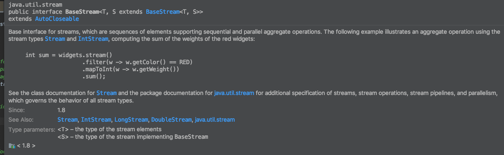
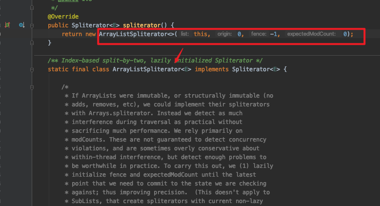

# Stream分析

### 一.Stream与BaseStream初识

#### 1.AutoCloseable接口

学习Stream的话，我们先来看一下它的父类BaseStream接口，这个接口又继承了*AutoCloseable*接口，那么这个AutoCloseable接口有什么用的呢？

其实就是用来帮我们自动关闭IO流的另一种方式，以前的关闭IO流是通过try-catch-finally这种方式，在finally中的大括号里面进行IO流的手动关闭行为，所以在java7中java提供了另一种用来关闭文件IO流以及socket流的另一种方式就是实现AutoCloseable这个接口，然后实现提供的close接口进行流的关闭。然后在使用的时候就不需要再手动去关闭了，但是还是需要写try方法构建当前的对象，怎么说呢？就是提供了一种新的方式去自动关闭我们的IO，使我们不那么容易忘记关闭流导致出错，不用当然也可以，就跟Optional关键字一样提供了一种更好的方式来达到非空异常的情况，但是不用也可以只要你记住或者不觉得做非空判断麻烦


#### 2.Stream特点属性介绍

关于技术的学习最好的方式还是官方文档，Stream的各种特点以及用处在Stream的javadoc文档就已经说的非常的清晰了，所以我们深入学习一下javadoc基本上就能理解Stream了，这里直接通过javadoc文档进行了解析


> 这里总结一下上面javadoc文档：
>
> - 首先一开始就是一个demo对流的用处进行了一个简单的说明，然后除了这个通用流之外还可以有几个特定数据数据类型的流对象
> - 流的数据来源可以是文件流，也可以是socket流，也可以是一个方法等
> - 流的操作都是基于管道pipeline的，操作都是在管道中完成，每一个中间操作都会生成一个新的流，就像map，filter等
> - 流是懒惰的，要遇到最终操作才会去执行中间操作，所以我们要么执行一个最终操作要么就是一个有结果输出的副作用操作也就是count()之类的，不是输出流而是流的计算，也会触发流计算
> - 流跟集合都是数据集，但是它们的目标是不一样的，集合是注重的数据的管理以及访问等，就是收集数据的一个容器，但是流的数据注重的是计算这个过程，目的不是数据的收集而是对我们的数据进行处理
> - 一个流同一时间只能是一个线程进行操作，这个就跟集合是一样的，一个集合同时只能是一个线程操作（读/写），不然就会抛异常，除非就是这个数据源就是特意为了并发而设计的底层就是ConcurrentMap集合
> - 流的各个操作也就是描述之间都是没关系的，相互独立的，而且大部分情况下流中的元素都是无状态的，先后执行数据得到的结果都是一样的
> - 一个流只能被使用一次，而且每一次流的中间操作都是产生一个新的流，所以流的操作要么返回一个新的流要么就是得到一个结果（最终操作）
> - 我们使用Stream的时候，要注意使用AutoCloseable接口的close()方法，如果数据源是IO或者Socket的时候，当然这种情况非常少，目前基本上都是通过集合或者数据直接创建一个流对象
> - 流的创建都是通过Collections中提供的方法stream()来实现的,当然还有并行流的创建方法，同时注意一下两种流是可以随时转换的

然后我们再简单看一下Stream中有哪些方法？


其实大部分都是比较简单的，很多都是顾名思义，通过直接看javadoc文档就可以知道有什么用处了，注意这里只是接口抽象方法的定义，具体的实现其实在java中只有一个实现类**java.util.stream.ReferencePipeline** 这个对象，后面再深入分析这些方法的实现原理，也会同时再细说每个方法的用处

#### 3.BaseStream接口

javadoc文档非常见到就是Stream的基础接口，然后用来进行数据的汇聚操作的，然后就是一个简单的demo



作为Stream的基础接口，我们可以看到其实定义的方法不多而且都是比较简单的顾名思义


>- Iterator() 第一个就是迭代器，进行数据的迭代
>
>- spliterator() 第二个就是分割迭代器，并发方式进行数据的迭代，还是一个及早求值方法
>
>- isParallel() 第三个判断是不是并行流，这个方法的使用要注意位置，要在及早求值前调用，不然就不是流了就无法调用了
>
>- sequential() 将流转换成串型或者说创建一个串型流，然后将流返回
>
>- parallel() 创建并行流的方法，然后将流返回
>
>- unordered() 如果流是无序的那么不变，有序的话变成无序返回当前的流
>
>- close就是关闭流的数据源，如果流的来源是IO或者socket的话，就需要关闭，这个是继承的AutoCloseable接口的方法的抽象方法，具体使用就是AutoCloseable这个接口的方法的使用方式
>
>- onClose() 这个方法可以细读一下方法的javadoc说得挺清楚的，大概意思就是通过产生一个子线程来关闭流我们主线程正常执行数据处理，处理结束后会通过产生的子线程去关闭我们的数据流入口。使用的时候需要注意一下，就是类似close()方法的使用，如下图所示；ps：同时再简单说一下onClose方法的一些要点：这个onClose方法可以多次调用，而且相互不受影响，假如添加了5个关闭处理器，第一个跑异常了后面的还是会继续执行，如果全都抛异常了，传递给调用者的异常信息只有第一个出现异常的异常信息会完整给调用者，后面的接着的异常会被压制成一个被抛出来，但是不是完整的异常，就是提示一下，集中提示，所以叫做压制异常，但是需要注意的是如果几个异常都是同一个（而不是同一种类型）异常对象的话，就无法被压制了，因为自己是没法压制自己的，所以多个一样的异常都会被抛出，但是同一种异常但是都是new 的对象的话，还是会被第一个压制
>
>  
>
>  

细心就会发现的BaseStream的接口的泛型入参有点奇怪，第一个T是普通流元素的对象，第二个入参S是BaseStream的子类，我们看一下BaseStream的子类LongStream的定义***public interface LongStream extends BaseStream<Long, LongStream>*** 就可以发现其实第二个入参就是当前的流的对象

```java
public interface BaseStream<T, S extends BaseStream<T, S>> extends AutoCloseable {...}
```

#### 4.几种流操作分类结果

| Stream操作分类 | 类型                       | 方法                                                         |
| -------------- | -------------------------- | ------------------------------------------------------------ |
| 中间操作       | 无状态(Stateless)          | unordered() filter() map() mapToInt() mapToLong() mapToDouble() flatMap() flatMapToInt() flatMapToLong() flatMapToDouble() peek() |
| 中间操作       | 有状态(Stateful)           | distinct() sorted() sorted() limit() skip()                  |
| 结束操作       | 非短路操作                 | forEach() forEachOrdered() toArray() reduce() collect() max() min() count() |
| 结束操作       | 短路操作(short-circuiting) | anyMatch() allMatch() noneMatch() findFirst() findAny()      |

### 二.分割迭代器Spliterator分析

#### 1.为什么说分割迭代器

严格来说，分割迭代器是java8的一大升级点之一，目前所知道的分割迭代器的使用是在java的新特性Stream中是特别重要的一个组成部分，因为Stream流对象的构建就是基于Spliterator来实现的，这个也是为什么在大量数据处理的时候Stream可以高效完成的原因之一；当然这个分割迭代器不仅仅是用来给Stream使用的，还可以用来各种数据集的数据遍历使用的，在集合的对象中像ArrayList中就有分割迭代器ArrayListSpliterator这个内部类对象，用来提供给外部并行访问集合的数据。所以作为java的一次大版本升级中，是新功能Stream的基础，同时也是为了高效处理数据出来的，用于替换传统的之前的单线程迭代器Iterator的使用，这个支持并发多线程进行数据的迭代（目前针对在Stream中的使用来进行说明，实际上集合的使用也是类似）

这里进行说明分析一下，Stream中是怎么使用分割迭代器，其实主要用途就是用来进行我们数据源的数据映射，然后我们进行数据读取的时候就通过迭代器来获取我们要的数据，如果是并发模式，在迭代的时候，会根据当前机器等相关的原因去创建线程然后线程根据分割迭代器的分割方法，对数据源的映射分割成多个迭代器，然后通过调用forEachRemaining()方法来进行调用对应现场的tryAdvance（）方法来进行数据的读取，用于后续的数据逻辑处理

我们通过集合创建一个流Stream对象的方式是：list.stream()；那么为什么这样能将一个集合创建成一个流对象呢？


最终的底层就是集合上层接口Collection提供的一个默认实现方法stream()方法，这个方法如上图所示，通过StreamSupport这个流的最终类来创建我们的数据流对象，其中一个入参就是Collection接口的另一个分割迭代器的默认方法，这个方法就是通过分割迭代器工具类入参当前对象返回一个分割迭代器对象，这就是一个集合的底层构建需要依赖一个分割迭代器，所以分割迭代器是Stream流的基础，分割迭代器在流中用处非常大，毕竟是Stream的基础建设，所以需要知道分割迭代器是什么。需要注意一下，我们获取分割迭代器的方法spliterator()这个方法的实际返回的分割迭代器的对象，会根据我们实际的数据源的类型，根据对应的数据的类型的内部类（或者其他方式的活着通过的分割迭代器，一般是内部的分割迭代器如ArrayList的ArrayListSpliterator内部类等）所以实际获取的分割迭代器对象是由数据源来确定的，这里是一个通用的存在


#### 2.分割迭代器是什么


这个直接去读官方javadoc文档是最好的，但是实在太多了，而且不太好理解，所以在网上找了篇翻译文章 [分割迭代器对象javadoc翻译 - 简书](https://www.notion.so/javadoc-edbef2d86c6d4550800762dcd5656c64)  ，直接看中文翻译吧，不过官方文档说得比较多，这里总结一下分割迭代器方法以及注意点：

- 分割迭代器的出现是为了提升传统的迭代器的遍历数据的速度的，分割迭代器可以支持并行遍历，注意只是支持具体的如何实现并行多线程遍历还是得靠我们自己去实现，这个并行处理能力我们可以通过java的fork/join 来实现（可以简单的理解为，淘宝可以提供商品交易，但淘宝并没有商品，需要商家自行解决）

- 顾名思义，分割迭代器主要的用途就是对数据进行遍历以及分割，数据源其实就是等同与Stream支持的数据源，可以是数组，集合，IO通道，以及生成器函数（例如：Stream的iterate方法），因为Stream对象的数据来源就是来之分割迭代器，而分割迭代器其实就是对数据源的数据的映射，实际上并不存在数据，所以这里需要注意不同的数据源的并发操作的问题，如：ArrayList是不支持并发的，使用的时候不要同时多个线程修改

- 分割迭代器进行数据的遍历的提供了两个方法，一个是tryAdvance另一个是forEachRemaing()方法，tryAdvance就是单个元素的串型遍历，forEachRemaing方法就是分块并行遍历，通用的情况下，forEachRemaining()方法就是调用tryAdvance()方法进行数据迭代获取的，但是这个可以看具体接口方法的实现，不是强制的，但是一般而言并发的时候，每个线程都是进入forEachRemaining()方法进行迭代，然后再将其转发到tryAvance()方法中

- trySplit()方法就是将数据进行分割的方法，迭代器分割这个就是这个分割迭代器的核心了，如果按照之前的Iterator迭代器的话，我们只能一个线程去迭代数据，但是在分割迭代器中，我们可以将一个迭代器按照某种规则进行分割，然后会将一个迭代器分割成两个，每一次分割都是返回一个迭代器，然后前一个迭代器指向也就是映射的数据就变少了，新的分割迭代器的数据就是将前一个分割后的所有数据映射到自身；但是这样其实并不能保证高效，因为分割的方式，也可能是不平均的，也就是两个分割迭代器的数据映射差别很大，所以这个需要根据不同类型的不同情况进行分割，最好的方式就是每一次分割都是对半的；具体分割原理（下图以行为分割进行查看）

  

- estimateSize()方法，就是用来计算分割迭代器中的元素的数量的，如果分割迭代器的数据源是含有特性SIZED的，这个值就是确定的，但是数据源长度是不确定的是可变的话，这个方法获取的值也是非常具有参考性的

- getExactSizeIfKnown()方法就是，如果长度是确定的就返回分割迭代器中的元素数量

- characteristics()这个方法跟流的收集器的特性用法是类似的，就是这个方法返回值的就是分割迭代器接口定义的常量值，也就是我们实现类通过这些特性值进行一些特定的处理

- hasCharacteristics(int) 这个方法就是分割迭代器对象进行调用判断是否包含某个特性值

- getComparator() 这个方法就是跟分割迭代器的SORTED特性如果有的话，就是说明当前的分割迭代器是已经排序的，这个方法返回的就是对应的比较排序的比较器对象

- 尽管分割迭代器是支持并发遍历的，但是分割迭代器还是线程不安全的，这个就说明了多线程操作一个迭代器的数据源的时候要注意同一时刻只有一个线程使用，不然就会出现并发操作异常；这个这个需要底层的数据源支持并发，这个才能够进行并行读取，对于我们用到的大部分的集合都是不支持并发访问活着修改，否则就会抛异常；所以我们需要人为地处理并发的问题，这个处理的方案有挺多种的，就是保证多线程访问一个数据源，能够确保一个时刻只有一个线程进行访问。比较直接的方式就是多个线程任务化，一个接着一个进行数据的读取

- 分割迭代器是快速失败的，如果是数据源不可变的，我们在进行数据遍历或者操作的时候会先去校验一遍如果变更了就会抛出异常，这个就是快速失败；

- 特征值说明

  > **ORDERED** ： 表明元素是有序的，就算再次trySplit的结果还是有序的（这个表明数据源是有序的），也可以理解为这个分割迭代器映射的数据源是有序的集合
  >
  > **SORTED** ：表明元素是已经排好序，如果有这个特征就说明元素肯定是有序的，也就是肯定有**ORDERED**这个特征，而且拥有这个特性值，调用getComparator方法就会返回对应的比较器，如果是自然排序就返回null（表明对数据进行排序）
  >
  > **DISCTINT** ：表明数据源的元素是不可重复的，类似Set集合的元素
  >
  > **SIZED** ：表明数据源的元素是长度确定的有限的值，如果没有修改的话这个值是固定的，如ArrayList这种
  >
  > **NONNULL** ： 表明数据是不为空的，分割迭代器数据源是不为空的
  >
  > **IMMUTABLE** ：表明数据源的数据结构是不可变的，如果一个分割迭代器的对象没有IMMUTABLE也没有CONCURRENT这两个特性值的话，使用的时候一定要注意是不是可变更的，因为有可能是可变有可能不可变要注意处理
  >
  > **CONCURRENT** ：这个特征表明，分割迭代器的数据源结构在使用的时候是可能会被多线程进行修改的，要注意线程安全以及数据可能变化这个问题
  >
  > **SUBSIZED** ：这个是表明当前是一个子分割迭代器，如果是子分割迭代器是确定包含SIZED跟SUBSIZED这两个特性的，因为长度有限才会分割，分割后就是SUBSIZED
  >
  > **PS：** SIZED这个特征跟CONCURRENT是冲突的，同时IMMUTABLE跟CONCURRENT也是冲突的；如果一个分割迭代器经过trySplit()方法处理的话，子分割迭代器是有SUBSIZE跟SIZED这两个特征值的也意味着trySplit()方法的数据源也是不可变；

#### 3.分割迭代器的原理 

首先来看一下分割迭代器的顶层接口


其实这个就是Spliterator接口的结构，主要构成部分有指定类型的内部类接口，我们分割迭代器都是没有制定特定类型的，在其子对象接口种OfPrimitive接口是入参一个指定的类型，然后OfPrimitive接口是泛型的入参，其下面还有三个具体的类型的接口那就是OfInt，OfLong, OfDouble这几个子接口，都是指定类型的分割迭代器接口，方便这几种类型的分割迭代器使用减少拆包装包的过程

分割迭代器最底层的就是对读取数据源的数据一个映射封装，我们上游的Stream获取数据去进行源算，就是通过分割迭代器来进行读取，如果是单线程非并发的模式的话，就是跟Iterator一样，一个线程去对数据源的迭代，但是如果是分割迭代器并发就是将一个数据源（假设是一个ArrayList集合）经过分割迭代器的实际根据机器配置或者一些配置指定的线程数（这个没有深入研究线程的数量的问题）对一个集合进行适当的分割都，然后多个进行数据获取的时候，多个分割迭代器每一个迭代器映射一部分集合的数据；多个分割迭代器分别去获取集合的数据，然后去作为数据源进行相关的业务处理，这个获取数据的底层，就是最简单的读取数据源的集合，根据具体的位置来进行数据的获取


这个分割迭代器是ArrayList这个实现了的内部类，实现类用来方便外部用来读取自身数据的分割迭代器，可以看到分割迭代器的底层还是通过对应映射的坐标来进行数据读取，只是可以支持多个线程高速读取。

当然这里展示的是比较片面的一个ArrayList集合的分割迭代器的实现，实际上不同的集合类型的实现有所区别，不过万变不离其中，底层的数据读取应该都是对应的数据源的读取方式，只是多提供了分割迭代器的方式，而且想要支持这种方式就得先实现一个分割迭代器，然后在调用的时候实际上还是根据其实际的实现进行处理

分割迭代器进行数据分割的原理，通过一个demo展示，本来是一串字符串的，经过分割迭代器的一次分割，就将一个整体的数据分割成两部分了，第一个被按照分割迭代器的分割方法进行了分割，分成了两部分，如果开启了并行迭代的话，这里后续还会不断的根据支持的子线程数量进行多次的分割，然后每个线程持有一个分割迭代器，然后分别调用forEachRemaining()方法来对数据进行迭代


#### 4.Spliterator内部子接口


可以看到Spliterator类里面可以看到这么一个接口，那么这个接口是干什么的，源码：

```java
 public interface OfPrimitive<T, T_CONS, T_SPLITR extends Spliterator.OfPrimitive<T, T_CONS, T_SPLITR>>
            extends Spliterator<T> {
        @Override
        T_SPLITR trySplit();
        @SuppressWarnings("overloads")
        boolean tryAdvance(T_CONS action);
        @SuppressWarnings("overloads")
        default void forEachRemaining(T_CONS action) {
            do { } while (tryAdvance(action));
        }
    }1234567891011
```

可以看到，这个接口基本没有变动，这是多增加两个泛型声明而已，本质上和Spliterator没有太大的区别，只不过，它限制tryAdvance的参数action类型T_CONS和trySplit的返回参数T_SPLITR必须在实现接口时先声明类型。
基于OfPrimitive接口，又衍生出了OfInt、OfLong、OfDouble等专门用来处理int、Long、double等分割迭代器接口（在Spliterators有具体的实现


再看一OfInt这个接口，除了在OfPrimitive中新定义的两个接口之外，其他三个接口是都通过默认实现了分割迭代器的接口中定义的抽象方法，当然这些方法的实现都是函数式接口式的实现，也就是具体的操作行为通过过入参来确定


尽管继承父类的的tryAdvance()方法以及forEachRemaining()方法都是有默认实现的，但是其最终调用的还是OfPrimitive中定义的未实现的同名的方法的，也就是说等于再做了一层封装


#### 5.分割迭代器有什么用？怎么用？

分割迭代器的主要用途就是用来迭代指定数据源的数据，在Stream中就是将数据源的数据映射到分割迭代器中，然后在我们进行终止操作的时候，触发分割迭代器的迭代数据的方法进行数据的获取，然后进行相关的业务操作；如果是一个Stream对象的构造中的分割迭代器的用处就是，第一步就是基于数据源构造一个迭代分割器，然后第就是将迭代分割器里面的数据作为数据源去构建成一个流，其实某种程度上就是通过迭代分割器对接数据源，通过IO或者各种集合的数据源读取数据，然后作为流源的数据；

总而言之，分割迭代器其实就是给定一个数据源，我们通过分割迭代器对该数据源进行映射，然后通过迭代器将数据源的数据迭代器出来，就是用来取代以前的Iterator迭代器的，因为这个单线程的以及处理的相对比较低效率，使用分割迭代器就会更加高效一些，支持多线程并发迭代，后续的集合类数据源的遍历使用这个进行处理会更加高效方便；

关于怎么使用？

这个在我们分割迭代器进行这个对象构造的时候就已经需要将数据源对象作为构造方法传递进去了分割迭代器中了，所以就是我们基于一个数据集构造了一个分割迭代器对象，我们在后面需要使用的时候，直接调用这个构造的分割迭代器的对象的迭代方法就可以获取构造的时候入参的集合对象了。注意，我们分割迭代器并不保存数据，只是对数据源进行了映射，在迭代的时候也是在数据源中进行数据的读取出来进行业务处理；下面看一个ArrayList中的内部分割迭代器的构造吗就是保存一个List的引用，然后迭代的时候通过下标进行读取


上面展示的分割迭代器的构造，但是实际上读取数据，这里展示一下Stream中是怎么读取的，其实就是在终止操作的方法中读取数据然后进行链式操作的时候，调用该Stream的分割迭代器进行数据的迭代处理


这里就是如果是并行迭代的话，就能够多线程去读取数据，提高数据源读取的速度，能够支持高并发；但是，但是，但是如果一个操作是顺序执行的，那么就意味着无法并发迭代了，这个速度就会受到限制了，因为一个分割迭代器读取的数据在stream中的中间操作是有序的就需要按顺序读取数据出来分割迭代器的高性能，就无法体现了跟单线程读取的区别基本上没什么不一样；因为如果是无序的操作，多个线程，分割迭代器尽管不能同时操作数据源但是多个线程交替读取速度也是很快的，假如有10个数据，两个线程第一个是读取1-5，第二个读取6-10的话，支持并发的话，读取的数据就是1，6，2，7。。。总之就是交替读取，具体顺序不确定，如果要顺序读取分割的优势就没得体现了

#### 6.分割迭代器Apliterator跟迭代器Iterator的比较

- Iterator是java8之前java的迭代器，只支持单线程并发，效率相对比较低
- Spliterator是java8新推出的分割迭代器，跟上一代的迭代器最明细的区别在于，支持多线程并发使用，效率更加高还有就是稍微更加合理一些，这就是为什么java8的并发操作支持更好的原因，不管是Stream，还是常用的集合操作
- Iterator迭代器，进行数据遍历的时候需要调用两个方法，先试调用hasNext()，返回true之后，再调用next()方法来获取对象；分割迭代器Spliterator迭代器就是调用一个方法就可以实现遍历，如果有下一个就直接迭代并且返回true否则就返回false
- Spliterator是支持快速失败
- 分割迭代器还有很多相关的自身特性，方便我们在使用分割迭代器进行数据的读取的时候可以进行相关的优化迭代，可以更高速一些

#### 7.分割迭代器的demo

##### a.ArrayListSpliterator介绍

先来一个网上看的对ArrayList的内部分割迭代器类的解析，这个是ArrayList这个集合内部对分割迭代器的实现

``` java
static final class ArrayListSpliterator<E> implements Spliterator<E> {
    //用于存放ArrayList对象
   private final ArrayList<E> list;
   //起始位置（包含），advance/split操作时会修改
   private int index; 
   //结束位置（不包含），-1 表示到最后一个元素
   private int fence; 
   //用于存放list的modCount
   private int expectedModCount; 

   ArrayListSpliterator(ArrayList<E> list, int origin, int fence,
                             int expectedModCount) {
            this.list = list; 
            this.index = origin;
            this.fence = fence;
            this.expectedModCount = expectedModCount;
        }
    //获取结束位置（存在意义：首次初始化石需对fence和expectedModCount进行赋值）
   private int getFence() { 
        int hi; 
        ArrayList<E> lst;
        //fence<0时（第一次初始化时，fence才会小于0）：
        if ((hi = fence) < 0) {
            //list 为 null时，fence=0
            if ((lst = list) == null)
                hi = fence = 0;
            else {
            //否则，fence = list的长度。
                expectedModCount = lst.modCount;
                hi = fence = lst.size;
            }
        }
        return hi;
    }
    //分割list，返回一个新分割出的spliterator实例
    public ArrayListSpliterator<E> trySplit() {
        //hi为当前的结束位置
        //lo 为起始位置
        //计算中间的位置
        int hi = getFence(), lo = index, mid = (lo + hi) >>> 1;
        //当lo>=mid,表示不能在分割，返回null
        //当lo<mid时,可分割，切割（lo，mid）出去，同时更新index=mid
        return (lo >= mid) ? null : 
            new ArrayListSpliterator<E>(list, lo, index = mid,                                         expectedModCount);
    }
    //返回true 时，只表示可能还有元素未处理
    //返回false 时，没有剩余元素处理了。。。
    public boolean tryAdvance(Consumer<? super E> action) {
         if (action == null)
             throw new NullPointerException();
         //hi为当前的结束位置
         //i 为起始位置
         int hi = getFence(), i = index;
         //还有剩余元素未处理时
         if (i < hi) {
             //处理i位置，index+1
             index = i + 1;
             @SuppressWarnings("unchecked") E e = (E)list.elementData[i];
             action.accept(e);
             //遍历时，结构发生变更，抛错
             if (list.modCount != expectedModCount)
                 throw new ConcurrentModificationException();
             return true;
         }
         return false;
     }
    //顺序遍历处理所有剩下的元素
   public void forEachRemaining(Consumer<? super E> action) {
       int i, hi, mc; // hoist accesses and checks from loop
       ArrayList<E> lst; Object[] a;
       if (action == null)
           throw new NullPointerException();
       if ((lst = list) != null && (a = lst.elementData) != null) {
           //当fence<0时，表示fence和expectedModCount未初始化，可以思考一下这里能否直接调用getFence()，嘿嘿？
           if ((hi = fence) < 0) {
               mc = lst.modCount;
               hi = lst.size;
           }
           else
               mc = expectedModCount;
           if ((i = index) >= 0 && (index = hi) <= a.length) {
               for (; i < hi; ++i) {
                   @SuppressWarnings("unchecked") E e = (E) a[i];
                   //调用action.accept处理元素
                   action.accept(e);
               }
               //遍历时发生结构变更时抛出异常
               if (lst.modCount == mc)
                   return;
           }
       }
       throw new ConcurrentModificationException();
   }

   public long estimateSize() {
        return (long) (getFence() - index);
    }

    public int characteristics() {
        //打上特征值：、可以返回size
        return Spliterator.ORDERED | Spliterator.SIZED | Spliterator.SUBSIZED;
    }
}

```

如果细心的话会发现，在java的集合类中所有的集合类都内置了一个内部类，就是当前集合的分割迭代器的实现，自身提供了这样一个对象，方便外部使用该集合的时候可以使用分割迭代器对该类型的集合的数据高速迭代，或者说支持高速迭代的实现；具体的迭代以及分割迭代器的接口实现都是已经在对应的集合内部实现了，我们使用分割迭代器或者说获取某个集合的分割迭代器，通过分割迭代器对某个集合的数据进行数据迭代的时候，可以使用对应的集合内部提供的获取当前集合类型的分割迭代器，然后调用该内部的分割迭代器的方法进行相关的该集合的数据操作，可以是再次分割，可以是进行数据迭代，也可以查看当前的数据的个数，以及一些分割迭代器的特性等

那么获取一个集合的分割迭代器的方式有哪些呢？其实java中的集合对象，基本上都提供了获取自身集合的分割迭代器的方法***spliterator()*** ，也就是创建了一个集合对象，就可以直接通过集合对象来获取当前集合的分割迭代器对象了

这里展示一下上面说的ArrayList这个集合对象的分割迭代器的使用：

```   java
 List<String>  arrs = new ArrayList<>();
 arrs.add("a");
 arrs.add("b"); 
 arrs.add("c");
 arrs.add("d");
 arrs.add("e");
 arrs.add("f");
 arrs.add("h");
 arrs.add("i");
 arrs.add("j");
// 特别注意这里就是调用该集合的获取分割迭代器的方法了
 Spliterator<String> a =  arrs.spliterator();
 //此时结果：a:0-9（index-fence）
 Spliterator<String> b = a.trySplit();
 //此时结果：b:4-9,a:0-4
 Spliterator<String> c = a.trySplit();
 //此时结果：c:4-6,b:4-9,a:6-9
 Spliterator<String> d = a.trySplit();
 //此时结果：d:6-7,c:4-6,b:4-9,a:7-9
```

我们进入到该分割迭代的方法中可以看到：



其实就是将当前集合的集合数据调用内部类分割迭代器的构造方法，构造了一个分割迭代器，然后将其返回；同理，我去看了一下java提供的各种集合对象，内部都是有一个对应当前集合的分割迭代器，因为不同集合的数据器对应的迭代方法以及分割方法不一样，其拥有的分割迭代器的特性个方面都是不同的，所以都是自身内部提供了实现。同时也提供一个获取自身数据的分割迭代器接口，方便外部对集合的数据使用分割迭代器的烦事进行遍历，这里展示几个常见的集合对象的分割迭代器截图


##### b.普通迭代器

既然学了分割迭代器Spliterator，那也来收拢一下迭代器Iterator这个对象，因为之前不是很了解，现在经过分割迭代器也算是搞懂了迭代器的使用了；对于用途的话，就是用来进行集合类型的数据进行迭代的，具体的用处跟分割迭代器的差不多，就是分割迭代器更加高级一些一个是java2出来的一个java8出来的

我们先看一下迭代器接口的方法定义


迭代器的接口比较简单，就是四个方法，所以而且这四个方法基本上都是见名思义，比较简单的；跟分割迭代器一样，每个不同的集合数据的遍历方式是不太一样的，所以如果不是通用的遍历，一般的集合内部都会自己实现一个迭代器的实现类，然后集合的接口实现有一个获取当前的集合的迭代器，一个获取当前的分割迭代器的方式，这两个方法就是返回当前集合内部类的迭代器的实现类；至于为什么所有的集合对象都需要提供一个迭代器一个分割迭代器呢？因为集合的顶层是Collection接口，这个接口继承了Iterable接口


Iterable接口的抽象方法有三个，一个就是传统的迭代器对象获取的对象Iterator获取的方法，一个就是我们刚整理的Spliterator对象的获取方法，还有一个通用forEach()方法入参是一个函数式接口，也就是集合的forEach()数据的时候使用；因为我们的所有集合的父类是Collection这个接口，这个接口继承了Iterable接口，所以也就是所有的集合都要内部提供一个迭代器的实现类一个分割迭代器的实现类，大都是以内部类的方式实现了这个迭代器或者分割迭代器；下面展示个别常用集合的迭代器的定义以及对应的获取方法


##### c.自己动手写一个分割迭代器

自己动手写一个分割迭代器的话，这个可以参考java内置的很多的集合的自己实现的分割迭代器的实现，其实就是主要根据想要进行迭代的数据源类型，以及我们想要的进行怎么样的迭代来进行具体的迭代实现，这里参考了网上的一个分割迭代器的例子就行一点小小的改造

这个分割迭代器的目的：对一个字符串按照一个个的字符进行迭代

```java
public class NumCounterSpliterator implements Spliterator<Character> {

    private String str;
    private int currentChar = 0;
    private boolean canSplit = true;

    /**
     * 构造方法
     */
    public NumCounterSpliterator(int currentChar,String str,boolean canSplit) {
        this.str = str;
        this.currentChar = currentChar;
        this.canSplit = canSplit;
    }

    /**
     * 从头遍历数据流的方法
     */
    public void forEachRemaining(Consumer<? super Character> action) {
        do {
        } while (tryAdvance(action));
    }

    /**
     * 遍历方法
     */
    @Override
    public boolean tryAdvance(Consumer<? super Character> action) {
        if(str.equals("")){
            return false;
        }
        action.accept(str.charAt(currentChar++));
        return currentChar < str.length();
    }

    /**
     *  自己定义的分割方法，这里确定根据什么进行分割
     */
    @Override
    public Spliterator <Character> trySplit() {
        int i = currentChar;
        for(;canSplit && i < str.length(); ++i){
            //第一个不是数字的pos，进行分割
            if(!Character.isDigit(str.charAt(i))){
                String str1 = str;
                this.str = str1.substring(currentChar, i);
                canSplit = false;
                if(i + 1 < str1.length()){
                    return new NumCounterSpliterator(0,str1.substring(i+1, str1.length()),true);
                }else{
                    return null;
                }
            }
        }

        canSplit = false;
        return null;
    }

    /**
     *  计算总数的方法
     */
    @Override
    public long estimateSize() {
        return str.length() - currentChar;
    }

    /**
     * 这个分割迭代器有什么特性
     */
    @Override
    public int characteristics() {
        return ORDERED | SIZED | SUBSIZED | NONNULL | IMMUTABLE;
    }
}
```

使用这个分割迭代器进行构建一个Stream流对象，然后使用该对象，最后就会触发这个操作对分割迭代器进行数据的读取，进行数据源的数据迭代

```java
public class NumCounterTest {
    public static void main(String[] args) {
        // 手动构建数据源字符串
        String arr = "12%3 21sdas s34d dfsdz45   R3 jo34 sjkf8 3$1P 213ikflsd fdg55 kfd";

        // 使用数据源去构建一个分割迭代器的对象
        Spliterator<Character> spliterator = new NumCounterSpliterator(0,arr,true);

        // 对分割迭代器进行一次分割，这个分割的方法是通过我们的自己定义的trySplit()方法来进行分割的
        Spliterator<Character> characterSpliterator = spliterator.trySplit();

        // 传入true表示是并行流
        // 分别用两个分割迭代器，使用流构造的工具类StreamSupport类构建一个流对象，可以指定是并行还是串型流，通过参数确定
        Stream<Character> stream1 = StreamSupport.stream(spliterator, false);
        Stream<Character> stream2 = StreamSupport.stream(characterSpliterator, false);
        // 对流数据进行终止操作进行输出，输出的过程会调用分割迭代器的迭代数据方法，读取数据来进行迭代，然后处理，这里是进行打印
        stream1.map(Function.identity()).forEach(System.out::println);
        stream2.forEach(System.out::println);
    }

}
```

ps:这里再强调一下，注意使用分割迭代器并行操作的时候的数据源，如果是不支持哪个并行操作的不要同一个时间多个线程操作，不然会出现并发操作异常：ConcurrentModificationException()；这个尤其要注意，所有的并发操作都需要小心一点

#### 8.分割迭代器的一个注意点


构建ArrayList对象的时候，留意一下，其实new ArrayList跟我们Arrays.asList（）构造出来的对象是不一样的，所以上面底层调用的分割迭代器跟进去其实是调用的ArraySpliterator对象；这个生成的实际的分割迭代器对象是根据数据源的集合类型来确定的，不同的数据集的分割迭代器有其相对应的实现


### 三.深入Stream流的结构与原理

#### 1.流的构造产生

我们先来看一下一个集合的Stream对象的构造流程：

- 第一步：一个集合的.stream()，就进入到了Collection接口的构造一个Stream的抽象方法中


- 第二步：进入到Collection的方法，最终就是调用StreamSupport工具类的.stream()方法中，其中入参有两个，一个就是获取对应的集合的分割迭代器实现类（这个分割迭代器提供的是我们的数据来源），一个就是是否是并行流；我们先进入分割迭代器对象的获取方法中


- 第三步：我们进入到spliterator()方法，这里就是通过分割迭代器的工具类对象Spliterators来构建一个分割迭代器对象，Spliterators.spliterator()方法获取的一个分割迭代器对象，默认实现就是得到一个**IteratorSpliterator**迭代器分割迭代器对象，这个就是直接跟进去下图中的Spliterators.spliterator()方法就是进入了Spliterators的类中，返回的是其内部实现的一个分割迭代器；但是实际上，我们尽管会进来这个获取迭代器的方法，不过获取的分割迭代器对象是对应的集合的类型分割迭代器的实现类的，是根据我们的实际的数据源来确定的


实际上会获取的对应的数据源的分割迭代器实现类的


- 第四步：回到第二步的位置，我们公共spliterator()方法获取到对应的分割迭代器后，会调用StreamSupport.stream()方法来创建一个Stream对象，所以进入到该方法；该方法所提供的方法都是构建一个ReferencePipeline.Head的对象，也就是构建一个流的源

  

  我们先来熟悉一下StreamSupport工具类对象，这是一个底层的Stream流对象的构造方法去创建一个流不建议我们直接使用，直接创建流的话直接使用集合的.stream()方法即可，这个是其底层的实现

  

  StreamSuppot的构造方法私有了，仅仅提供了静态方法提供给我们使用，作为一个底层方法，它的用处就是创建流对象，我们看它所有的方法，其实就是创建四种流，一个是通用的，一个是Int的，一个是Long的，一个是Double的，其中创建方法的入参就是分割迭代器，跟是否并发流，还有一些是制定这个Stream的特征值的

  

- 第五步：这里最终是入参一个分割迭代器对象，还有分割迭代器的特征值以及是不是并行流的一个标识，使用这些去构建一个ReferencePipeline内部实现类Head的对象，这个对象实际上也就是Stream接口的实现类，其实就是生成了一个Stream对象，只是子类为Head

  

  

  

>流的构造是，集合调用创建流的方法，然后通过获取对应分割迭代器获取我们要的集合的数据入口，然后根据分割迭代器作为数据源，去创建一个AbstractPipeline的对象，这个对象就是作为流源存在，主要目的就是创建一个Stream对象并且提供我们需要转换成流的数据源通过分割迭代器进行获取

#### 2.ReferencePipeline对象

经过上面的流的构造流程，我们可以看到最终一个Stream的产生整个流程，最终就是入参一个分割迭代器到**ReferencePipeline**这个对象的Head的构造方法中，构建一个ReferencePipeline的子类对象作 为Stream的源，先来看一下这个对象的构造方法


继续深入这个Head的构造方法最后调用的方法是：AbstractPepeline这个类的构造方法中；


上面展示了ReferencePipeline对象构造源以及往ReferencePipeline管道中添加中间操作的构造方法，其中一个特别明显的区别在于有没有给**previousStage** 这个属性赋值，以及入参是分割迭代器数据源还是一个ReferencePipeline对象这个对象就是当前流操作方法的前一个状态对象（然后构造方法中给前一个状态的属性值赋值，然后爷指定了当前前一个对象的引用）；ReferencePipeline.Head指的是数据源对象，ReferencePipeline指的是流的源阶段+中间操作对象（除了内部类Head对象之外的是源阶段，其他的流方法叠加都是通过中间操作的构造方法进行累加）


一个中间操作的添加到Stream中的构造过程，这里简单以stream.map()方法为例子：


> 这就是整个中间操作最终调用的是ReferencePipeline的父类AbstractPipeline的构造方法，所以流的创建，以及中间操作每一个操作结果都是一个对象存在。每个操作的对象之间的关系是通过AbstractPipeline这个对象的属性previousStage,以及nextStage这两个属性来将上一个对象以及下一个对象串联起来。调用构造方法构造的AbstractPipeline对象，其实就是就是一个个的Stream对象了，源的构造方法生成一个Stream，中间操作也是产生一个个的Stream对象，也就是对应上了之前说的每一个中间操作后产生一个新的对象

#### 3.流的底层原理实现

主要解答几个问题：1.流的操作时如何记录下来的？2.操作时如何叠加的？3.叠加之后如何执行整个操作？4.执行完如何收集结果？

先来展示一下整个Stream的对象结构：


我们在底层使用的时候很多情况都是使用ReferencePipeline这个对象的内部实现类：Head，StatelessOp，StatefulOp这三个内部对象来进行构造我们的Stream对象，每一个Stage阶段都是会生成一个AbstractPipeline对象类

##### a.>>流的操作时如何记录

流的中间操作的的记录是通过自身的两个属性previousStage，nextStage来记录前一个Stage（阶段）以及后一个Stage（阶段）的对象的，每一个中间操作就会产生一个阶段对象StatelessOp或者StatefulOp对象，其实也就是Stream的实现类；在前面小节说流的构造产生的时候就提到了，流源的构造跟流的中间操作的不同点在于，中间操作多了一部分就是指定上下阶段的对象引用


所以中间操作以流源的构造开始，每一个中间操作就会产生一个Stream对象，每个中间操作之间都会持有其上下游的引用对象，最后就以一种链表形式连接在一起，这种链式引用的操作就是Stream之间各个操作的联系，然后后面的Sink对象方法的对象由下游开始一直构建一个链式的Sink对象依赖的方式也是这里的Stream的结构基础，通过Stream的深度获取一个个的Stage阶段的对象，然后由终结操作的Sink对象一直往一个个的中间操作Stream对象中的opWrapSink()方法初始化实例的入参。所以这个Stream对象的结构是非常有用的，不仅仅是记录顺序还是用于链式遍历初始化方法

##### b.>>流的操作是怎么叠加

这个一直是我个人比较难以理解的部分，就是整个Stream的操作是怎么串联起来的。按照常规的理解，前面一步流的操作记录既然是有顺序了，那么直接按照顺序进行方法的调用即可，但是为什么流的设计方法执行不是以这种方式呢？

先来说一下，流的操作是怎么进行叠加进行的

> 在Stream中流的操作叠加是通过一个Sink协议来进行的，这个Sink协议对象包含的方法主要有：begin()，accept()，end()，cancellationRequest()这四个方法来进行流的各个中间操作中的方法调用的实现，这几个方法的用处主要是：开发调用我们的操作前调用，执行我们的中间操作相关业务，然后每次判断是不是能够进行短路操作，最后就是结束这个操作相关处理
>
> | 方法名                          | 作用                                                         |
> | ------------------------------- | ------------------------------------------------------------ |
> | void begin(long size)           | 开始遍历元素之前调用该方法，通知Sink做好准备。               |
> | void end()                      | 所有元素遍历完成之后调用，通知Sink没有更多的元素了。         |
> | boolean cancellationRequested() | 是否可以结束操作，可以让短路操作尽早结束。                   |
> | void accept(T t)                | 遍历元素时调用，接受一个待处理元素，并对元素进行处理。Stage把自己包含的操作和回调方法封装到该方法里，前一个Stage只需要调用当前Stage.accept(T t)方法就行了。 |
>
> 了解了Sink的接口协议之后，我们看一下这个Sink对象的构造，其实就是前面每一个中间操作的对象的构造的时候，重写的每个中间操作操作的对象实现类的**opWrapSink(int flags, SInk sink)**这个方法，这个方法就是返回一个Sink接口的实现类**Sink.ChainedReference<P_OUT, R>(sink)**这个对象，然后这个Sink的实现类重写了SInk的处理业务接口**accept()**这个方法，其中每一个中间操作的结果将传递给下一个阶段的对象，因为我们是调用下一阶段对象Sink协议的**accept()**方法，所以就是等于将数据传递到了下一个阶段对象的opWrapSink()方法的返回值对象Sink的accept()方法中，其实因为opWrapSink()方法是产生了一个Sink对象，我们进行的操作叠加已经是在这个独立的Sink对象中连着调用了，只是这个对象是在Stream中承载
>
> 
>
> 经过上面的分析，我们知道流的操作流程记录是在Stream中的属性对象中进行引用记录的，但是流的链式操作的叠加也就是操作结果的叠加是通过Sink这个协议进行的，上游调用执行相关的业务操作后，就会将结果传递到下一个阶段流中，上游处理业务是通过Sink对象的包装起来的下游被调用也是调用下油的accept()方法将结果传递并且最终的业务处理也是下游自身处理，处理后再传递下去，所以**Stream的API底层实现也就是各个中间操作如何重写Sink这个接口的四个方法**，当然这些方法的实现java中已经帮我们实现了，我们使用的时候只需要传递每个中间操作的具体操作去处理数据即可；
>
> 有了Sink对操作的包装，Stage之间的调用问题就解决了，执行时只需要从流水线的head开始对数据源依次调用每个Stage对应的Sink.{begin(), accept(), cancellationRequested(), end()}方法就可以了。一种可能的Sink.accept()方法流程是这样的：
>
> ```java
> void accept(U u){
>     1. 使用当前Sink包装的回调函数处理u
>     2. 将处理结果传递给流水线下游的Sink
> }
> ```
>
> 所以基本上所有的Stream的中间操作都是重写Sink的几个方法，来进行我们需要的各种业务处理，以Stream.map()为例简单说明每一步的操作
>
> ```java
> // Stream.map()，调用该方法将产生一个新的Stream
> public final <R> Stream<R> map(Function<? super P_OUT, ? extends R> mapper) {
>     ...
>     return new StatelessOp<P_OUT, R>(this, StreamShape.REFERENCE,
>                                  StreamOpFlag.NOT_SORTED | StreamOpFlag.NOT_DISTINCT) {
>         @Override /*opWripSink()方法返回由回调函数包装而成Sink*/
>         Sink<P_OUT> opWrapSink(int flags, Sink<R> downstream) {
>             return new Sink.ChainedReference<P_OUT, R>(downstream) {
>                 @Override
>                 public void accept(P_OUT u) {
>                     R r = mapper.apply(u);// 1. 使用当前Sink包装的回调函数mapper处理u
>                     downstream.accept(r);// 2. 将处理结果传递给流水线下游的Sink
>                 }
>             };
>         }
>     };
> }
> ```
>
> 上述代码看似复杂，其实逻辑很简单，就是将回调函数*mapper*包装到一个Sink当中。由于Stream.map()是一个无状态的中间操作，所以map()方法返回了一个StatelessOp内部类对象（一个新的Stream），调用这个新Stream的opWripSink()方法将得到一个包装了当前回调函数的Sink。如果是有状态操作返回的对象是StatefulOp对象，这个对象的话我们就需要重写begin()方法来创建一个对应的有状态容器以及end()方法来处理所有执行后的结果进行有状态处理，如果是短路操作还需要重写cancellationRequested()方法；
>
> 看一个有状态操作的实现：sorted()
>
> ```java
> // Stream.sort()方法用到的Sink实现
> class RefSortingSink<T> extends AbstractRefSortingSink<T> {
>     private ArrayList<T> list;// 存放用于排序的元素
>     RefSortingSink(Sink<? super T> downstream, Comparator<? super T> comparator) {
>         super(downstream, comparator);
>     }
>     @Override
>     public void begin(long size) {
>         ...
>         // 创建一个存放排序元素的列表
>         list = (size >= 0) ? new ArrayList<T>((int) size) : new ArrayList<T>();
>     }
>     @Override
>     public void end() {
>         list.sort(comparator);// 只有元素全部接收之后才能开始排序
>         downstream.begin(list.size());
>         if (!cancellationWasRequested) {// 下游Sink不包含短路操作
>             list.forEach(downstream::accept);// 2. 将处理结果传递给流水线下游的Sink
>         }
>         else {// 下游Sink包含短路操作
>             for (T t : list) {// 每次都调用cancellationRequested()询问是否可以结束处理。
>                 if (downstream.cancellationRequested()) break;
>                 downstream.accept(t);// 2. 将处理结果传递给流水线下游的Sink
>             }
>         }
>         downstream.end();
>         list = null;
>     }
>     @Override
>     public void accept(T t) {
>         list.add(t);// 1. 使用当前Sink包装动作处理t，只是简单的将元素添加到中间列表当中
>     }
> }
> ```
>
> 上述代码完美的展现了Sink的四个接口方法是如何协同工作的：
>
> 1. 首先begin()方法告诉Sink参与排序的元素个数，方便确定中间结果容器的的大小；
> 2. 之后通过accept()方法将元素添加到中间结果当中，最终执行时调用者会不断调用该方法，直到遍历所有元素；
> 3. 最后end()方法告诉Sink所有元素遍历完毕，启动排序步骤，排序完成后将结果传递给下游的Sink；
> 4. 如果下游的Sink是短路操作，将结果传递给下游时不断询问下游cancellationRequested()是否可以结束处理。

---

这里回答一下，前面说的：为什么操作顺序已经有记录了，还要通过Sink这种方式来将操作结果叠加的？不是直接从头开始调用

>要想让流水线起到应有的作用我们需要一种将所有操作叠加到一起的方案。你可能会觉得这很简单，只需要从流水线的head开始依次执行每一步的操作（包括回调函数）就行了。这听起来似乎是可行的，但是你忽略了前面的Stage并不知道后面Stage到底执行了哪种操作，以及回调函数是哪种形式。换句话说，只有当前Stage本身才知道该如何执行自己包含的动作。
>
>换而言之，就是抛开Sink接口这个协议，没有begin()方法，没有end()方法，没有cancellationRequested()方法，只有一个执行中间操作的方法的话；如果一个操作直接调用下一个操作，那就是没法进行有状态的操作，除非触发所有的操作前都单独执行这里的四个操作，这样又有一个问题，有些没必要的操作，每次都要执行，而且每个中间操作都要去实现其对应的所有四个操作。这样以来，前面的操作不知道后面要执行那些操作，也无法知道因为其下游可能是任意的中间操作，只能全部按照通用的方式来执行调用全部的接口或者调用一个接口，这个接口封装了全部相关的操作，然后判断执行哪些方法，这个不就是类似Sink协议了吗，Sink协议做了这个事，每个操作实现自己关注的操作，不同的操作还要调用下游操作的不同时机；然后调用的回调方法，也就是下游的方法，如果是不使用Sink这种协议，就可能每一个中间操作都需要去适配一下对应的上下游的调用问题，要是一个通用方法来实现，就比较不灵活；就是，如果只有当前的中间操作指导自己需要干什么以及怎么做，然后上游不知道下游到底要执行哪些方法，有些下游要执行Sink中的4个方法，有些只需要执行其中一个方法就可以了，用了Sink协议就是执行对应的一个方法，即可；但是不用的话，就只能所有的下游一概而论，所有的方法都执行（如果不执行也是内部做了判断，但是上游不知道），总之就是上游不知道下游具体要执行的操作，然后下游也不知道下下游要执行那些操作，所以都将其封装在Sink协议中，等于将下游的所有要做的方法都抽象出来一个了。就是Sink的accept()方法，下游根据自己的情况执行对应的操作

##### c.>>叠加的操作是如何执行


执行流的中间操作的时机就是遇到了终止操作的时候，终止操作就没有下游了，**通过流的操作记录由下往上给对象的opWrapSink()方法的入参赋值自身的产生的对象，这样就将整个链路的opWrapSink()方法的都调用了这个方法就会创建每一个Stage阶段的Sink对象（也就是将对应的操作的Sink对象初始化），然后调用第一个操作的Sink对象的accept()方法，第一个对象的方法就会调用下一个阶段的accept()方法**，一直到最后一个方法完成等到结果，其实这样就事非常的灵活，整个链路操作就是调用第一个操作的执行方法即可，然后整个链路的所有的处理数据方法就会一直被调用下去，下面展示一个终止操作用于初始化所有的Sink对象的方法，就是遍历所有的Stage阶段的对象调用其opWrapSink()方法

```java
// AbstractPipeline.wrapSink()
// 从下游向上游不断包装Sink。如果最初传入的sink代表结束操作，
// 函数返回时就可以得到一个代表了流水线上所有操作的Sink。
final <P_IN> Sink<P_IN> wrapSink(Sink<E_OUT> sink) {
    ...
    for (AbstractPipeline p=AbstractPipeline.this; p.depth > 0; p=p.previousStage) {
        sink = p.opWrapSink(p.previousStage.combinedFlags, sink);
    }
    return (Sink<P_IN>) sink;
}
```

现在流水线上从开始到结束的所有的操作都被包装到了**一个Sink**里，这第一个对象的Sink也是可以触发所有下游操作的对象，只要执行其的方法整个Sink就相当于执行整个流水线，执行Sink的代码如下：

```java
// AbstractPipeline.copyInto(), 对spliterator代表的数据执行wrappedSink代表的操作。
final <P_IN> void copyInto(Sink<P_IN> wrappedSink, Spliterator<P_IN> spliterator) {
    ...
    if (!StreamOpFlag.SHORT_CIRCUIT.isKnown(getStreamAndOpFlags())) {
        wrappedSink.begin(spliterator.getExactSizeIfKnown());// 通知开始遍历
        spliterator.forEachRemaining(wrappedSink);// 迭代，从分割迭代器中获取数据，逐一调用Sink的方法
      // 这里的Sink就是一个Cnsumer，这里就是会调用入参sink对象的accept（）方法接收数据进行处理
        wrappedSink.end();// 通知遍历结束
    }
    ...
}
```

上述代码首先调用wrappedSink.begin()方法告诉Sink数据即将到来，然后调用spliterator.forEachRemaining()方法对数据进行迭代（Spliterator是容器的一种迭代器），最后调用wrappedSink.end()方法通知Sink数据处理结束。逻辑清晰。

##### d.>>执行结果

执行Stream的终止操作的时候要尽量避免对副作用的结果进行操作，例如forEach()这个Stream的操作是个终止操作，我们应该在只是遍历输出这种场景使用一下，不应该使用来收集结果数据，这个执行结果以及操作正确性是无法保证的。基本上除了打印结果的情况使用，总之建议对应的终止操作用来做对应的事情，而不是遍历的终止操作用来收集数据

大部分使用流的副作用场景，都可以使用流的归约操作（指的是collect()或者reduce()这两个操作）来完成，规约操作的就是对多个结果进行整合之后输出；

```java
// 错误的收集方式
ArrayList<String> results = new ArrayList<>();
stream.filter(s -> pattern.matcher(s).matches())
      .forEach(s -> results.add(s));  // Unnecessary use of side-effects!
// 正确的收集方式
List<String>results =
     stream.filter(s -> pattern.matcher(s).matches())
             .collect(Collectors.toList());  // No side-effects!
```

对于流的操作，其输出结果有几种类型：boolean，Optional，Array，以及常用的归约操作的结果（可以是归约操作之后的各种结果），这几种输出结果对应的终止操作类型：

| 返回类型             | 对应的结束操作                    |
| -------------------- | --------------------------------- |
| boolean              | anyMatch() allMatch() noneMatch() |
| Optional             | findFirst() findAny()             |
| 归约结果（各种类型） | reduce() collect()                |
| 数组                 | toArray()                         |

1. 对于表中返回boolean或者Optional的操作（Optional是存放 一个 值的容器）的操作，由于值返回一个值，只需要在对应的Sink中记录这个值，等到执行结束时返回就可以了。
2. 对于归约操作，最终结果放在用户调用时指定的容器中（容器类型通过收集器指定）。collect(), reduce(), max(), min()都是归约操作，虽然max()和min()也是返回一个Optional，但事实上底层是通过调用reduce()方法实现的。
3. 对于返回是数组的情况，毫无疑问的结果会放在数组当中。

#### 4.forEach方法一些说明

关于Stream的forEach()方法，这个方法底层底层有两个实现，其中一个就是直接对构建的流源进行遍历，也就是没有中间操作的时候调用的forEach()的实现是Head中的，有中间操作后的实现是AbstractPipeline中的实现


如果一个集合构建成流的遍历，如果是没有中间操作的话除非是有需求时并行高速读取的情况下，不建议转换成流之后再次进行遍历，建议直接使用集合提供的forEach()进行遍历或者，直接使用集合的迭代器进行遍历，这样反而性能更高，因为一个集合转换成流进行遍历的话会产生一系列的相关的中间对象，反而降低性能；

还有就是，如果我们使用并行流的方式来对流进行遍历的话，如果其中的中间操作存在有状态操作的话，这样是体现不了并行流的优势的，并行流的优势是多个线程去读取数据源，然后往后进行数据的遍历，如果包含了中间操作的话，多线程多处读取数据就没有用处了，这样跟顺序读取是没有区别的。所以如果想要高效处理数据集的话，需要将无状态操作提取出来进行处理生成结果后，再使用有状态的进行单独处理，进而提升性能


### 其他

#### 1.ArrayList是不支持并发修改的

如果同一时间多个线程变更ArrayList集合数据的话，就会抛出并发修改异常**ConcurrentModificationException()**；所以java8提供了一个支持并发修改的集合实现类**CopyOnWriteArrayList**用来支持存在并发修改的集合数据对象，这个支持并发修改的原理就是多个线程操作的时候每个会拷贝一份数据出来单独处理（大概这个意思）

#### 2.为什么有些情况下IntConsumer能等同于Consumer？

两者没有任何关系，既不是继承关系也不是实现关系，是两个单独的对象接口，为什么就能够判断是不是一样的实例呢？


- 首先再来一个问题，为什么在面向对象的思想里面，如果Consumer跟IntConsumer两者不是继承或者实现的方式，是无法这样进行转换的，在这里lambda也就是方法引用中反而可以这样使用呢？猜想：因为Consumer类型的T是Integer类型，然后InConsumer类型入参是int类型，所以经过拆装箱之后两者是可以对等的**--这个回答是不太准确的，本质不是这样的**

- 因为Consumer这个接口的函数式接口入参就是一个泛型T，然后不返回值，然后IntConsumer这个接口就是接受一个Int类型的参数，不返回值，所以当Consumer这个接口的实现类的入参类型T是int类型的时候，Consumer实例其实也是等同于IntConsumer，最终因为我们调用IntConsumer接口的实例的时候，接收的是int类型，但是在上面图中的action入参类型是Integer类型，存在拆装箱的过程，所以最终是可以转换成IntConsumer接口对象的 **--当然这个回答也不是根本回答**

- 最根本的一个核心线索就是，我们函数式编程很多时候，入参的类型都不是明确指定的，都是泛型的（等同于匿名函数），通过上下文来进行主动推算出实际执行的是什么类型的对象，所以尽管是通用类型也是可以在具体使用的时候通过推断实际确定当前的类型是什么类型，这个就导致了函数式接口跟面向对象的设计理念有所偏差，面向对象如果两个对象是没有层级关系的时候时候是无法转换的，但是函数式接口是可以进行转换的

- **总之核心区别在于一个是传递的行为，一个是传递的对象，传递行为的，尽管类型不一致，但是行为是一致的，而且行为对象类型一致就可以进行处理**

- 

- 归根到底就是，我们限定了入参的行为就是整数的，所以这个行为是整数的行为，而且这个入参的实现就是一种行为，所以就可以进行判断

- 正如，我们看的分割迭代器中的子接口OfInt接口中的tryAdvance方法的判断，尽管方法定义的入参是一个函数式接口对象，但是除了可以直接入参该类型的对象之外，还是可以入参一个lambda表达式作为参数传递进去的，这就是为什么上面的两个不相关的接口能够判断是不是instanceOf()了，因为一旦入参是一个lambda表达式的话，就是一样的写法了（注意上图的测试demo，的方法引用实际上就是一个lambda表达式，这就是传递一种行为

  

- 理解一个核心的概念，就是lambda表达式的对象就是一种行为，行为如果我们入参的时候限定了某个类型的行为的话，就是可以惊醒具体的转换

#### 3.Stream中终止操作是怎么触发分割迭代器的 todo

这个其实比较简单，直接进入到我们的Stream的终止操作，然后跟进去，就可以发现在调用链式调用的时候就使用到我们构建Stream时候的分割迭代器，调用对应分割迭代器的forEachRemaining()方法，就通过迭代获取到数据；具体的稍后补充整个流程的源码


#### 4.使用并行流的一些坑（特别注意）

- 比如我只是简单的遍历一遍int数组，那就不要使用stearm，直接使用for循环性能会更好，因为stream你只是用着简单，但你看下源码，封装很多复杂逻辑，原本只是简单的数组遍历，你用stream之后将会创建出很多中间对象，还有一大堆的流式调用逻辑。
- 用了stearm之后就很少写for循环了，这不是一个好的习惯。比如我只是简单的遍历一遍int数组，那就不要使用stearm，直接使用for循环性能会更好，因为stream你只是用着简单，但你看下源码，封装很多复杂逻辑，原本只是简单的数组遍历，你用stream之后将会创建出很多中间对象，还有一大堆的流式调用逻辑
- 还有更恐怖的线程安全问题。在并发量高的接口中不要直接使用stream的parallerStream处理耗时的逻辑，因为并行流运行时，内部使用的fork-join线程池是整个JVM进程全局唯一的线程池。而这个线程池其默认线程数为处理器核心数。这个问题应该怎么处理呢？要么修改修改forkJoinPool线程数（不建议），要么就是自己建一个Fork-join线程池来进行处理（建议）；总之，不要在高并发的接口中使用并行流，直接使用处理请求的线程执行就行，如果有需要，那就全局创建一个Fork-Join线程池自己切分任务来执行。
- **那些耗时很长的任务，请不要使用parallerStream。假设原本一个任务执行需要1分钟时间，有10个任务并行执行，如果你偷懒，只是使用parallerStream来将这10个任务并行执行，那你这个jvm进程中，其它同样使用parallerStream的地方也会因此被阻塞住，严重的将会导致整个服务瘫痪。**
- **关于stream的并行流parallerStream使用注意事项就切记，请不要乱用并行流，在使用之前一定、一定、一定要考虑清楚任务是否耗时，有i/o操作的一定不要使用并行流，有线程休眠的也一定不要使用并行流，原本就只有两个线程，还搞休眠，等着整个服务崩溃咯。**

#### 5.内部类跟lambda表达式的区别

内部类再jvm编译的时候就是一个内部对象存在，编译的时候会生成一个对象：类名$数量.class；这种结构的一个类但是lambda表达式尽管跟内部类实现的功能是一样的，但是lambda表达式是不生成一个对象类的，作为对象的一个属性存在


