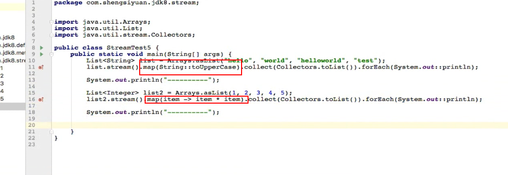

# Stream的使用

### 一.Stream是什么？

##### 1.javadoc的介绍

java8提供的一个新的对象类型，用来对集合类型的以管道的方式进行串型以及并行操作的聚合式计算的，类似高阶函数的操作，直白一点就是用来对集合类型的数据进行管道式流计算的操作


用大白话说一下Stream：

- 流式一种新的对数据元素的操作方式
- 流不会存储值，只是作为类似管道的方式来获取数据进行相关的操作 
- 流的本质是函数式接口的编程，也就是使用声明式来表示具体的操作（我们处理流中的数据并不会影响原来的数据，只会生成一个新的数据，但是如果数据源在使用过程中发生变化，有可能会导致发生异常并发操作异常）
- 流的很多操作都是延迟实现的
- 流之间很多操作都是无状态的

##### 2.流的创建方式

创建一个流的方式，我们正常写代码的方式有三种：

> 1.通过Stream提供的构造方法 Stream.of("", "", ""); 这种方式来创建一个Stream对象
>
> 2.通过数据工具类对象Arrays.stream(String[])创建一个Stream，当然这个方式的扩展可以使用Stream.of(String[])这种方式来创建一个流对象，这个入参是一个数组的底层调用的还是 Arrays.stream()； 这个方法
>
> 3.这种方式是我们最经常用的方式，直接用集合Collection的实现类，List之类的直接list.stream()来创建一个Stream对象
>
> 
>
> PS：尽管我们敲代码使用的方式就这三种方式，这三种一分类其实就是两种，一种就是集合对象直接.stream(),另外一种就是数组类，使用Stream提供的构造方法of();或者数组工具类对象Arrays.stream()；方法来创建一个流对象；但是，对于实际来说，创建流的数据源不一样，还是有点区别的，目前知道流的创建的数据源有几种：数组，集合，I/O流，一个方法等，对于IO流的方式创建一个Stream的方式，以及一个方法返回值的话，目前还没涉及到也不太清楚

### 二.Stream的特性

##### 1.聚合操作类型

- **中间操作**：中间操作就是没有得出一个具体结果的操作，也就是返回结果还是一个Stream对象，（**惰性求值**）这些操作是不会执行的直到遇到了最终操作（及早求值）才会进行相关的运算
- **最终操作**：最终操作就是得出一个结果的操作，要么是副作用结果类似计算总数，要么就是经过收集器处理成我们要的最终结果类型对象的操作（**及早求值**）
- 

##### 2.流的构成

- **数据源**：数据，集合，IO，方法

- **中间操作**（0个或者多个）：各种串联的运算描述操作

- **最终操作**：计算结果的操作

  > 流的中间操作跟最终操作的区别在于，中间操作返回的还是一个Stream对象，最终操作返回的是一个具体的对象类型或者是Optional对象封装的类型

##### 3.流的一些特性

- 串型/并行操作

  > Stream流有串型的流也有并行的流，串型的就是所有的数据在一个通道一个接一个执行相关的流计算操作，不过需要注意的是，就算一个Stream对象有n个中间操作，对于一个流中的元素来说都是遍历一次将所有的操作都执行完毕；并行流就是，多个线程来操作，多个线程的操作结果可能是一个结果，也可能多个结果最后合并，这个后面分析Stream的对象的特性会有所涉及

- 惰性求值原则

  > 不管有多少中间的操作，如果没有遇到**及早求值**操作，中间的操作都不会被执行

- 一个流对象只能被使用一次

  > 流对象只能被使用一次，每一次流的中间操作计算都会返回一个新的流，如果我们获取到中间结果的流，然后进行两次调用的话，就会抛出异常

### 三.一些重要方法解析

##### 1.Stream.collect(Collectors.toList())底层分析

我们在使用流对数据进行操作的时候，很多时候的操作结果最后被收集器collect()这个方法来进行收集之后生成一个集合List对象，那么这个收集器工具类Collectors的底层实现其实就是调用了下图的方法：


上面是使用方法引用的方式，还可以直接使用lambda的表达方式


整体说明一下：收集器的工具类Collectors的toList()方法实际上就是，将流中的数据，存放在一个集合中，如果是并行流的话就合并后再返回就这样的一个操作

##### 2.Collectors.toCollection()

对比前面的Collectors.toList()方法，这个方法就是使用所有集合的类型的，toList()就是返回的ArrayList类型的集合，toCollection(ArrayList::new),toCollection(HashSet::new)，toCollection(LinkList::new)等，可以指定生成我们要的集合类型的结果，后面分析到收集器的时候，再来解析更加具体的实现

##### 3.Stream的map()

流的map()操作，其实就是流元素的映射操作，将我们的流中元素对象，经过处理后映射成我们想要的对象类型操作



上图就是第一个就是将所有元素映射成其大写，第二个就是将元素经过处理后映射成其自身相乘的结果；

---

细心就会发现，Stream的map方法有几种


map方法还有几个特定类型的映射方法：mapToInt ,mapToLong, mapToDouble ，这三个方法跟map的方法的区别是map方法是通用型的，也就是我们确定我们映射后的结果是int，Long，Double这三种类型就建议直接使用到具体的方法，这个能够减少转换过程的类型转换或者说拆装箱的性能损耗；

同理的下面的flatMap也是一样的，钥匙map的结果是这三种类型，最好就是直接使用到具体类型的方法

##### 4.Stream的flapMap()

这个以前知道是摊平所有的元素的数据，然后合并成一个进行操作，但是具体使用还是不清不楚，现在好好梳理一下，就是一个流中的元素，元素还是一个集合的话，我们想要对每个集合中的元素进行统一处理，flatMap()的作用正是如此，将元素中list合成一个进行操作

使用场景：我们有多个集合数据，都要进行同一个操作，操作完成后合并成一个结果输出，我们将每个集合的数据当成一个元素，构造进流stream对象里面，然后直接flatMap操作之后，就会合并stream中的元素list成一个流中的元素了，然后可以继续操作


这里要注意一下，flatMap()这里的参数，上面的因为数据就是Integer类型的，所以映射入参的lamdba表达式就是直接将当前的集合转换成stream流对象，但是有可能，我们是获取对象的某个属性进行flat的，这里就要看lambda表达式具体处理数据后，再去合并成一个整体的Stream

---

再来两个个demo

第一个的实现目的就是，将list中的里面的每一个元素，根据 " "分割成一个个单词，然后将其合并成一个不重复的单词集合：注意一下，方法引用Arrays.stream调用的是Arrays.stream(String []) 这个方法，这个也说明了list.stream.map(item -> item.split(" "))分割的结果Stream的元素是一个个的数组


第二个实现的目的就是：笛卡尔积，第一个集合跟第二个集合组合一起，实现:Hi zhangzhan ，Hi lisi 。。。Hello zhangsan ，Hello Lisi 。。。你好 zhangsan，你好 lisi。。。，如果不使用flatMap的话。使用map，就会返回的是这种数据类型：List<list, list, list, list> ,使用了flatMap就是将一个个的list重新转化成stream，然后将各个stream合并成一个stream


##### 5.Stream的构造方法

我们直接通过Stream对象来调用，可以发现Stream对象中有如下几个方法是返回一个Stream对象的


其实主要就empty():返回一个空的Stream对象，of()入参数组或者一个对象，返回一个Stream，generate()这个方法主要就是通过入参的Supplier函数式接口产生一个Stream对象返回，iterate()方法就是产生一个无穷的Stream的一个构造方法一般通过配合limit()方法来使用，不然就会基于T对象然后就是经过UnaryOperator函数式接口运算后一直循环运算返回下一个无穷的Stream对象


上图就会基于1，每次+2产生一个新的元素，直到元素长度为6后停止，所以执行结果是：1，3，5，7，9，11

> Question:我们来做一个一个题目，找出上面的元素的大于2的元素，然后将其乘于2，然后去除前面两个元素，再获取前两个元素求和
>
> 这个操作就需要了解几个方法了：skip(n)跳过前面的n个元素，limit(n) 只获取前面n元素
>
> 最终的表达式：```Stream stream = Stream.iterate(1, item -> item+2).limit(6); ```
>
> ``` stream.fileter(item -> item>2).mapInt(item -> item*2).skip(2).limit(2).sum();```

##### 6.Stream的分组分区方法

分组分区的方法其实都是收集器工具类Collectors提供的一个静态方法，对于我们流的数据的很多收集器的聚合操作都是可以直接使用java8提供的收集器工具类Collectors来进行操作，这里介绍一下分组以及分区这两个方法，简单入门一下，后面会详细针对收集器详细讲解


流数据的分组方法，就是跟mysql的分组操作一个意思，指定一个分组的字段之后，值一样的都合并成一组，然后返回一个Map<字段值，List<Object>>对象，然后我们可以遍历去获取我们要的数据，看一个demo


上面的返回值是是根据学生的名称分组了，zhangsan这个学生的map的值有两个对象，其他的都是一个对象，然后再改造一下，按照学生名称分组后再计算，每个学生对象的数量


这个都是非常的描述性的，说实话lambda表达式跟mysql是一个意思的，都是通过描述性的语言来表达行为的意图，描述性语言就是跟我们直接通过代码操作数据不一样，每个描述性语言实际上还是会被解析成对应的底层语言进行操作的，正如这里的实现底层就是我们内置Collectors的内置方法，这里是描述性的，支撑的都是实际上的代码命令

---

上面是分组的，这里展示分区的demo，分区的demo跟分组的有点不太一样，可以说是分组特化，分组的结果Map对象的key可以是多个的，但是分区这里的Map结果的key只有两个值，一个是true一个false，然后值的话就是符合某个条件的List<Object>对象，分区就是一个条件，符合的数据为一组其key为true，不符合条件的为一组其key为false


### 四.流的并发与短路

流的类型有两种，一种就是串型流操作，这种流的操作就是可以理解为单线程处理业务聚合计算，并行流就是多线程执行，数据量比较少的时候看不出优势，如果数据量到一定的量级之后，就会发现并行流是比串型更加强大更快的，当然并行流的会不会有多线程操作的那些问题呢？

**还有一个使得我们流更高效的细节就是，流具有短路功能**

什么是短路功能呢？就是我们在流进行数据处理的时候，会进行内部遍历所有的元素，然后一个个元素进行整个链路的聚合操作，这个聚合操作会有筛选条件，如果某个元素一旦符合我们的筛选的条件之后，获取到了我们的目标的数据之后就会停止遍历剩余的数据了直接中断进行结果输出（可以理解为我们平时使用的逻辑操作&& || 等具有短路功能的操作，一点某个元素符合之后就不会再进行后面的判断直接往下走了），下面的图片使用filter()这个方法来证明短路功能，当然应该也是可以我们自己内部写判断方法进行，然后调用findFirst()方法，应该都会进行短路


### 最后补充

##### 1.使用lambda表达式有什么用？

lambda表达式是函数式接口的实际变现形式，主要用途两个一个就是进行**流式计算的操作**，使用这种声明的方式去进行业务操作，另一个就是优化以前的java只能进行值传递的现象，方法之间进行函数式接口的传递的表现形式就是lambda表达式，也就是**传递行为**

##### 2.lambda表达式的结果Optional或者具体对象（如int），有什么区别？

这个的最大的区别在于，如果是经过汇聚计算后的结果是能确定的，是肯定存在的，这种就可以返回具体的数据类型，例如count()的结果就算是没用结果返回的值都是0，这种就是可以直接返回；但是如果是findFirst()这种方法的话，返回的结果是不确定是不是存在的，有可能有也有可能是空的，这种就应该返回Optional对象。

其实关于Optional的使用，这个后面会更加深入了解一下，这个对象是java8出来的专门处理NPE异常的一个对象，理想状态就是所有的对外的接口返回值只要是不确定是否有返回值的情况，都用Optioanl来进行封装返回，这样处理后我们就能够主动避免了一些不小心的空指针异常了

##### 3.IntSummaryStatistics/DoubleSummaryStatistics/LongSummaryStatistics

这三个类对象的使用，其实直接看这三个类的javadoc就能够知道有什么用了，就是将对应的IntStream/DoubleStream/LongStream流的中间操作汇集到对应的对象中，然后用这三个对象的内置的对象可以进行数字的一些简单操作，计算总和，最大值，最小值，平均值等


使用的时候，需要确定是当前的中间操作后对应的流流行是intStream/LongStream/DoubleStream才行，而且是调用的同一个方法summaryStatistics()来返回对应类型的对象，然后获取到该对象就能进行内置的一些操作


##### 4.外部迭代/内部迭代是什么？

外部迭代就是显式的遍历，通过for或者外部的迭代器进行遍历迭代，内部迭代就是内部直接迭代，不需要依赖外部的迭代器之类的，都是内部通过数据直接遍历，**其实归根到底，目前我们所涉及到的，通过Stream流元素进行的所有的数据处理就是内部迭代**不需要依赖外部的for来获取到数据，都是直接内部直接遍历数据，内部的分割迭代器进行遍历处理了，**除此之外的遍历就是用for或者迭代器显式遍历的就是外部迭代**


外部迭代更多的是关心每一个元素，内部迭代更多的是关心所有的元素的聚合计算，下图第一个就是外部迭代，第二个就是内部迭代，外部迭代是将数据遍历后获取过来进行相关业务处理，内部迭代就是直接内部迭代通过聚合计算处理业务


