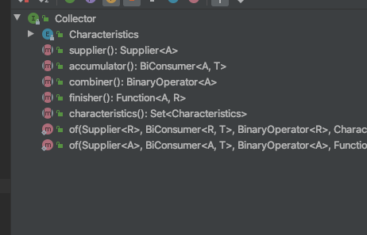
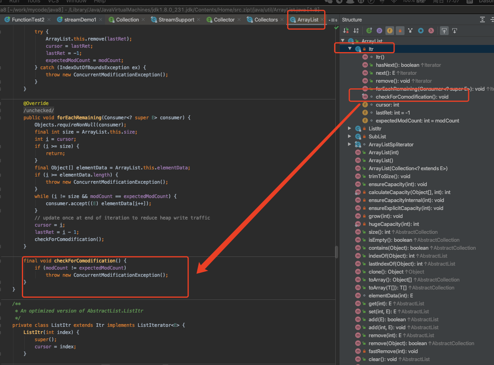
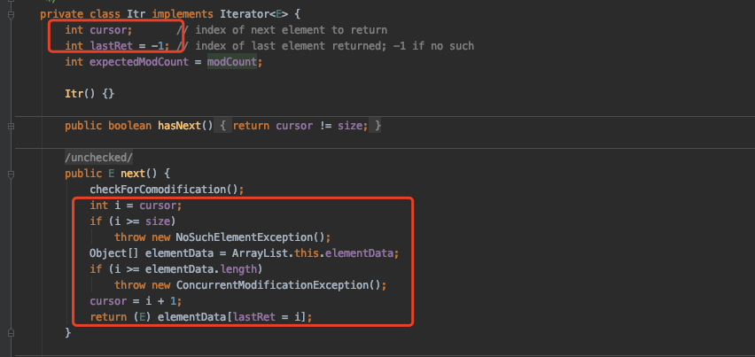
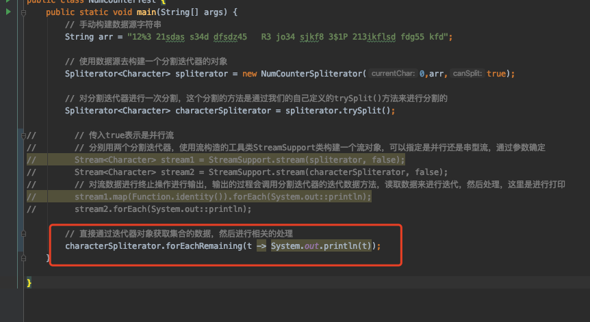

# java8自问自答

### 1.什么场景下使用方法引用

> 在java8引出了函数式接口以及lambda表达式，然后在我们对集合数据处理的时候，就会写函数式接口的实现lamdba表达式，如果我们的lambda表达式写的对象，一旦对应的表达式恰好能通过lambda表达式的语法糖也就是方法引用进行进一步的简写的话，使用方法引用就会更为优雅一些（可读性自然也会适当降低），很多情况下我们使用了Intellij IDEA这个优秀的编译器的话，就会自然给我们提示这个lambda表达式可以使用方法引用的方式了，所以根据提示直接使用即可；当然要知道方法引用才能看懂这个lambda表达式。
>
> 再稍微整理一下lambda表达式的四种方式可以简写的方式：
>
> - 引用静态方法：如果当前的lambda表达式的表达意思，刚好在一个类中有一个静态方法对应上，可以使用方法引用
> - 引用对象的实例方法：当前的表达式涉及一个实例对象的操作，而且这个实例对象中有一个方法入参出参跟表达式一样的非静态方法
> - 某个类型任意的实例方法：表达式跟某个类的方法实例表达意思一致，就可以直接使用，可以理解为类::方法
> - 构造方法引用：直接构造方法来匹配表达式
>
> 其实上面几种方式，除了第二种之外其他三种都是类似的，都是直接通过类名调用，静态方法，构造方法，普通方法其实就是所有的类方法都可以，反正直接使用第二种获取到一个类对象实例这种方式基本上没有用
>
> | 类型                             | 示例                                 |
> | -------------------------------- | ------------------------------------ |
> | 引用静态方法                     | ContainingClass::staticMethodName    |
> | 引用某个对象的实例方法           | containingObject::instanceMethodName |
> | 引用某个类型的任意对象的实例方法 | ContainingType::methodName           |
> | 引用构造方法                     | ClassName::new                       |

### 2.函数式接口使用场景

> 关于函数式接口的使用场景，在我们正常的业务开发中很少会使用函数式接口的对象作为参数传递，但是如果在功能性开发的时候或许会使用的比较多，例如：流的收集器对象的实现，流的各种中间操作的实现等；函数式接口，对于我们使用的话，更多的是对Stream的各种中间操作的函数式接口的入参传递一个lambda表达式作为其实现来使用；对于常用的几个函数式接口，Consumer，Predicate，Function，Supplier等一系列的使用就不多说了，函数式接口主要看那个唯一的抽象方法的出入参数，具体使用就不多说了
>
> 衍生一个问题：lambda表达式算不算事函数式接口的实现类？
>
> 是，函数式接口的实现类，因为函数式接口是一个接口，但是我们进行传递的操作的时候是具体的操作，而且加上Intellj IDEA的提示，看对应函数接口实现的时候，就会将lambda表达式也作为实现类展示出来

### 3.Optional关键字最佳实践

> Optional这个关键字就是对返回结果的对象做了一层封装，这个Optional对象不能保证我们要的返回的结果就是非空的，但是它提供了一种优雅的方式来让我们特别注意到我们获取的结果对象进行了一层封装，我们可以优雅地处理接口的返回结果，显性地通过这个对象来处理返回Optional封装的结果为空的情况，就是一个提醒作用；
>
> 什么是Optional?
>
> - 它是box类型，保持对另一个对象的引用。
> - 是不可变的，不可序列化的
> - 没有公共构造函数
> - 只能是present 或absent
> - 通过of(), ofNullable(), empty() 静态方法创建。
>
> 从这个盒子box中如何获取值？
>
> - get()
> - orElse()
> - orElseGet()
> - orElseThrow()
>
> 不建议使用方式就是if(optional.isPresent){} 这种使用方式，应该使用更优雅的，shuaige.ifPresent(item -> System.out.println(shuaige.get())); 这样连着一个函数式接口的方式，因为用isPresent()这种方式跟判断是不是null一个写法，都没有发挥Optional的用处；以后对外的接口可以都使用Optional<T>对象来进行封装返回，显得专业一些，不经意间展示了一个高级

### 4.java内置的比较器的默认排序算法

> java内置的比较器我们可以直接使用，用起来也是非常方便的，我们只需要简单写一个lambda表达式即可，就会对我们的集合数据进行了特定的比较排序比较，整个底层实现大概就是一个：模版方法设计模式，就是固定了一套的数据比较方法，根据入参进行比较；对于集合进行排序，入参就是一个比较器，具体的实现就是按照我们入参的比较方式来进行比较之后进行排序；这个就是整个的底层实现大概原理，这个更为底层的排序算法是有两个排序算法的，最终调用的排序是数组的排序ArrayList.sort()这个排序方法，再深入底层就是如果数量少于32位就是使用的二分排序算法进行数据的比较如果数据量大于32位的，就会调用分区比较法来进行集合的排序

### 5.简单总结一下Collector收集器

> 
>
> 直接看一下收集器对象接口，主要是几个构成部分：supplier()方法创建一个容器来手机Stream流中分割迭代器获取的数据源的数据对象，然后accumulator()方法就是将Stream流管道中的数据添加到管道中，combiner()方法就是如果收集器有并发的属性的话，就会有多个容器来接收数据这里就会通过这个方法将不同集合中的数据合并到一个中，finisher()方法就是将容器对象类型的数据转换成我们想要的目标容器类型的对象，但是如果supplier()方法创建的中间容器等同于结果容器这个收集器的特性就会包含这个**IDENTITY_FINISH**值，就不需要调用finisher()方法，把上层接口的方法说了一遍基本上就能知道收集器的用处了，因为我们Stream流是将数据源的数据经过管道以及各种中间操作后就会等到一个数据集，然后我们通过collect()这个方法来将处理结果的对象收集起来，在这个收集的过程我们可以多线程处理也可以单线程处理，然后在给收集器的中间容器添加数据的时候可以处理一下数据变成我们想要的样子也可以在finisher()方法中对中间容器的对象的进行再一次加工处理，总之解释将数据收集器来的一个对象类
>
> 需要注意一点的就是：如果一个Stream是并行流，但是收集器不是的话，这个过程是怎么样的？然后相反呢？印象中就是仅仅是一方是并行的话，会有多线程池处理，但是中间容器中有一个，当然最好的情况就是多个线程多个中间容器的情况，这两个要结合使用，多注意点
>
> 再来补充一下：
>
> 现有的Collectors内部提供的一系列的方法是怎么实现的？大概就是，现有的Collectors的内部类对象CollectorImpl实现类接口，但是这个实现也是类似函数式接口那种实现，因为接口的返回值都是函数式接口对象，CollectorImpl内部有需要返回的各种对象属性，然后提供对外的构造方法来给外部通过构造方法入参Collector的方法的返回值，也就是通过调用方使用函数式编程也就是lambda表达式来确定Collector的行为，也就是这个收集器的容器是入参确定，这个收集器收集的元素也是调用方确定，这个收集器合并方式以及怎么合并也是调用方入参确定，这个返回值类型也是，然后这个收集器收集元素的处理逻辑也是调用方确定，其实就是accumulator()的方法体确定所有的运算

### 6.java.util.stream.Collector.Characteristics着三个枚举值意义

> ```java
> /**
>  * Characteristics indicating properties of a {@code Collector}, which can
>  * be used to optimize reduction implementations.
>  */
> enum Characteristics {
>     /**
>      * Indicates that this collector is <em>concurrent</em>, meaning that
>      * the result container can support the accumulator function being
>      * called concurrently with the same result container from multiple
>      * threads.
>      *
>      * <p>If a {@code CONCURRENT} collector is not also {@code UNORDERED},
>      * then it should only be evaluated concurrently if applied to an
>      * unordered data source.
>      */
>     CONCURRENT,
> 
>     /**
>      * Indicates that the collection operation does not commit to preserving
>      * the encounter order of input elements.  (This might be true if the
>      * result container has no intrinsic order, such as a {@link Set}.)
>      */
>     UNORDERED,
> 
>     /**
>      * Indicates that the finisher function is the identity function and
>      * can be elided.  If set, it must be the case that an unchecked cast
>      * from A to R will succeed.
>      */
>     IDENTITY_FINISH
> }
> ```
>
> 其实直接看文档就差不多了，这里再简单说明一下，CONCURRENT指的是并行处理，也就是收集器是多线程多个容器来处理的，UNORDERED指的是无序的，也就是中间容器是无序的类似Set集合一样，IDENTITY_FINISH这个特性就是中间容器跟结果容器是一样的不需要调用finisher()方法来进行数据进一步收集的处理

### 7.Stream接口提供的一系列的流元素操作方法跟Collectors收集器对象的一系列操作方法的区别是什么？

>整体而言，Stream提供的很多方法，有很多的中间操作也有不多的最终操作，最大的区别在于对数据的处理方式不太一样，在Stream的各种管道操作方法方法之间是动态的链式的调用的，非常方便的组装操作的，在收集器中就是固定四个方法，对中间流的操作结果等到的流对象数据进行收集然后用我们常用的收集容器将数据收集起来使用
>
>总之都是对数据的处理，不太一样的就是数据处理的实现方式不一样以及目的不一一样，中间操作的实现方式是给予Sink对象的协议来将数据串联起的，收集器就是通过接口的几个方法将数据收集起来然后通过收集器对象将数据输出。

### 8.为什么多线程读写集合会出现并发操作异常java.util.ConcurrentModificationException

> 我们先来看一下，ArrayList集合的遍历，就是通过迭代器来进行遍历迭代的
>
> 
>
> 再看，每次迭代调用的方法就是hasNext()方法，这个方法就是迭代集合中的数据，获取出来，注意，同时这个会改变读取的数据的下标，这个下标在上面的checkForComidification()方法中会进行判断，如果不等预先的值就会抛并发修改异常
>
> 
>
> 如果多个线程同时操作的话，a线程操作的过程中b线程又来操作了，又因为a线程还没执行完毕，这样导致迭代的过程中调用校验是否并发方法的下标不一致，就会抛异常了，这个是迭代器的遍历设计如此，不需多线程同时迭代一个集合，避免很多多线程操作出现的问题，这个就是为什么多线程读取会抛异常了，因为一个线程没执行完的话，导致迭代的时候计算值的变更不一致

### 9.分割迭代器的用处是什么？跟迭代器的区别？

> 都是对集合数据进行遍历的对象，其实都是对数据进行遍历的，在java内置的集合对象中都有这两个迭代器对象的实现用来对当前的集合的迭代。分割迭代器跟迭代器的最大区别在于，分割分割迭代器是迭代器的升级版本支持多线程并发读取数据，数据量大的时候或者我们使用并行流多线程进行数据操作，多线程并发读取数据是很有必要的，这个也是随着现在的计算机硬件升级后处理器支持多线程操作用于提升系统的处理效率的非常重要的升级
>
> 对于分割迭代器，更细一点可以去看前面的文章，有比较详细的介绍，每个方法的用处如何实现以及如何使用；可以自定义一个分割迭代器就明白了，或者直接找一个集合去看其内部类的分割迭代器的实现，我们在迭代一个集合的时候其实可以直接通过其提供的分割迭代器来进行迭代，这是更为底层一点的遍历数据，具体迭代的如下图：
>
> 

### 10.Stream流到底是什么？

> - 1.使用匿名方法或者闭包的方式去计算处理数据
> - 2.用来替代函数式接口的简化写法，让我们可以write less do more 
> - 3.主要用途是用来实现用来支撑java的函数式编程，这就引出一个函数式接口
> - 4.lambda表达式为java添加了其对比其他语言所缺失的函数式编程特性，使得我们可以将函数当作一等公民（在函数当作一等公民的语言中，java又是相对特殊的一个，因为它是基于函数式接口的而且尽管是一个函数作为传递但是还是一个对象存在）
>
> 用通俗一点的说法就是，一个数据流的管道对象，将分割迭代器迭代出来的一个个数据源的对象，经过我们Stream的一系列串联的方法串联操作之后，等到我们想要的数据，最后将其收集起来或者做相对应的计算，就是一个新型的集合计算处理对象

### 11.为什么收集器接口只有一个实现类就能实现那么多的功能，而且还是作为一个内部类存在？

> 收集器对象只有一个实现，但是这个实现是函数式接口的实现，更重要的对应的方法拼接一个的lambda表达式，用来构建一个收集器对象的构造方法的入参，构造出一个对象。然后这个收集器对象会经过java的一个模版方法，将整个收集器对象的方法执行后得到我们想要的结果，这个过程应该是模版设计模式实现的，没有进一步深入研究了

### 12.整理一下Collections这个集合工具类的常用方法

> 这个工具类应该也是一个比较重要的实现，因为是集合对象的工具类，有很多对集合相关操作，主要的集合相关操作就是：创建一个集合，集合中求最大最小值，集合排序等，相关的方法
>
> - Collections.unmodifiableSet() 创建一个不可修改的Set集合，还可以创建不可变更的List，Map等类似的
> - Collections.sort() 集合排序
> - Collections.copy() 集合复制
> - Collections.singleton() 创建一个单元素的集合
> - 还有一系列方法，但是整体而言用的不多，就这几个稍微留意一下即可

### 13.流为什么是惰性求值的？跟流的中间操作原理有关系

> 这个是跟流的结构设计相关的，流之间的各个操作都是通过Sink协议连接起来的，只有遇到终止操作的时候，才会将所有的中间操作创建的对象的opWrapSink()方法初始化完成，所以流的结构设计如此，更为详细的看Stream分析前面的文章

### 14.Stream的高效性体现在哪里？

> 流的高校体现在，挺多的地方的，主要几个点：支持多线程并行操作（运用多核特性(forkAndJoin)并行处理），支持短路，数据处理是每迭代一个数据就执行完成整个数据流的处理流程，还有非常优雅的写法等相关的，整个设计是惰性求值需要用到的时候才会去触发执行

### 15.如果你想真正的搞透parallelStream,那么你依然需要先搞透ForkJoinPool

> https://github.com/CarpenterLee/JavaLambdaInternals/blob/master/7-ParallelStream.md

### 16.Stream并行流的利弊

> [答案整理自网上](https://github.com/CarpenterLee/JavaLambdaInternals/blob/master/7-ParallelStream.md)
>
> 使用parallelStream的几个好处：
>
> 1. 代码优雅，可以使用lambda表达式，原本几句代码现在一句可以搞定；
> 2. 运用多核特性(forkAndJoin)并行处理，大幅提高效率。 关于并行流和多线程的性能测试可以看一下下面的几篇博客：
>    [并行流适用场景-CPU密集型](https://blog.csdn.net/larva_s/article/details/90403578)
>    [提交订单性能优化系列之006-普通的Thread多线程改为Java8的parallelStream并发流](https://blog.csdn.net/blueskybluesoul/article/details/82817007)
>
> 然而，任何事物都不是完美的，并行流也不例外，其中最明显的就是使用(parallel)Stream极其不便于代码的跟踪调试，此外并行流带来的不确定性也使得我们对它的使用变得格外谨慎。我们得去了解更多的并行流的相关知识来保证自己能够正确的使用这把双刃剑。
>
> parallelStream使用时需要注意的点：
>
> 1. **parallelStream是线程不安全的；**
>
> ```java
> List<Integer> values = new ArrayList<>();
> IntStream.range(1, 10000).parallel().forEach(values::add);
> System.out.println(values.size());
> ```
>
> values集合大小可能不是10000。集合里面可能会存在null元素或者抛出下标越界的异常信息。
> 原因：List不是线程安全的集合，add方法在多线程环境下会存在并发问题。 当执行add方法时，会先将此容器的大小增加。。即size++，然后将传进的元素赋值给新增的`elementData[size++]`，即新的内存空间。但是此时如果在size++后直接来取这个List,而没有让add完成赋值操作，则会导致此List的长度加一，，但是最后一个元素是空（null），所以在获取它进行计算的时候报了空指针异常。而下标越界还不能仅仅依靠这个来解释，如果你观察发生越界时的数组下标，分别为10、15、22、33、49和73。结合前面讲的数组自动机制，数组初始长度为10，第一次扩容为15=10+10/2，第二次扩容22=15+15/2，第三次扩容33=22+22/2...以此类推，我们不难发现，越界异常都发生在数组扩容之时。 `grow()`方法解释了基于数组的ArrayList是如何扩容的。数组进行扩容时，会将老数组中的元素重新拷贝一份到新的数组中，通过`oldCapacity + (oldCapacity >> 1)`运算，每次数组容量的增长大约是其原容量的1.5倍。
>
> ```java
>    /**
>     * Increases the capacity to ensure that it can hold at least the
>     * number of elements specified by the minimum capacity argument.
>     *
>     * @param minCapacity the desired minimum capacity
>     */
>    private void grow(int minCapacity) {
>        // overflow-conscious code
>        int oldCapacity = elementData.length;
>        int newCapacity = oldCapacity + (oldCapacity >> 1);// 1.5倍扩容
>        if (newCapacity - minCapacity < 0)
>            newCapacity = minCapacity;
>        if (newCapacity - MAX_ARRAY_SIZE > 0)
>            newCapacity = hugeCapacity(minCapacity);
>        // minCapacity is usually close to size, so this is a win:
>        elementData = Arrays.copyOf(elementData, newCapacity);// 拷贝旧的数组到新的数组中
>    }
> 
> 
>    /**
>     * Appends the specified element to the end of this list.
>     *
>     * @param e element to be appended to this list
>     * @return <tt>true</tt> (as specified by {@link Collection#add})
>     */
>    public boolean add(E e) {
>        ensureCapacityInternal(size + 1);  // Increments modCount!! 检查array容量
>        elementData[size++] = e;// 赋值，增大Size的值
>        return true;
>    }
> ```
>
> 解决方法： 加锁、使用线程安全的集合或者采用`collect()`或者`reduce()`操作就是满足线程安全的了。
>
> ```java
> List<Integer> values = new ArrayList<>();
> for (int i = 0; i < 10000; i++) {
>     values.add(i);
> }
> List<Integer> collect = values.stream().parallel().collect(Collectors.toList());
> System.out.println(collect.size());
> ```
>
> 1. parallelStream 适用的场景是CPU密集型的，只是做到别浪费CPU，假如本身电脑CPU的负载很大，那还到处用并行流，那并不能起到作用；
>
> - I/O密集型 磁盘I/O、网络I/O都属于I/O操作，这部分操作是较少消耗CPU资源，一般并行流中不适用于I/O密集型的操作，就比如使用并流行进行大批量的消息推送，涉及到了大量I/O，使用并行流反而慢了很多
> - CPU密集型 计算类型就属于CPU密集型了，这种操作并行流就能提高运行效率。
>
> 1. 不要在多线程中使用parallelStream，原因同上类似，大家都抢着CPU是没有提升效果，反而还会加大线程切换开销；
> 2. 会带来不确定性，请确保每条处理无状态且没有关联；
> 3. 考虑NQ模型：N可用的数据量，Q针对每个数据元素执行的计算量，乘积 N * Q 越大，就越有可能获得并行提速。N * Q>10000（大概是集合大小超过1000） 就会获得有效提升；
> 4. parallelStream是创建一个并行的Stream,而且它的并行操作是*不具备线程传播性*的,所以是无法获取ThreadLocal创建的线程变量的值；
> 5. **在使用并行流的时候是无法保证元素的顺序的，也就是即使你用了同步集合也只能保证元素都正确但无法保证其中的顺序**；
> 6. lambda的执行并不是瞬间完成的，所有使用parallel stream的程序都有可能成为阻塞程序的源头，并且在执行过程中程序中的其他部分将无法访问这些workers，这意味着任何依赖parallel streams的程序在什么别的东西占用着common ForkJoinPool时将会变得不可预知并且暗藏危机。

### 17.java调用迭代分割器（数据映射）获取数据的触发点是什么操作或者什么时候，也是终止操作？

> 对的，只有遇到终止操作后，一个流才会去讲整个流处理数据的流程执行的过程的opWrapSink()的每一个中间操作的返回的Stream的方法初始化完成，在终止操作中分割迭代器迭代出来的数据就会一个个去调用整个数据处理流的链式调用流程


