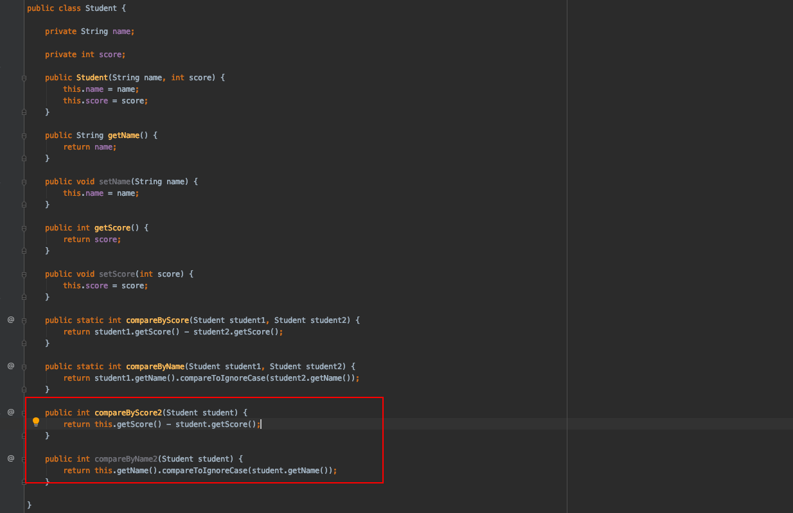

# lambda+函数式接口+方法引用

> **本文介绍一下什么lambda表达式，以及跟lambda表达式相辅相成的函数式接口，常用的几个函数接口使用，以及lambda表达式的语法糖方法引用的几种方式使用**

### 一.lambda表达式入门

##### 1.什么是lambda表达式

> lambda表达式就是：使用匿名方法或者闭包的方式去计算使用
>
> 非常直接的说法就是：用来替代函数式接口的简化写法，让我们可以*write less do more* 

##### 2.为什么需要lambda

> java作为一个面向对象语言，我们在方法中数据交互传递的都是**值**在对比其他语言的更加灵活的属性我们发现不仅仅是可以进行**值**传递，还可以进行**方法**传递，例如在javaScript中是非常常见，因为只能进行值传递，使得有些时候我们编写代码会比较复杂（例如一个一个对象的十个属性进行处理，我们可能需要写对应的是个方法，入参是对应的属性来处理相关的业务逻辑，但是如果入参是一个属性+一个方法，我们就可以写一个比较通用的方法来处理各种情况，具体操作逻辑作为函数式接口的实现lambda表达式传递进来）；所以为了处理这个短板，java8提出了函数式接口，使得简化一些场景的代码开发工作；除了这个之外，我们还可以使用lambda替代很多常用的匿名内部类的使用

##### 3.lambda表达式上下文

我们在使用lambda表达式的时候，如果不结合上下文的话，那么很多时候我们写的lambda表达式是没有意义的，例如我们写这样一个表达式***() -> {};*** 我们完全不知道是啥，但是如果我们结合了上下文，也就是该lambda表达式的接口定义来使用，这个表达式就是有意义的，就是对应的函数式接口的抽象方法实现，也可以说是该函数式接口的实现类，如下图，我们就知道这个lambda表达式就是**TheInterface**的实现


说起上下文，我们顺便提一下，在我们平常编程的时候，用到这种写法是在jdk1.8开始的，这种写法教钻石语法也叫棱形语法，编译器能够通过这个对象的接口泛型入参确定后面的类型对应类型而不需要定义实例的时候前面跟后面都明显写出来```List<String> list = new ArrayList<>();// diamond``` 这样我们只需要确定前面的泛型，而不需后面再写明；

##### 4.lambda表达式的两种```Stream``` 

在java 中lambda表达式有两种流，一种是串型流一种是并行流，两种流的区别在于是单并发还是多并发，如果是单并发就是一个线程来执行整个流的操作，如果是多并发就是多个线程执行，提升效率

``` list.stream(); //这个是串型流  list.parallelStream(); //这是并行流 ``` 


而且对于流的操作，操作结果也有两种状态，一个是最终状态流，一个是中间态，中间态可以继续操作，可以继续使用相关的方法处理我们的数据，而最终态就是操作结果，可以直接输出

那么一个集合是怎么样转成一个**流**的呢？这个是在我们集合的基础接口**Collection**中的默认方法提供的实现，而且创建的调用方法其实是一样的就是一个基本入参是否并发的区别


### 二.函数式接口

##### 1.什么是函数式接口

首先先看一下javadoc文档的说明：


说了那么多，总之就是：**如果一个接口里面有且只有一个抽象方法，那么这个接口就是函数式接口；** 更多的详细的说明如下几点

> - 1.如果一个接口有且只有一个抽象方法（这个抽象方法不包括**Object**中包含的方法）
> - 2.如果一个接口使用了函数式接口的注解声明**@FunctionalInterface**,那么在java的编译器中就会将其当作一个函数式接口的要求来处理；（如果这个接口的不符合，就无法编译通过）
> - 3.如果一个接口，有且只有一个抽象方法，就算这个接口没有使用**@FunctionalInterface**，那么编译器依旧将其看作函数式接口

对于上面说的第2点补充说明一下：一个使用了函数式接口注解声明的接口，如果不满足1.不是注解类的对象，枚举类对象，普通类对象，也就是这几种类型都不是；2.这个接口的满足其有且只有一个抽象方法（当然还可以有很多默认方法，只要有一个抽象方法，而且这个方法跟**Object**的方法不重复即可，因为***Object***中的方法所以的java文件都会有）；

对于上面第3点补充说明：一个接口使用**@FucntionalInterface**声明会在编译器进行校验，有点类似@Override注解一样，声明了就会进行一些对应的校验，在我们使用对应的注解之后，其实idea也会提示不合法，如果不按照对应的注解的规范编写代码的话

##### 2.函数接口一些要点补充


如上图函数式接口的javadoc文档所描述：如果一个接口的各个条件都满足函数式接口的要求，但是这个函数式接口中唯一的一个抽象方法是java.lang.Object的方法重写的话，这个接口不会认为是函数式接口，因为对于这个接口的实现类，就算是实现了该抽象方法，也算是重写了Object对象的方法，对于一个普通类来说都会有该方法的，所以函数式接口的唯一抽象方法是除了Object对象所包含的方法之外的方法


##### 3.lambda表达式跟函数式接口的关系

lambda表达式的起源就是函数式接口，在java中想要使用lambda表达式，那么必须得有函数式接口来承载，怎么承载呢？

> 就是如果我们想在函数方法中传递函数，那么方法的入参就是一个函数式接口对象，然后我们在方法的实现类中调用函数式接口的抽象方法进行相关的操作，但是这个相关操作的逻辑是我们在调用方传递过来的，所以传递的就是一个函数式接口的实现类，其实就是对应的这个函数接口的抽象方法的实现的lambda表达式。

尽管说在java8之后，函数也可以传递，作为跟对象一样一个一等公民，但是在java中其实际上还是作为一个对象存在，尽管是传递的函数，但是底层还是被当作一个对象


lambda表达式也就是函数式编程中，正是将其一等公民对待，也就是其也能想普通对象那样进行传递了，但是跟其他语言不一样的是，其他类型的语言例如ruby或者 javaScript这些语言中是作为一个函数存在，但是我们java中只是作为一个对象存在的，其必须依附在函数式接口中，所以函数式接口的实例就是一个对象

##### 4.lambda的作用

- lambda表达式为java添加了其对比其他语言所缺失的函数式编程特性，使得我们可以将函数当作一等公民
- 在函数当作一等公民的语言中，java又是相对特殊的一个，因为它是基于函数式接口的而且尽管是一个函数作为传递但是还是一个对象存在

简单说一下lambda的基本写法：

- 基本写法： (arg1) -> {body}，(arg1 ,arg2) -> {body}

- 示例：(int a ,intb) -> {return a+b},() -> System.out.println("张震")；() -> "张震"; 

- Lambda 结构 ：

  > 
  >
  > 
  >
  > 写lambda表达式的时候又个小细节需要特别注意一下的：就是我们写lambda表达式体的时候，如果有多条语句就要用花括号{}包起来，如果只有一条语句也是可以用花括号包起来的，但是，所有使用花括号的场景都需要使用分号"***;***"结尾，不然编译会报错
  >
  > 使用了花括号就是**statement**风格，不使用花括号的单号就是**expression**风格的写法
  >
  > 

  

##### 5.函数式接口的对象创建


我们可以看到，一个函数式接口的实例创建的方式有三种，注意一下就是这三种都是使用lambda这种方式来获取的实例，不包括默认的直接继承接口实现抽象方法以及内部类实现抽象方法这两种方式

对于lambda的方式创建的实例其实方法引用的方式跟构造引用都是类似，就是lambda表达式就是普通lambda表达式的写法，方法引用就是一种语法糖写法，更简化一些写法，构造引用也是，另一种构造的方式来简化写法

先来简单看一下那三种创建函数式接口实例的其中两种：

然后就是构造引用的方式：


##### 6.函数式接口-Function

java8内置的函数式接口挺多的，这里抽几个比较重要的来重点说明一下，首先第一个就是***Function***接口


文档描述非常简单：*代表一个函数接收一个参数，返回一个结果*；该函数式接口的唯一的抽象方法就是 ***R apply(T t);*** 非常的简洁明了，就是对一个参数进行处理后返回一个结果

这个跟普通的我们直接用面向对象的方式写的方式的区别在于，使用面向对象的方法进行处理，如果想对一个变量进行不同的处理然后返回一样的结果的话，常规的做法是每一种处理方式写一个方法，但是在函数式接口中相反的是，定义一个统一的抽象方法，然后在调用端通过lambda表达式来确定对应的处理逻辑


我发现我以前以为自己懂得使用lambda表达式了，是个大错误，只能说懂得使用来进行集合的一些基础操作，深入一点的根本就不知道，就像这个demo，其实我们定义的方法只有一个，如上图，我们只定义了一个方法compute，但是我们这个方法可以做很多事情，而且是不同的业务处理的，因为这个方法对入参的具体操作，是通过我们调用方法写的lambda来实现的（跟我们之前的面向对象的编程是不一样的，面向对象的行为都是定义好的，通过值传递来处理返回结果，这里是通过传递行为去处理，调用方确定行为）；上面图的两种方式实现的效果都是一样的，但是写法差别很大，明显函数方法的方法减少很多代码工作量，以后得转变一下代码方式，下图表达的意思是使用lambda表达式简化开发，不使用内部类来实现我们需求，通过传递函数式接口的方法实现也就是一个函数式接口来进行排序


理解Function的关键在于，当我们把Function入参传递的时候，传递的不是值了而是一种行为，在调用方调用的时候通过lambda表达式的方式确定行为

上面的案例的方式是很简单，但是前提是入参的操作方法也很简单，如果入参的操作方法比较复杂的话，我们将业务处理的lambda表达式体写的太长，不美观，所以我们可以实现定义好函数式接口的实现对象的lambda表达式，然后将该对象传递进去


其实这里就涉及到一个更高级一点的定义：***高阶函数*** ；什么是高阶函数呢？——就是一个方法的入参是一个函数，返回结果也是一个函数，那么这个函数就是一个高阶函数，在java中lambda的使用场景，更多的是我们使用java提供的很多内部高阶函数，目前写的比较少，但是java里面倒是挺多这样的封装方法，返会一个函数式接口对象我们再获取对象来进行处理，就像函数式接口Function的一些内部默认方法的返回结果就是一个函数式接口，入参也是，如下图


就如上面说的，这两个方法其实就是一个高阶函数，因为函数式接口的引入java也支持了高阶函数。回归到***Function***这个函数式接口的上面高阶函数的两个方法的用处

***compose()***这个函数方法，顾名思义就是组合，入参是一个Function函数式接口，返回的结果是也是一个Function函数式接口，这个方法的用处是将入参的函数式接口的执行结果当作当前返回的函数式的返回值，就是将多个Function函数式串联起来，将一个函数式接口的执行结果当作下一个函数接口的入参，如此拼接起来

***andThen()***是刚好相反，就是将当前函数的执行结果当作入参函数式接口的接收的唯一入参，然后我们可以写一个对应的业务处理方法去处理该入参，也就是将当前的入参函数式接口的入参值固定了，就是当前的执行结果。

直接看一个使用demo，可以看到第一个就是先执行2 * 2=4，然后4作为参数去执行value* * 3 =12，然后第二个的执行结果是2 * 3 =6，然后 6 * 6 =36，大概就是这个意思，具体的使用细节的话可以研究一下


##### 7.函数式接口-Bifuction

上面说的Function这个函数式接口的入参是一个返回结果也是一个，这是比较常用的场景，但是还有两个入参一个返回值的场景也是比较常用的，所以jdk默认基于Function给我们提供了一个BiFunction函数式接口


这个函数式接口跟Function其实区别不大，使用的区别仅仅是一个是两个入参一个返回结果，一个是一个入参一个返回结果，使用差别不大，比较经典的使用场景就是，两个数的运算，得到一个结果


我们可以留意到，上面的BiFunction的函数式接口的默认默认方法比Function少了一个copose（）方法，为什么呢？因为BiFunction的入参是两个，返回结果是一个，如果有compose方法，执行结果只有一个入参是不能满足条件的，所以只能是andThen()方法，当前的BiFunction执行结果是Function函数式接口入参。那为什么这个默认方法的返回值是一个BiFunction呢？因为这是一个整体的，这个函数包含了两个函数，接收的参数是两个，返回结果是一个，经过这个方法处理后的函数自然是需要是第一个调用的方法的入参（总之感觉很别扭，但是因为这个返回的是两个函数的结合，所以被调用的时候，需要入参是第一个函数的入参，返回结果是第二个的返回结果的一个整体函数）


使用lambda表达式需要注意的一点就是，我们表达式body只有一行的时候建议使用expression表达式的方式处理，如果是expression表达式处理并且有返回值的话，这个return这个关键字也可以省略的，编译器能够根据上下文识别（写代码的时候编译器会提示最优方式的了，但是前提自己也能写不能只依赖idea，这样你就没啥子用了）

##### 8.函数式接口-Predicate

说完了Function函数式接口，继续说Predicate函数式接口，这个函数式接口就是接收一个参数，处理之后返回一个boolean值


自然也能想到其的用法了，就是接收一个参数然后返回的结果是true or false，然后根据这个返回结果进行下一步的处理


不多说了使用的话，看上面的demo大概就知道怎么使用了，但是实际开发中似乎没什么使用的场景？这个没怎么发现

继续说一下Predicate函数式接口的默认方法：***and() ,or() ,negate()*** 这三个方法，都是围绕着逻辑运算符来的，因为Predicate函数式接口的唯一抽象方法结果就是返回一个boolean值，所以如果一个Predicate函数式接口表达式调用接口and(Predicate other )之后执行的结果就是两个函数式接口的实现lambda表达式的***与***操作，两个都是true才是true；然后同理，使用or()方法就是两个Predicate的实现lambda表达式的结果一个是true就是true，就是***或***操作，一个Predicate的函数式接口的对象调用negate（）方法的话就更加简单了，就是直接的***非***操作，是变成否


##### 9.函数式接口-Supplier


这个Supplier函数式接口的用处也是简洁明了，不接受参数返回一个对象；这个的使用场景可以是用来创建无参的方法对象，或者工厂方法返回一个对象，如果是有参数的工厂方法可以使用Function的函数接口，看一下使用demo，脱离不了它的核心用处，就是不接受参数，创建一个对象或者调用一个方法返回一个对象


其实这个接口说的话，也没什么特别好说的，基本上函数式接口都比较简单，因为非常抽象，具体实现都是我们在调用的时候确认

##### 10.一些其它函数式接口

我们开发中比较常接触的函数式接口主要是：Function，Predicate，Supplier，Consumer，这几个，对于***Consumer***这个函数式接口


也是比较简单，就是接收一个参数不返回结果的这样一个抽象接口，然后也有andThen()这个方法，用处也是比较清晰的就是执行结果是一个对象，作为入参的函数的入参

然后还有***BinaryOperateor***这个函数式接口，这个接口是BiFunction的函数式接口的特殊场景，就是入参两个以及返回结果都是同一类型，但是对于实际使用其实跟原来的BiFunction基本上没有区别


其实对于**BinaryOperateor**这个函数式接口的基本使用没什么特色，其重点在于它的两个默认方法的实现，因为是静态方法可以直接调用，它的用处是创建了一个函数式接口，入参一个比较器，然后返回一个BinaryOperateor接口，这个接口再调用的实现就是方法定义的那样，入参两个对象，然后执行我们入参的比较器，执行比较后如果是**minBy()**就是获取比较小的那个对象，如果是**maxBy()**就是获取比较大的


经过这些例子，最重要的一点就是需要我们反思转变思考的一种方式，我们不能再用以前的方法调用就是通过参数传递然后在方法里面的具体逻辑处理了，现在函数接口的处理方式就是，先是定义一个不明确的通用方法，然后具体执行逻辑通过我们的函数接口的实现--lambda表达式定义的根据对应的函数接口的的唯一抽象方法的入参以及出参写的函数接口的实现，作为参数传递进去处理我们的数据的，这个是跟我们传统的java面向对象不一样的，面向对象就是对对象进行处理，传递的也是对象，业务逻辑再方法中，但是函数接口，方法逻辑可以作为参数传递进去

##### 11.Optional用处

***Optional***的诞生就是为了解决空指针异常而出现的，因为空指针是在我们java开发中特别烦人的一种情况了，需要不断的判断，做了非常多的没有必要的工作，使得代码不优雅；直接翻译Optional就是可选的，Optional结果就是可选的，可以根据结果去判断怎么处理；这个是跟lambda表达式一样在java8中一起出现的，很多时候可以作为lambda表达式的结果对象存在；

Optional是一个基于值的类，而且是一个final的类，所以我们创建Optional的对象的方法一般使用工厂方法，也就是使用Optional内部提供的对外创建的静态方法来创建Optional对象


对于我们使用Optional我们不建议使用常规的面向对象的方式来写代码，类似这种if (optional.isPresent()) {} 这种方式是不推荐的，这样还不如直接获取结果来判断是不是空，何必再封装一层呢？我们使用Optional，就应该使用lambda表达式的姿势来使用，尽量都是使用Optional内部提供的那些默认方法来处理或者说来判断怎么做


看一下几个比较实用的默认实现方法，内部的几个默认的实现方法都是非常简单实用的，或者直接看javadoc文档就可以使用了，描述的非常清楚明了


Optional有3个构造方法，分别什么时候使用呢？--如果能确保当前的对象一定不为空，就用of()，如果确保为空就用empty()，如果不能确定就是用ofNullable（）构造方法

java8之所以推出Optional这个对象，就是为了用来处理空指针异常的，所以我们懂得利用，这样才能显得高级一些，利用新技术不要呆在原地；对于使用optional这个对象有一定的讲究的，最好的实践就是用来作为一个方法的返回值，这个方法被其他地方调用的时候，就不用我们传统的做一个空判断了。要避免不用使用的场景就是用Optional作为一个参数进行传递，这个是不如不用，或者在方法内部将一个对象封装成Optional对象，这个都是画蛇添足的行为，等于你传递一个值对象然后再将其封装一层，然后获取到之后再通过Optional提供的方法来判断是不是空，还不如直接传递过来判断，还有在方法内部作为一个变量使用也是，直接判断是不是空不是更好为何将其封装一层之后再判断，而且还有一点就是作为对象也不可，因为不可序列化，有点画蛇添足；


### 三.方法引用

我们先来看一下函数式接口的对象的创建方式：

> 如上图的函数好接口的注解javadoc文档所写，我们创建一个函数式接口的实例对象的方式有：**lambda表达式，方法引用，构造方法引用**；
>
> 实际上可以分成两类，**一类就是方法引用，一类就是lambda表达式**，关于方法引用其实有4种写法其中一种就是构造方法引用，所以按细的分有5种方式，其中4种是方法引用的，4种方法引用种有：**静态方法引用，实例方法名，类对象名称，构造方法引用**
>
> PS：目前我所发现的，方法引用的方式似乎只能是结合lambda表达式的一起使用的，不是java的新的语法，只能说是lambda表达式表达方式的另一种优化；并不能脱离lambda使用

##### 1.什么是方法引用

可以理解方法引用是lambda表达式的语法糖，就是lambda表达式的一种约定写法，能够使用更少的代码去表达同样的意思，如下图


方法引用的表示方式，前面已经说了，一共有四种方式：静态方法的方法引用，实例对象的方法引用，类名的方法引用，构造方法的方法引用；

##### 2.方法引用方式一：静态方法引用

首先来看图：


第二张图的两种排序方法，实现的结果都是一样的，根据学生的成绩进行排序，唯一不一样的就是students.sort()；中的入参比较器对象，第一个方法就是使用lambda表达式的方式来正常表示，其实就是符合比较器的用法，入参两个对象，然后返回运算后的大小值。第二个方法就是使用了静态方法的方法引用，直接通过类名称::静态方法的方式进行方法调用；有点非常不一样的是，方法引用是没有入参的。这个默认是将集合中的对象两两作为入参，调用对应的方法。

> ps：需要注意一下，静态方法引用跟静态方法的调用是不一样的，静态方法直接调用就是一种特殊的方法使用方式而已，但是方法引用是一种约定优于配置的方式，而且还是不需要入参的。

##### 3.方法引用方式二：对象实例实例方法引用

用对象（对象实例）::实例方法名称

方法引用的使用方式基本上没什么很大的区别，这个跟前面的静态方法的方法引用唯一的区别在于，前面是直接类对象名称直接调用


> PS：这里先来总结一下前面两种方式的方法引用，第一种静态方法的方法引用，就是在一个实体中定义静态方法入参是当前的对象类型，然后在后面的lambda表达式中，直接通过方法引用来调用。但是这个实体类的静态方法是跟当前对象没啥关系的，把这个方法放到任何地方都可以实现这个功能；
>
> 尽管可以使用第一种方式来实现方法引用，对比之下，第二种更为合适，就是将第一种的静态方法提取出来了，而且还不是静态类型的方法了（当然可以是静态方法，这样的话其实使用就是方法一的方式了），这里是非静态类型的方式，将两个方法放到一个第三方的类对象中
>
> 因为第一种方式，是将静态方法写在当前定义的对象中的（也可以定义别的类中，在第三方类中如果是静态方法就是静态方法引用，如果是普通方法可以直接就是实例方法引用）跟当前的对象其实关系不大，但是我们可以稍微改造一下，因为方法入参是两个，所以我们可以将该方法改成当前对象调用，这就跟当前的对象有关系了，也就是第三种方式了

##### 4.方法引用方式三：类名方法引用

类名::方法名

这种表达方式其实就是基于第一种进行改进的方式，这样以来就是只能定义在实体对象中，入参对象其中一个就是自身




这是第三中方法引用的使用方式，我们留意到，这个调用的compareByScore2只有一个入参，但是sort()方法的入参是一个Comparator函数方法，入参是两个，为什么这里能够匹配起来呢？

- 因为通过这个方法的时候，我们发现调用compareByScore2方法的是一个Student对象实例，然后入参也是一个Student实例这个函数方法就是默认将第一个比较的对象作为调用方，第二个入参最为比较方，实际上还是两个入参对于整个Comparator而言，这种方式就比较取巧了

> PS：前面引出的时候，说了这个方法Comparator比较器的入参是两个，一个变成自身了，另一个是遍历数据流传递进来的另一个对象。但是这里需要灵活变动，也可以这个方法的入参就是只有一个，也是完全可以的，只是定义的方法的时候，不需要传递参数，调用的时候就是数据流的当前对象去调用该方法，同理可以是更多参数，需要的也是自身对象了，因为这个入参必须是stream流中的对象

##### 5.方法引用方式四：构造方法引用

类名::new

整体而言，其实前面三种方法引用，都能归类成一种，这就是为什么函数式接口声明接口说的，函数式接口的对象的创建方式有：lambda表达式，方法引用，构造方法引用；这三种方式了，因为前面三种方法引用的方式其实大同小异的


这个怎么说呢？就是当一个方法的入参是一个函数式接口对象，而刚好这个函数式接口表达的意思跟入参的泛型对象存在的构造方法一致的话（其实就是入参跟返回结果跟这个对象已有的构造方法一致）就可以使用构造方法引用的方式进行处理；目前来看，只有上面的图片这个demo的场景类似才用得着，好像其他地方都不太用得着，也就是一个方法的入参是一个Supplier函数式接口，这个函数式接口的意思很简单就是不入参返回一个对象。目前貌似就是一个方法的入参是Supplier的场景下，而且这个函数式接口的入参泛型有一个入参构造方法，就可以这样使用来创建一个对应的对象实例在方法中使用；

##### 6.方法引用小结

就是一个方法入参是一个函数式接口的话，而且这个函数式接口的泛型对象中存在方法（静态方法，构造方法，自身调用的普通方法，甚至是第三方类的普通方法）跟我们这个函数式接口的表达意思一致的话，就可以使用方法引用。

> PS:使用方法引用的要点
>
> 1.方法引用其实就是lambda表达式的另外一种写法，也就是用来入参是函数式接口的情况的（基本上目前用得着的话都是用来处理stream流的时候场景）
>
> 2.只能是函数式接口作为入参的时候，表达的意思跟函数式接口的入参泛型对象中存在的方法一致情况下，才能用来简化对应的lambda表达式
>
> 3.目前基本上是idea的提示简写就足以了，当然可以自己思考一下别的场景

### 四.额外知识点补充

##### 1.为什么list接口的数据可以使用forEach遍历

> 因为List接口的父类继承了**Iterable**接口，在Interable接口中在jdk8版本添加了一个**forEach**方法以及实现，所以所有的的**Interable**接口的子类都是可以通过**forEach**来进行数据遍历的,这个要归根于java8的接口可以添加默认的实现方法的升级,所以以后，所有的继承Interable接口的数据都是可以通过这个方式进行遍历的，同时还可以同interator的方式进行遍历
>
> 
>
> 
>
> 我们看到**Iterable**接口的forEach方法的实际入参其实是一个函数式接口Consumer（接收一个对象，不返回值的函数式接口），所以上面的通过匿名内部类的写法可以简化成下面这种方式
>
> 
>
> 

##### 2.迭代一个集合两种方式

- 外部迭代：直接对其进行遍历，然后读取底层就是通过readIndex每次读取都是+1的方式，最后没有值就不读取了；就是通过每次获取之后标识的偏移量来确定位置读取

> 
>
> 

- 内部迭代：跟外部迭代不一样的是，就是不需要依靠外部的，直接读取一个个依次读取的

> 
>
> 

##### 3.一个类中可以有多个类或者接口

一个java文件中可以有多个类或者接口，但是只能有一个public类型的，其他的要么private的类或者接口，要么是默认类型

##### 4.方法返回一个集合的处理

注意一下：一个专业的程序员，返回值是一个集合的时候，如果集合为空，就返回一个空的集合，这个是基本常识

##### 5.java8提供的接口默认方法用处以及一些细节分析

这个的话，就是java8新提供的接口的允许写方法的实现，跟以前不一样的地方，实现了由默认方法的接口，就可以直接调用默认方法

这里主要讨论三个问题：

> 1.因为接口是多实现的，如果同时实现的接口方法中有重复的默认方法调用的是哪个的呢？
>
> - 这个问题的话，编译器会帮我们处理的了，如果实现的两个接口都有同一个默认的实现的方法的话，我们需要该类中重写该方法。实际处理方式有两种，一种就是如果我们想使用其中一个接口的默认方法的话，就调用该接口中的默认实现方法，如果两个都不是想要的方法实现的话，就直接重写该方法的实现即可，如果是调用其中一个接口的默认实现方法的话，调用方式就是：方法名称.默认实现方法();
> - 
>
> 2.如果一个类继承的父类中跟实现的接口的默认方法一致，调用该方法的时候调用的哪一个呢？
>
> - 这个问题的话，因为在java的默认的优先级中，实现类的优先级都是高于接口的优先级的，所以这种情况是能够编译通过的，只是会调用继承的类中的实现方法，因为实现类优先级高于接口的
> - 
>
> 3.为什么java8会添加默认方法实现这个功能呢？
>
> - 这个的话，就是很取巧了，因为java 的升级需要添加添加一些新的功能，但是不可能所有的新功能都重新定义接口来处理，很多基于原来的接口进行改造变更的。如果我们直接给一些接口添加抽象方法的话，如果旧项目java版本升级了的话，实现了该接口的类都要去实现该抽象方法了，就会造成无法向下兼容了，对原有的项目功能进行了破坏。所以添加了默认方法实现，这样以来不仅可以兼容旧的项目，还可以添加新的功能，一举两得

