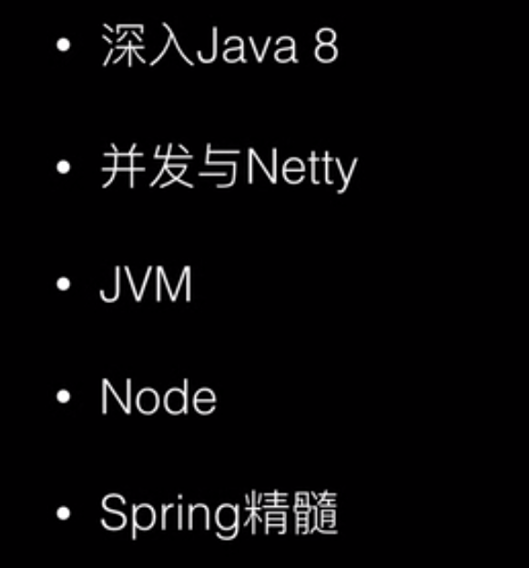
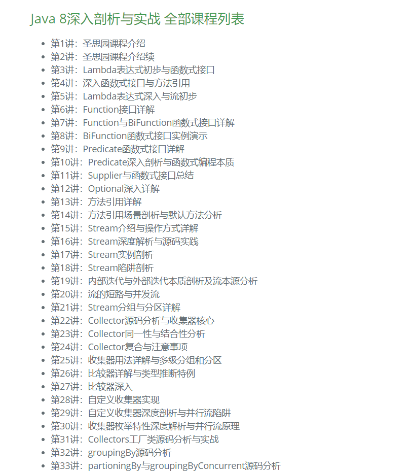
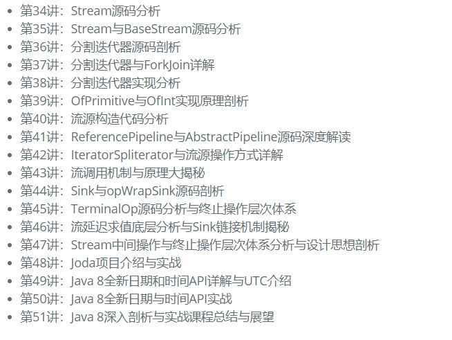

# 学习导论

## 关于学习

### 手段

看书看视频，只是一个手段，绝不能是一个目的，看了视频看了书没意义的，有意义的是看完之后的输出

### 看几遍

视频那些最多不能超过3次，否则就没有了意义，要将其固化成自己的知识体系

一个视频可能只是40分钟，但是你做笔记加上敲代码，总结输出的时间加起来也不会低于视频的时间，这样才有价值

### 怎么做

- 肯定是要动手敲代码，这是最基本的
- 肯定要去看源码
- 肯定要总结输出
- 项目实战

## 关于jdk8

学习难度（小到大）：java8>spring>node>netty>jvm

jdk8主要的事情就是，函数式编程。跟函数式编程相对的是，命令式编程。函数就是将一系列命令集成一个定义好的函数一次调用的方式编程就是函数式编程了

java的面向对象编程在没有函数式编程之前，方法之间传递的都是变量也就是数据（Data），但是在函数式编程中，除了传递数据还可以的是传递一个行为，就是将一个函数作为入参传递然后在另一个方法中执行该函数

[圣思园地址](http://www.iprogramming.cn/jdk8.html)

