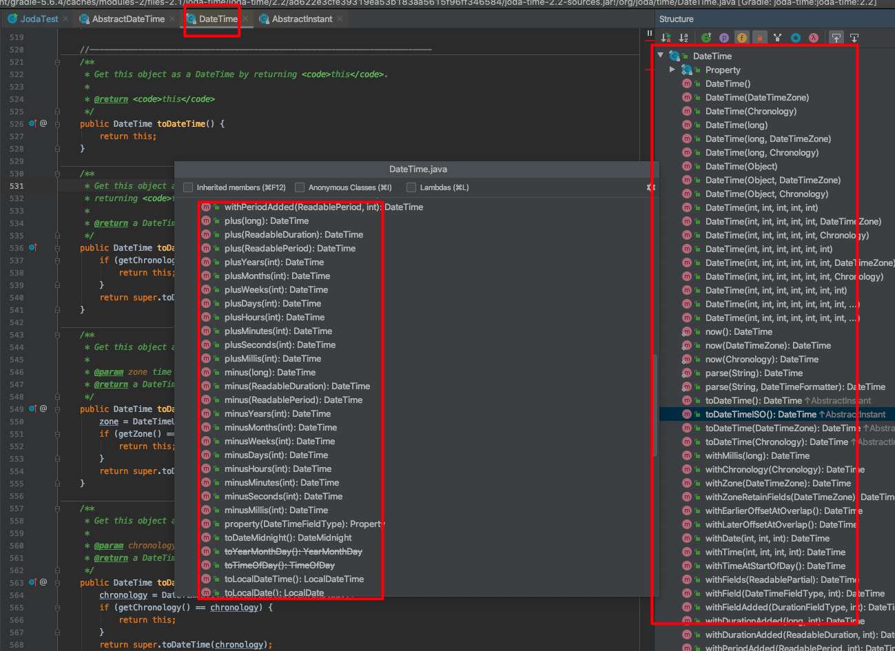

# java8日期api

### 一.Joda日期API介绍

在java8出来之前，java的日期api是非常的简单基础的，很多日期相关的功能无法使用，在java8之前就有一个第三方的日期api工具库可以很好的处理实现java的Date这个对象中没有的各种功能：时区，倒计时，前多少天，前几个月，时间差，国际化的时间通用等很多时间相关的操作；


因为joda比java8的日期对象出来的早而且方便应用广，所以java8的日期库处理大都跟joda的一样的，甚至作为了一个标准，java8之后，joda就不建议使用了，因为使命已经完成

这里展示一些joda的api方法：


> 构造一个dateTime对象，这个对象是joda的对象，这个对象有很多非常简单实用的方法，可以直接转换成java的Date对象，加一天，当前月之类的，直接看javadoc其实基本上能知道有哪些方法以及怎么用



> 从Joda - Time的日期独享DateTime得内置的方法来看，拥有非常多的我们非常灵活实用的方法，例如获取当前时间的年月日，或者给指定的时间加上年/月/日；又或者可以直接判断一个时间是否在我们指定的时间区域内等，各种方法；除了DateTime这个日期对象之外，我们可以留意到，Joda还提供了一个对象LocalDateTime/LocalDate这两个对象，这两个对象就是当前地区的时间操作对象，脱离了时区的概念的操作，这里只是简单看了一下这两个javadoc的说明，更为细致可以去器javadoc中看，但是觉得这个没啥必要，下面再展示一下一些demo


### 二.新日期API操作

##### 1.为什么java8会有新API

Java8之前的旧的日期对象的包是在java的工具包里面的，java.util.Date，新的java日期对象是在java.time包里面的，里面的很多方法都是新增的，可以说是完善自身的日期相关的操作api；（简单通俗地说就是，原来java8之前的java.util.Date中的日期对象就是处于一种能用状态，使用起来非常不方便）java8参考了Joda - Time的理念，java8将对应的日期操作完善了，也逐渐抛弃了Date这个对象的使用迎来了一个新的完整操作日期的包来进行日期处理，总结如下：

- 线程本来是不安全的，java8的新Api解决了这个问题
- Api设计更加合理以及易于理解
- 解决了之前没有处理好的时区问题

##### 2.标准时间/格林威治时间

 关于时间有两个标准，一个就是：格林威治时间（普通的时区时间），一个是标准UTC时间（绝对时间值 ---这个时间是没有时区的概念的，都是标准的时间的，除非后面加上时区，最好的系统之间的时间传递就是用这个标准时间进行传输，不用进行时区等相关的转换？然后客户端，就收之后根据需求转换成当前时间或者指定的时区时间或者其他的时间之类）；mogodb就是使用的utc时间，就不会有国际化时区等问题，但是需要对绝对时间进行相关的转换


##### 3.基本的API操作

先来看一下java8的日期的包结构


细心看一下，其实跟JodaTime是比较相像的，整体的使用也是比较像的，在java8中主要使用的日期对象是LocalDate/LocalDateTime这两个日期对象（貌似LocatDateTime没有对旧的Date做直接的兼容，所以两者转换需要注意一下，后面举个例子展示一下两者的转换）。

几个java8中比较常用的时间对象，这里只是这些对象的一些基础操作，更详细的要自己使用的使用去根据自己的需求看对应的javadoc文档介绍怎么使用，还有非常多的方案使用的api的，例如判断是不是闰年这些就是一个简单方法，如果使用Date那不要太麻烦

- **Instant 时间戳** ：表示的是时间戳的时间，对比传统的时间戳这个可以更为精确，Date 最多可以表示毫秒级别的时刻，而 Instant 可以表示纳秒级别的时刻

- **LocalDate 日期对象** ：时间精确度是到天的日期对象

  > 

- **LocalTime 时间对象**：跟localDate相反的是，这个对象更加关注时分秒毫秒等更为细节的时间处理

  > 

- **LocalDateTime 当前时间** ：集合前面的LocalDate以及LocalTime两个时间对象处理，日期时间的对象

  > 

- **ZoneDateTime 时区时间** ：表示的是含有时区的时间，前面的时间都是依赖当前系统的时间的，没有时区之分，如果时区不一样等到的时间是不一样的，这个对象可以理解为LocalDateTime的再次封装加上时区的描述

  > 

- **Period** : 用于计算两个日期（年月日）间隔。

  > 

- **Duration** : 用于计算两个时间（秒，纳秒）间隔。

  > 

- **DateTimeFormatter** ：作为格式化日期时间的主要类，它与之前的 DateFormat 类最大的不同就在于它是线程安全的，其他的使用上的操作基本类似

  > ```java
  > public static void main(String[] a){
  >     DateTimeFormatter formatter = DateTimeFormatter.ofPattern("yyyy年MM月dd日 HH:mm:ss");
  >     LocalDateTime localDateTime = LocalDateTime.now();
  >     System.out.println(formatter.format(localDateTime));
  > 
  >     String str = "2008年08月23日 23:59:59";
  >     DateTimeFormatter formatter2 = DateTimeFormatter.ofPattern("yyyy年MM月dd日 HH:mm:ss");
  >     LocalDateTime localDateTime2 = LocalDateTime.parse(str,formatter2);
  >     System.out.println(localDateTime2);
  > 
  > }
  > 
  > ```
  >
  > 输出结果：
  >
  > ```java
  > 2018年04月23日 17:27:24
  > 2008-08-23T23:59:59
  > ```

##### 4.对旧时间对象Date的兼容

```java
// 将Date转换成 LocalDateTime
Date date = new Date();
LocalDateTime localDateTime5 = LocalDateTime.ofInstant(date.toInstant(), ZoneId.systemDefault());
// 将Calendar转换成LocalDateTime
Calendar calendar = Calendar.getInstance();
LocalDateTime.ofInstant(calendar.toInstant(), ZoneId.systemDefault());

// 将LocalDateTime转换成Date 需要指定时区的，因为Date是没有时区概念
ZoneId zoneId2 = ZoneId.systemDefault();
LocalDateTime localDateTime8 = LocalDateTime.now();
ZonedDateTime zdt = localDateTime8.atZone(zoneId2);
Date date5 = Date.from(zdt.toInstant());

System.out.println("LocalDateTime = " + localDateTime);
System.out.println("Date = " + date5);
```

