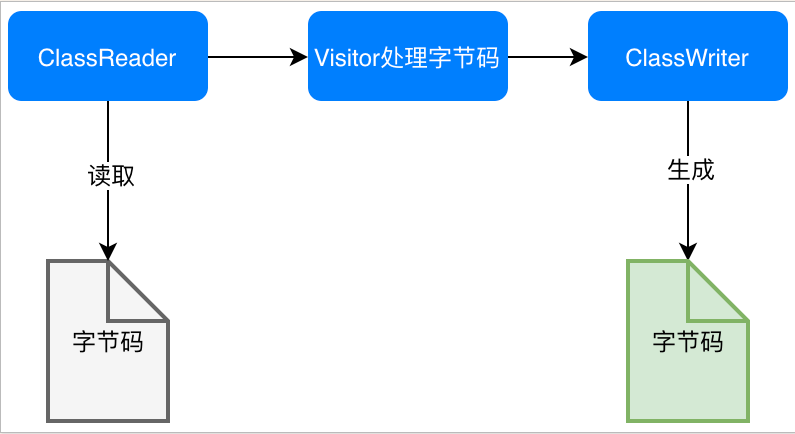

# java元编程

https://tech.youzan.com/java-metaprograming/

## 1.什么是java元编程

- 讨论元编程，先来了解一下生产力，做同样的事情python利用第三方框架可能非常简单地就实现了，但是在java中使用SSM框架框架搭建等基础功能模块搭建，然后再去一点点实现代码。先不讨论这两者好坏，两个不用语言使用不同框架，做同样的时间需要时间越短的生产力越强，也意味着这个帮我们做了很多我们没有写的代码功能的实现；这个额外的本应该写的代码变成了对应的框架去帮实现的话，这个框架就承载着元编程的能力，如下图：

  

- 那么元编程是什么呢？***元编程是写的代码是用来生成代码的*** ，也就是用来给我们平常写的代码添加额外的代码或者在编译或者运行期间添加额外功能的代码。最简单的场景就是我们java的代码生成器，这个代码生成器的结果是代码，那么编写代码生成器就是元编程；有些框架之所以开发效率高,其原因也是因为框架层面,把大量的需要重复编写的代码,采用元编程的方式给自动生成了.

- 目前常用的元编程使用地方lombok插件就是一个用注解的方式替代在编译期间主动生成实体的getter/setter/toString/hashCode等这些代码都不用写，还有就是我们使用mybatis的时候，很简单的一个表CRUD没有什么逻辑的代码也需要我们一行行去写，除了使用代码生成器之外还可以自定义一个运行时的元编程去自动处理该操作（具体实现下面案例）

- PS：程序员世界的一个挠痒痒定理：**当一个东西令你觉得痒了,那么很有可能,这个东西也令其他程序员痒了,而且github上面也许已经有了现成的项目可以借鉴**. 

## 2.java类的加载原理/机制

为什么要学习类加载机制？

- Oracle当初引入这个机制是为了满足Java Applet开发的需求，JVM咬咬牙引入了Java类加载机制，后来的基于Jvm的动态部署，插件化开发包括大家热议的热修复，总之很多后来的技术都源于在JVM中引入了类加载器。可以说是无意之中打开了java开发的大门

### 2.1 类加载过程


#### 2.1.1 加载机制

一个java文件从被写好到编译成class文件，然后被jvm加载到运行的过程，就是上图。其中jvm做的事情跟编译无关，jvm做的是直接读取字节码文件然后运行的过程，这就诞生了不少的基于jvm的相关语言，语言不一样，经过对应的语言的编译器之后编译成的字节码文件就是class文件，也就是可以在jvm中运行的文件。


类加载的过程其实就是，加载class文件->校验->准备->解析->初始化 这个链路过程


#### 2.1.2 运行期加载/编译期加载

- **编译期**是指编译器将**源代码翻译**为**机器能识别的代码**，`Java`被编译为`JVM`认识的**字节码文件**，就是在.java文件编译成.class二进制文件的期间，程序尚未运行起来
- **运行期**则是指`Java`代码的**运行**过程，程序已经编译完成并且运行起来，这个期间动态去通过类加载器加载新的文件进来程序

#### 2.1.3 加载过程


其中连接就是指 **验证-准备-解析** 


需要注意的是，解析阶段不一定所有类加载过程都会有，只是为了支持java动态绑定才产生的，所以如果没有动态绑定的话，就不会调用解析这个过程。而且上述的某个阶段会调用另一加载过程中激活或者调用另一个阶段

加载：

- 通过类的全限定明来获取此类的二进制字节流，如从 ZIP包中，网络中，运行时计算等方式来生成得到
- 将该二进制字节流所代表的**静态存储结构**转化位**方法区**的**运行时数据结构**
- 在内存中生存一个代表这个类的 **java.lang.Class** 对象
- 这个加载的过程是通过java的**类加载器**来进行的，类加载有两种，一种是**启动类加载器**，另一种是**自定义加载器** ，我们可以通过重写自定义加载器来进行对原程序的增强

验证：

- 是验证代码能够运行的第一步，也就是对字节码结构进行解析，需要校验所有的程序，所以会占用很大的运行时间

- 目的：为了验证程序是能否符合虚拟机的要求能够运行，并且不会危害虚拟机自身的安全

- 验证过程

  

准备：

- 为类变量（静态变量）**分配内存**：**因为这里的变量是由方法区分配内存**的，所以**仅包括类变量**而不包括实例变量，后者将会在对象实例化时随着对象一起分配在`Java`堆中
- 设置类变量**初始值**：通常情况下零值

解析：

- 解析阶段就是虚拟机将**常量池**内的**符号引用替换为直接引用**的过程
- 发生时间：`JVM`会根据需要来判断，是在类被加载器**加载时**就对常量池中的符号引用进行解析，还是等到一个符号引用将要被**使用前**才去解析

初始化：

- 是类加载过程的最后一步，会开始真正执行类中定义的`Java`代码。而之前的类加载过程中，除了在『**加载**』阶段用户应用程序可通过**自定义类加载器**参与之外，**其余阶段均由虚拟机主导和控制**

### 2.2  类加载器

##### 2.2.1 类加载器类型

在JVM的角度，类的加载有两种类型：**启动类加载器，其他类加载器**

**启动类加载器:**

> - java虚拟机的最底层的加载器，由C++语言实现，是JVM自身的一部分
> - 负责加载在 JAVA_HOME\lib 目录中或者`-Xbootclasspath`参数所指定路径中的、且可被虚拟机识别的类库
> - java的程序是无法直接调用的，如果自定义类加载器想调用启动类加载器的话，可以用null直接替代，就会默认调用启动类加载器

**其他类加载器:**

这种类加载器是由*java* 语言来实现的，独立于虚拟机外部，并且都是继承于`java.lang.ClassLoader` 类加载，可以被java程序直接引用，也是我们可以修改的加载器，用来实现字节码增强方法之一；其他类加载器一共有三种：**扩展类加载器，应用程序加载器，自定义类加载器**

> **扩展类加载器**：
> 	A. 由`sun.misc.Launcher$ExtClassLoader`实现
>
> ​	B. 负责加载`＜JAVA_HOME＞\lib\ext`目录中的、或者被`java.ext.dirs`系统变量所指定的路径中的所有类库
>
> **应用程序类加载器**：
>
> ​	A. 是**默认**的类加载器，是`ClassLoader#getSystemClassLoader()`的返回值，故又称为**系统类加载器**
>
> ​	B. 由`sun.misc.Launcher$App-ClassLoader`实现
>
> ​	C. 负责加载用户类路径上所指定的类库
>
> **自定义类加载器**：
>
> ​	如果以上类加载起不能满足需求，可自定义。这个也是字节码增强的切入点之一，自定义类加载器加载字节码	文件，然后做一定的修改

**整个类加载器的调用流程：**


PS：虽然**数组类**不通过类加载器创建而是由`JVM`直接创建的，但仍与类加载器有密切关系，因为**数组类的元素类型最终还要靠类加载器去创建**

PS2: 这里只是简单的了解一下类加载流程，更为细致的可以通过深入学习JVM的原理等方式进行学习

##### 2.2.2 双亲委派模型

双亲委派模型其实就是表示加载器之间的层次关系，如上图类加载器的加载过程，类加载使用过程是优先使用其上游的父加载器进行处理（父加载器是通过引用的方式，也就是组合的方式来组合在一起），接收到加载的请求，首先调用其父类处理直到启动类加载器，如果当父类无法解析最后才会到自定义的类加载器来加载；


## 3.几种元编程的姿势

### 3.1 反射

反射是什么？

- 反射的本质就是我们通过运行中的**.class** 文件来获取整个类的所有的信息，然后封装成对应的`java.lang.reflect` 包中的对象，然后通过反射包中的对象获取反射的对象获取相关的信息属性或者调用其方法等；在反射包中的类对象是我们一个类反射后我们能够获取的所有的信息的对象封装了，有些是用来获取类的方法，有些是获取属性等各种信息的对象。反射包中的对象都是不提供对外public构造方法的，想要获取反射类中的对象，只能是通过反射类来进行获取如：`new people().class.getXXX()` ，所以我们的反射包的对象的获取基本上都是基于Class类，也就是类对象中能够获取

  

  反射包中的几个比较核心的接口或者类：

  

  获取方式都是在Class对象中：

  

- 想要使用反射就要从java的类加载过程说起，因为类加载过程是加载我们的类的字节码文件，我们进行反射操作也是通过运行中的对象其实也是字节码文件对象中获取信息。所以需要特别注意的是，同一个类加载加载的.class的类的结构是固定的，我们能够通过反射来获取，但是如果是不同类加载器加载的同一个.class文件的话，加载的结构很可能是不一致的，所以需要注意这一点

#### 3.1.1 自省

> 反射有两种能力，一个能力就是**自省**，自省有什么用呢？主要是用来获取自身的信息，知道当前的代码长什么样子的，是一个类还是一个接口，这个类中有哪些Field也就是属性，这个属性是static/final/或者其他，还可以获取类中的方法Method等，方法的参数是什么（参数名称在运行时会被抹除），总之就是获取类自身的所有信息。
>
> 反射的api除了**自省**的读的功能以外，还提供修改能力的：**动态代理**

#### 3.1.2 反射的使用

关于反射的使用，主要是看官方javadoc文档，也即是以Class类对象的文档为主，然后我们可以通过Class对象中能够获取到很多的反射对象的各种属性，然后进行调用或者进一步的修改等操作。网上的各种使用以及案例，其实都是对javadoc的文档的实践，而且不一定准确，所以只能是作为参考，有问题还是自己去看文档 `java.lang.Class` 这个对象

- 反射对象的创建

> 反射的创建一共三种方式：
>
> 1) Class提供的静态方法`forName()`
>
> 2) 类对象.class，如：`People.class;`
>
> 3) 对象实例.getClass(), 如：`people.getClass();`
>
> 

- 反射对象的方法，接口，属性，父类等信息获取

> 通过反射可以获取到一个对象类的所有的信息，这里不细说，更为具体的看以后的使用场景或者根据需求直接去看Class中的api调用，然后再看如何使用
>
> 
>
> 一些常用的信息获取：
>
> 
>
> 

- 反射的操作（属性赋值，方法调用，创建实例等）

> 1） 通过反射构建实例对象
>
> 在正常的使用下，我们创建一个对象只能通过构造方法来进行构建，如果构造方法私有了，我们就不能构造对象了，但是在反射这里不会受到这个限制，我们可以通过反射new 一个对象
>
> 
>
> 反射静态的属性以及方法调用
>
> 
>
> 
>
> 需要注意的是，反射中的入参是需要区分包装类以及原生类的
>
> 
>
> 构造方法的调用：
>
> 
>
> 
>
> 总而言之，常用的几个方法：
>
> 
>
> 一些使用细节可以参考网络文章：[Java 反射使用总结](https://zhuanlan.zhihu.com/p/80519709)

#### 3.1.3 JDK动态代理

> 上面的反射使用，更多的是基础的使用，我们常用的反射使用还有一个就是**jdk**提供的原生的动态代理的实现.对比静态代理，动态代理更加灵活，不需要每一个代理对象都是固定的都是实现同一个接口，一旦接口变更就全部需要变更，不够灵活。JDK动态代理，是依赖JDK就可以实现底层使用的反射以及拦截器。动态代理的实现条件对接被代理方只有一个：**必须是实现接口** ，对于代理的实现就需要实现：**InvocationHandler** 接口，使用的时候需要：**使用 Proxy.newProxyInstance 产生代理对象** 。我所理解的是，动态代理是为了能够让开发者在运行期间对固定的代理接口统一做一些额外的操作
>
> 具体demo：
>
> ```java
> /**
>  * jdk 动态代理必须依赖接口，这里定义一个接口
>  */
> public interface ProxyInterface {
> 
>     String syaHello(String message);
> 
> }
> 
> /**
>  * 接口实现类
>  *
>  * @author chendecheng
>  * @since 2021-01-02 23:28
>  */
> public class ProxyInterfaceImpl implements ProxyInterface {
> 
>     @Override
>     public String syaHello(String message) {
>         System.out.println("张震想说" + message);
>         return "张震最帅";
>     }
> }
> 
> /**
>  * jdk 动态代理的对象需要额外做的处理，也就是字节修改
>  * 这里是通过构造方法引入实际代理的对象，因为是代理的类型是通用的，所以代理的对象是Object
>  *
>  * @author chendecheng
>  * @since 2021-01-02 23:29
>  */
> public class MyInvocationHandler implements InvocationHandler {
> 
>     private Object target;
> 
>     public MyInvocationHandler(Object target) {
>         this.target = target;
>     }
> 
>     @Override
>     public Object invoke(Object proxy, Method method, Object[] args) throws Throwable {
>         System.out.println("代理来，所以前面插入点东西");
>         // 通过反射的方式，调用对象中原有的方法。这里即使反射的知识点来，我们通过InvocationHandler
>         // 创建了对应的实例的对象，然后还有对象的方法，以及方法的入参，都提取出来了，在这里统一调用, 所以这里是通过反射调用方法
>         Object result = method.invoke(target, args);
>         System.out.println("代理了，所以后面也插入点东西");
>         return result;
>     }
> 
> }
> 
> /**
>  * 动态代理的使用，通过测试类来处理，不仅仅是调用方法，这里还会构造对应的代理对象
>  *
>  * @author chendecheng
>  * @since 2021-01-02 23:34
>  */
> public class DynamicTest {
>     public static void main(String[] args) throws Exception {
>         // ---------------------第一种方式，使用封装好的方式---------------------
>         ProxyInterface proxyInterface = new ProxyInterfaceImpl();
>         InvocationHandler invocationHandler = new MyInvocationHandler(proxyInterface);
>         // 首先是构造接口的实现类 --- 这里是构造了一个ProxyInterface的实现类
>         ProxyInterface newProxyInstance = (ProxyInterface) Proxy.newProxyInstance(ProxyInterface.class.getClassLoader(),
>                 proxyInterface.getClass().getInterfaces(), invocationHandler);
>         System.out.println(newProxyInstance.syaHello("6666666"));
> 
>         // ---------------------第二种方式，也就是第一种方式的细分---------------------
>         // 生成 $Proxy0$ 的class文件
>         System.getProperties().put("sun.misc.ProxyGenerator.saveGeneratedFiles", "true");
>         // 获取动态代理类
>         Class proxyClazz = Proxy.getProxyClass(ProxyInterface.class.getClassLoader());
>         // 3、获得代理类的构造函数，并传入参数类型InvocationHandler.class
>         Constructor constructor = proxyClazz.getConstructor(InvocationHandler.class);
>         // 4、通过构造函数来创建动态代理对象，将自定义的InvocationHandler实例传入
>         ProxyInterface proxyInterface1 = (ProxyInterface) constructor.newInstance(new MyInvocationHandler(new ProxyInterfaceImpl()));
>         // 5、通过代理对象调用目标方法
>         proxyInterface1.syaHello("另一种代理方式");
> 
>     }
> }
> 
> ```
>
> 总结一下使用JDK动态代理的4个步骤：
>
> - 被代理类实现接口
> - 被代理的切入的额外操作实现类实现接口**InvocationHandler**
> - 使用 **Proxy.newProxyInstance()** 获取代理对象
> - 调用方法
>
> 使用到反射动态代理的技术框架或者项目：
>
> - Spring的机遇接口的AOP（Spring有多种动态代理方式，还有cglib）
> - dubbo reference 对象的生成

### 3.2 字节码增强

字节码是指java的代码文件被编译成.calss文件的格式，java的类的加载就是字节码被读取生成Class文件的过程。字节码增强是java支持这种能力，就是对已经加载了的类文件进行修改，在加载后的类中添加我们原来代码没有的额外功能；那么动态修改java的字节码文件的方式就有三种：**一种是在加载类文件的时候，一种是在代码运行的过程中去修改**

#### 3.2.1 加载时

> 加载时的处理，这个就是java虚拟机在加载java编译好的文件.class的时候进行字节码文件读取的过程中进行修改。这个字节码增强在java5之后（java6进行了增强）就提供了java.lang.instrument这个类对象来进行字节码增强
>
> 
>
> 
>

#### 3.2.2 运行时

> 运行时去变更字节码文件的话，这个修改是有限制的只能修改类的实现不能对方法以及类的结构进行变更，这个有点类似以前的java代码的打补丁方式，现在的**idea以及eclipse的动态加载也是这个原理**。某种程度上就是，我们动态去操作正在运行的字节码文件，进行一些修改。目前所了解的能够通过**Instrumentation** 接口来做运行时字节码文件的修改，其他的大部分都是加载的时候进行字节码增强

**更为详细的字节码增强介绍，看第5节，那里会详细介绍字节码增强以及使用**

## 4.反射

参考文章：[深入理解java反射和动态代理](https://zhuanlan.zhihu.com/p/60805342)

#### 4.1 什么是反射

- 官网定义：https://docs.oracle.com/javase/8/docs/technotes/guides/reflection/index.html
- 反射是java程序开发语言特征，允许运行中的ava程序获取自身的信息（所有信息，包括属性，方法，私有方法等）以及进行类对象的操作
- 可以通过反射获取对应的属性以及方法，然后进行实例化调用等，或者运行其中需要某个对象通过反射动态去创建对应的对象

#### 4.2 反射使用场景

- 当我们的程序在运行时，需要动态的加载一些类这些类可能之前用不到所以不用加载到 jvm，而是在运行时根据需要才加载，这样的好处对于服务器来说不言而喻，简单轻巧提升性能等，举个例子我们的项目底层有时是用 mysql，有时用 oracle，需要动态地根据实际情况加载驱动类，这个就是反射的作用了
- **反射是java各种框架的基石**，开发通用的框架兼容性非常重要，所以通过反射我们能够动态读取相关的配置文件实例化对应的对象在应用中使用，而不是在开发的时候固定某个对象，这样框架的兼容性就非常低，最简单的我们连接数据库的时候不会固定某一个数据库的整个连接，而是通过配置文件去实时读取然后实例化对应的连接实例；还有就是我们spring初始的配置化，就是通过配置文件来实现动态加载也就是实例化我们的对象
- **动态代理的实现**，jdk默认的动态代理的实现就是依赖的反射，就是我们去代理了某个类的方法，然后在执行前后添加我们业务相关的额外功能，也是简化我们开发的一个要点，也是现在AOP功能的实现的依赖；当然处理JDK自带的反射实现动态代理还有其他的第三方框架的实现，对应的底层原理后续研究一下
- **注解的功能实现**，注解作为一个非常简化开发的功能，其仅仅是一个标记作用，底层的实现还是依赖的反射，通过注解去调用对应的注解解释器，然后执行相关的行为，这个过程也是依赖的反射
- **可扩展性功能**，应用程序可以通过全限定名称来对外部的扩展性的对象进行实例化加载，然后使用，这个加载实例化就是用到反射

#### 4.3 反射缺点

- **性能开销：** 反射会动态去加载类对象（这就是为什么创建反射实例的时候需要入参类加载器的原因，对象实例化需要类加载器），因此一些JVM启动时的优化就不会生效，反射的操作的性能就会比非反射的性能要差一些，因此在高性能程序中尽可能避免使用反射
- **破坏封装性： ** 反射的调用会忽略一些权限检查（类加载过程的检查？），因此会破坏封装性导致一些安全问题
- **内部曝光：** 在非反射的模式下，我们私有了一些属性以及方法对外不开发，但是一旦使用反射私有的方法也是可以直接调用私有方法或者一些其他的不对外的方法，这样可能会原有对象的可移植性（本来不考虑私有方法就可以直接移植，但是一旦被反射调用了，移植有可能会受到影响），还有就是会破坏了java的抽象，因此也会随着平台相关的升级改变一些行为，总之就是破坏了java的一些自身结构，所以使用的时候需要谨慎一些
- 因为反射，我们java的功能才会如此的强大，这也是为什么java反射有那么多的缺点但是还是我们的各种框架必不可少的基石，没有反射这些底层，很多功能都无法实现

#### 4.4 反射的使用

参考3.1章节

## 5.静态代理+静态代理

#### 5.1 静态代理


如上图所言，静态代理我们能够在不变更实现类的时候扩展原有的功能，但是静态代理不够灵活，**我们对一个类进行扩展特定的功能的话，我们就需要单独写一个代理类去实现公共接口，是一对一的关系**，不够灵活而且一旦公共接口变更所有的实现类都需要实现。所以目前使用得比较少，下面看个demo：

```java
/**
 * 代理接口顶层类
 */
public interface FruitService {
    void eat();
}

/**
 * 香蕉
 *
 * @author chendecheng
 * @since 2021-01-07 22:55
 */
public class BananaServiceImpl implements FruitService {

    private Logger logger = Logger.getLogger(BananaServiceImpl.class.getName());

    @Override
    public void eat() {
        logger.info("吃个大香蕉");
    }
}

/**
 * 对应的吃香蕉代理实现类
 *
 * @author chendecheng
 * @since 2021-01-07 22:57
 */
public class ProxyServiceImpl implements FruitService {

    private FruitService fruitService;

    private Logger logger = Logger.getLogger(ProxyServiceImpl.class.getName());

    public ProxyServiceImpl(FruitService fruitService) {
        this.fruitService = fruitService;
    }

    @Override
    public void eat() {
        logger.info("想吃什么呢？");
        fruitService.eat();
    }
}

/**
 * 测试一下静态代理
 *
 * @author chendecheng
 * @since 2021-01-07 23:00
 */
public class TestStaticProxy {

    public static void main(String[] args) {
        FruitService fruitService = new BananaServiceImpl();
        ProxyServiceImpl proxyService = new ProxyServiceImpl(fruitService);
        proxyService.eat();
    }

}
```

#### 5.2 动态代理

**动态代理的实现方式有两种种，其中有：反射以及Cglib 两种，当然还可以使用其他字节码增强的方式，但是这里讨论常用的方式**

##### 5.2.1 JDK动态代理


JDK动态代理跟静态的一个大区别在于，动态代理不受约束，不需要继承跟代理类一样的接口可以无嵌入式的代理，唯一一个要求就是被代理类必须是实现接口。具体的实现方式是：动态代理对象继承 **InvocationHandler** 这个接口，然后代理对象对我们要代理的类对象进行具体的代理增强（其实也就是一个被代理对象就要有一个具体的代理对象，而且这个代理对象都是一样的结构实现 `InvocationHandler`接口，当然一堆被代理对象的方法需要增强同一个操作的话，可以多个被代理类使用一个代理对象）

```java
/**
 * jdk 动态代理必须依赖接口，这里定义一个接口
 */
public interface ProxyInterface {
    String syaHello(String message);
}

/**
 * 接口实现类
 *
 * @author chendecheng
 * @since 2021-01-02 23:28
 */
public class ProxyInterfaceImpl implements ProxyInterface {

    private Logger logger = Logger.getLogger(ProxyInterfaceImpl.class.getName());

    @Override
    public void syaHello(String message) {
        logger.info("张震想说" + message);
    }
}

/**
 * jdk 动态代理的对象需要额外做的处理，也就是字节修改
 * 这里是通过构造方法引入实际代理的对象，因为是代理的类型是通用的，所以代理的对象是Object
 * 这里是针对ProxyInterfaceImpl 方法来进行来具体的代理，跟静态代理一样的，一般情况下我们都是进行某一个对象类的代理，如果想要通用代理，这个代理类设计的时候就要设计成通用的增强，例如打印日志之类
 * @author chendecheng
 * @since 2021-01-02 23:29
 */
public class MyInvocationHandler implements InvocationHandler {

    private Logger logger = Logger.getLogger(MyInvocationHandler.class.getName());

    private Object target;

    public MyInvocationHandler(Object target) {
        this.target = target;
    }

    @Override
    public Object invoke(Object proxy, Method method, Object[] args) throws Throwable {
        logger.info("代理来，所以前面插入点东西");
        // 通过反射的方式，调用对象中原有的方法。这里即使反射的知识点来，我们通过InvocationHandler
        // 创建了对应的实例的对象，然后还有对象的方法，以及方法的入参，都提取出来了，在这里统一调用, 所以这里是通过反射调用方法
        method.invoke(target, args);
        logger.info("代理了，所以后面也插入点东西");
        return null;
    }

}

/**
 * 动态代理的使用，通过测试类来处理，不仅仅是调用方法，这里还会构造对应的代理对象
 *
 * @author chendecheng
 * @since 2021-01-02 23:34
 */
public class DynamicTest {
    public static void main(String[] args) throws Exception {
        // ---------------------第一种方式，使用封装好的方式---------------------
        ProxyInterface proxyInterface = new ProxyInterfaceImpl();
        InvocationHandler invocationHandler = new MyInvocationHandler(proxyInterface);
        // 首先是构造接口的实现类 --- 这里是构造了一个ProxyInterface的实现类
        ProxyInterface newProxyInstance = (ProxyInterface) Proxy.newProxyInstance(ProxyInterface.class.getClassLoader(),
                proxyInterface.getClass().getInterfaces(), invocationHandler);
        newProxyInstance.syaHello("6666666");

        // ---------------------第二种方式，也就是第一种方式的底层---------------------
        // 生成 $Proxy0$ 的class文件
        System.getProperties().put("sun.misc.ProxyGenerator.saveGeneratedFiles", "true");
        // 获取动态代理类
        Class proxyClazz = Proxy.getProxyClass(ProxyInterface.class.getClassLoader());
        // 3、获得代理类的构造函数，并传入参数类型InvocationHandler.class
        Constructor constructor = proxyClazz.getConstructor(InvocationHandler.class);
        // 4、通过构造函数来创建动态代理对象，将自定义的InvocationHandler实例传入
        ProxyInterface proxyInterface1 = (ProxyInterface) constructor.newInstance(new MyInvocationHandler(new ProxyInterfaceImpl()));
        // 5、通过代理对象调用目标方法
        proxyInterface1.syaHello("另一种代理方式");

    }
}

```

##### 5.2.2 CgLib动态代理

Cglib的动态代理，比JDK更为方便使用，对被代理类没有什么要求。而且底层不是使用反射，而是自动实现一个被代理类的子类，然后在别的请求访问被代理类的时候拦截直接访问代理类，这种方式不会有性能问题也没有JDK代理的需要被代理类实现接口（需要注意一点就是，Cglib不能对final修饰的方法进行增强，也不能对private方法进行增强，因为私有方法无法继承，cglib底层就是生成一个被代理类的子类，无法被继承的方法就无法动态代理）


对比JDK而言，Cglib的动态代理更为简单，对于被代理类是没有入侵式，也没有接口要求，仅是实现MethodInterceptor接口然后定义我们想要对被代理类的方法进行对应的增强，然后就是客户端进行调用，看下面的demo：

```java
/**
 * 被代理类
 *
 * @author chendecheng
 * @since 2021-01-08 00:35
 */
public class StudentDo {
    private Logger logger = Logger.getLogger(StudentDo.class.getName());
    public void study() {
        logger.info("学生学习");
    }
}

/**
 * cglib代理类(底层就是为被代理类创建一个子类，拦截调用方法去执行生成的子类的方法)
 *
 * @author chendecheng
 * @since 2021-01-08 00:37
 */
public class CglibProxy implements MethodInterceptor {
    private Object target;
    public CglibProxy(Object target) {
        this.target = target;
    }
//    // 测试类第一种方式使用的方法，为目标对象生成代理对象
//    public Object getProxyInstance() {
//        //工具类
//        Enhancer en = new Enhancer();
//        //设置父类
//        en.setSuperclass(target.getClass());
//        //设置回调函数
//        en.setCallback(this);
//        //创建子类对象代理
//        return en.create();
//    }

    @Override
    public Object intercept(Object o, Method method, Object[] objects, MethodProxy methodProxy) throws Throwable {
        System.out.println("开启代理");
        // 执行目标对象的方法
        method.invoke(target, objects);
        System.out.println("结束代理");
        return null;
    }
}

/**
 * 调用端测试类
 *
 * @author chendecheng
 * @since 2021-01-08 00:37
 */
public class TestCglibProxy {
    public static void main(String[] args) {
        StudentDo studentDo = new StudentDo();

        // 第一种：这种方式是客户端的代理类对象由对应的代理对象提供
//        StudentDo studentProxy = (StudentDo) new CglibProxy(studentDo).getProxyInstance();
//        studentProxy.study();

        // 第二种：另一种就是自行由调用端直接创建代理
        CglibProxy cglibProxy = new CglibProxy(studentDo);
        //工具类
        Enhancer en = new Enhancer();
        //设置父类（对于动态生成的代理类的父类其实就是代理类）
        en.setSuperclass(studentDo.getClass());
        //设置回调函数
        en.setCallback(cglibProxy);
        StudentDo anotherProxy = (StudentDo) en.create();
        anotherProxy.study();
    }
}

```

##### 5.2.3 两种动态代理区别

***有什么区别：***

- JDK动态代理需要被代理类实现接口，Cglib不需要
- JDK动态代理是通过反射来实现的，Cglib是基于小而块的字节码处理框架 ASM 实现
- 对于Cglib只能动态代理只能代理非static，private的方法，底层创建一个被代理类的子类，这两种无法被实现，所以不能被代理，同时也不能是final修饰
- 调用次数少可以使用JDK，如果高频调用使用Cglib性能更好

***Spring中两者区别：***

- 如果是接口实现类，默认使用JDK动态代理，如果不是实现类也就是没有实现接口就使用Cglib来进行动态代理

- Spring可以修改AOP动态代理的实现方式，修改配置文件即可，在**application.xml** 中修改

  ```xml
  spring:
  	aop:
      	proxy-target-class: false
  ```

#### 5.3 总结


## 6.字节码增强

参考学习文章: [美团字节码增强技术](https://tech.meituan.com/2019/09/05/java-bytecode-enhancement.html)

### 6.1 字节码

#### 6.1.1 字节码是什么

- 结合前面所说的java类加载流程我们可以知道我们编写的**.java**代码最终是会被编译成**.class**文件也就是字节码文件，最终会在java虚拟机**JVM**中运行

- java代码编译流程

  

- 为什么java代码可以一次编译跨系统运行？一是因为 JVM 针对各种操作系统、平台都进行了定制，二是因为无论在什么平台，都可以编译生成固定格式的字节码（.class 文件）供 JVM 使用

- 之所以被称之为字节码，是因为字节码文件**.class**由十六进制值组成，而 JVM 以两个十六进制值为一组（**两个16进制的值刚好 = 一个字节大小 = 8位  = 2的8次方 = 256种可能 ** ），即以字节为单位进行读取

- 字节码增强技术在 Spring AOP、各种 ORM 框架、热部署中的应用屡见不鲜，深入理解其原理对于我们来说大有裨益

- 由于 JVM 规范的存在，只要最终可以生成**符合规范的字节码**就可以在 JVM 上运行,如：scala Groovy Kotlin 等语言，拥有自己的编译器，但是编译结果是符合JVM格式能够在jvm中运行，了解字节码对这些语言的学习也会有方便之处

  

#### 6.1.2 字节码结构

我们直接通过文本打开.class文件，看看字节码的格式（如果是直接通过文档打开.class文件，是一堆杂乱的代码，具体通过16进制字节数打开.class文件的方式：**vim -b xxx.class**   然后按字节单位分割一下，在vim 中输入命令" **:%!xxd**"）


上面的右边字节码看似杂乱，但是每一个字节都是严格按照JVM的规范编译生成的字节码，每一部分都是必不可少的，正是这些字节码组成java程序，每一个字节码都是由 十个部分组成的，这十部分如下图


**魔数：** 前四个字节都是魔数，也就是 **CA FE BA BE**（魔数的固定值是 Java 之父 James Gosling 制定的，为 CafeBabe（咖啡宝贝），而 Java 的图标为一杯咖啡），所有的**.class**文件都是这四个字节开头，否则就不通过校验，不会进行后续的操作

**版本号：** 魔数后4个字节就是版本号，前两个是次版本号，后两个字节是主版本号，上图的 00 00 00 34 就说明次版本号是0，主版本号34的16进制转成10进制就是52，在oracle官网中就是1.8.0

**常量池： ** 版本号后面4个字节就是常量池的计数器，也就是当前类有多少个常量


如上图的第9 10 两个字节，00 45 换成十进制是69减去下标0就是有68个常量；确定好常量的个数之后，我们通过常量翻译规律表来进行翻译，常量池后的第一个字节的值表示其后一个常量的类型，然后根据常量表读取后续制定的字节数量或者有些固定类型的数据直接读取对应数量的字节，然后再将其转换成我们对应的字符等程序信息，转换表参考下图：


抽取一个常量池的值来翻译一下，加入这个常量池的字节码值为：**01 00 01 61** 


其他类型的 cp_info 结构在本文不再赘述，整体结构大同小异，都是先通过 Tag 来标识类型，然后后续 n 个字节来描述长度和（或）数据。

**访问标志：** 常量池结束后字节码的结构就是访问标志内容了，常量池结束之后的两个字节，描述该 Class 是类还是接口，以及是否被 Public、Abstract、Final 等修饰符修饰。JVM 规范规定了如下图的访问标志，更为具体的可以后续深入再学习了解


**当前类索引：** 访问标志后的两个字节，描述的是当前类的全限定名（ 也就是当前类名）。这两个字节保存的值为常量池中的索引值，根据索引值就能在常量池中找到这个类的全限定名，也就是说常量池中已经存在，这里只是索引到常量池中

**父类索引：** 当前类名后的两个字节，描述父类的全限定名，同上，保存的也是常量池中的索引值。

**接口索引：** 父类名称后为两字节的接口计数器，描述了该类或父类实现的接口数量。紧接着的 n 个字节是所有接口名称的字符串常量池中的索引值。

**字段表：** 也就是我们类或者接口级别的属性，不包括方法内部的局部变量；字段表也分为两部分，第一部分为两个字节，描述字段个数；第二部分是每个字段的详细信息 fields_info。字段表结构如下图所示：


举个例子：


0002 对应为 Private。通过索引下标在常量池分别得到字段名为 “a”，描述符为 “I”（代表 int）。综上，就可以唯一确定出一个类中声明的变量 private int a；

**方法表：** 字段表结束后为方法表，方法表也是由两部分组成，第一部分为两个字节描述方法的个数；第二部分为每个方法的详细信息。方法的详细信息较为复杂，包括方法的访问标志、方法名、方法的描述符以及方法的属性，如下图所示


这里的方法表介绍非常简单，更为深入的以后找资料学习一下

**附加属性：** 字节码的最后一部分，该项存放了在该文件中类或接口所定义属性的基本信息，也就是一些描述或者补充信息等。

***这里说的字节码结构，只是一个大概的结构，更为深入的以后有需要用到再深入了解***

#### 6.1.3 JVM解析的字节码

了解到java文件编译后的.class文件是有固定的结构之后，我们可以根据字节码的结构表来反推出来改字节码对应的程序结构，同理jvm在调用程序的时候也是需要根据固定的字节码结构将其解析成对应程序结构，然后在JVM中运行（尽管在底层是cpu运行2进制文件，这个转换过程应该是在JVM处理的，JVM应该还需要根据java程序的特性解析出每一个类的结构然后进行相关的语言特性处理之后才会转换），那么我们可以通过java提供的命令对.class文件进行JVM反编译，查看JVM读取字节码文件后在虚拟机中的程序结构：**java -verbose xxx.class**

看一个例子：


定位到其编译后的文件： UserSportServiceImpl.class ，然后使用命令 javap -verbose  UserSportServiceImpl.class


可以看到，jvm读取的结构进行反编译后，整体结构就是按照上面说的字节码的结构组成的，然后进行一些优化整理。常量池结束后就类索引，父类索引，字段表，然后就是方法表，方便表中有**Code区域**，就是我们的核心代码区域，Code 区是具体执行的 JVM 指令，即 Java 代码转换后的 JVM 指令，像一些**字节码增强框架，修改的就是 Code 区的部分**，继续往下看：


可以看到，从字节码反编译的第一张图一开始就是魔术（也就是咖啡的图标），然后就是版本号，一大串的常量池，然后就到各个变量或者方法的访问标志，当前类名等各种字节码结构的数据，其中最重要的一部分是 Code区域了，也就是JVM运行代码的核心逻辑以及我们能修改的字节码结构位置，其他的结构都是固定的不可轻易修改，不然就是修改类的结构了，这个一旦修改就是整个类的结构都会发生变化，这个增强就是等同于一个完整的编译流程了，非常复杂，所以我们增强只是方法体内的增强也就是通过**访问者设计模式**的方式，针对固定结构的数据进行针对性的修改

#### 6.1.4 如何查看字节码

可以使用idea插件 ：jclasslib-bytecode-viewer 


#### 6.1.4 字节码中关键字的体现


如上图就是，我们java一些常用的关键词在字节码反编译后的体现，也即是在对应关键字修饰的变量，方法等都会在字节码中通过对应的关键字在 flag中体现。但是具体关键字处理流程不是在java层面处理，而在 JIT 编译生成的机器码层面，所以知道对应关键字的会在编译后打上 ACC_FINAL、ACC_VOLATILE，ACC_SYNCHRONIZED  标签。更为具体可以参考文章[static、final、volatile、synchronized 关键字的字节码体现](https://blog.csdn.net/hosaos/article/details/100990954) ，可以看一下反编译的具体的常量区的每一行代表的意思，这里就不描述出来了

### 6.2 字节码增强技术

**字节码增强技术就是一类对现有字节码进行修改或者动态生成全新字节码文件的技术**，除此之外，操作字节码进行 **程序分析**、**程序生成**和**程序转换**都是非常有用的技术，可在许多应用环境下使用：

- 程序分析，既可能只是简单的语法分析（syntaxic parsing），也可能是完整的语义分析 （sematic analysis），可用于查找应用程序中的潜在 bug、检测未被用到的代码、对代码实施逆向工程，等等。
- 程序生成，在编译器中使用。这些编译器不仅包括传统编译器，还包括用于分布式程序设计的 stub 编译器或 skeleton 编译器，以及 JIT（即时）编译器，等等。
- 程序转换可，用于优化或混淆（obfuscate）程序、向应用程序中插入调试或性能监视代码，用于面向方面的程序设计，等等。


#### 6.2.1 ASM

推荐文章 [AOP 的利器：ASM 3.0 介绍](https://developer.ibm.com/zh/articles/j-lo-asm30/)

学习理解ASM需要先进行访问者设计模式熟悉，整个ASM的框架使用就是基于访问者设计模式（具体的访问者设计模式看第8节的补充）



##### ASM是什么

> ASM是一个很小很快速的java的字节码操作框架，它能够在类加载过程对对已有的编译好的对应的字节码文件进行修改操作或者是动态生成一个单独的字节码文件。因为我们的.class字节码文件结构都是固定的，正因为如此我们能够通过ASM来对字节码按照对应的结构进行相关的改造，改变原有的类行为

##### ASM有什么用

> 用来动态变更字节码文件，动态生成或者修改已有的字节码文件。我们的业务的开发中经常会需要动态变更或者添加一些跟业务无关，但是又是必要的，甚至是跟业务相关，但是大批量的重复代码，这个时候我们就可以通过使用面向切面的编程方式（AOP编程思想），这个时候就是我们ASM能派上用场的时候，我们在不影响原有的业务代码的情况下，通过ASM去修改原油的字节码文件，添加这些跟业务无关或者统一操作的业务。
>
> 我们常见的一些实现AOP操作的框架例如：Cglib就是基于ASM来实现的，当然还有很多别的实现AOP的功能框架，ASM的性能比较突出，而且还能够直接生成字节码文件。当然我们日常使用中基本很少使用ASM，使用要求比较高需要了解java的字节码结构有足够的了解，日常的使用Cglib就基本能够实现我们想要的功能。但是需要实现更多的字节码操作，还是得用ASM

##### 同类型框架比较

> 字节码操作框架有很多，最终的目的都是对我们的字节码进行修改，而且都是基于java的类加载机制，在类加载的时候对原有的字节码文件进行修改，或者在编译期间就进行增强的其他框架，最终目的都是修改字节码的各种手段而已。常见的同类型框架有：AspectJ，Javassist，Javaagent（Instrument），Cglib，java 动态代理。各自比较对比后面6.2.6统一总结

##### 如何使用

> ASM的使用场景主要有两种，一种就是java的虚拟机JVM加载类的时候，对Java类进行增强进行字节码操作对原有的类进行修改；另一种方式就是，java应用已经在运行了，通过ASM来动态生成一个字节码文件，然后调用类加载器来进行生成的字节码类问价加载，然后再通过反射的方式创建对象调用生成的类对象的方法；
>
> ASM 之所以要提供两个 API，是因为没有哪种 API 是最佳的。实际上，每个 API 都有自己 的优缺点:
>
> 基于事件的 API 要快于基于对象的 API，所需要的内存也较少，因为它不需要在内 存中 创建和存储用于表示类的对象树 (SAX 与 DOM 之间也有同样的差异)。
> 但在使用基于事件的 API 时，类转换的实现可能要更难一些，因为在任意给定时 刻， 类中只有一个元素可供使用 (也就是与当前事件对应的元素)，而在使用基于对 象的 API 时，可以在内存中获得整个类。
>
> 
>
> 
>
> 对于更为具体的使用，可以参考：[ASM4使用指南](https://blog.csdn.net/wanxiaoderen/article/details/106898567)
>
> ASM对字节码的修改提供两套API，一套是普通的核心API就想我们普通程序API一样，另一套就是树状API，将我们的java类对象加载到内存中构建成对应的一个树状，我们能够更为方便的对字节码实现操作。两套api各有好坏，但是目前看到的案例以核心api为主

##### 代码demo

> ```java
> /**
> * 这个demo 是动态产生字节码，然后通过类加载器对动态生成的字节码加载然后运行的实例
> */
> public class ASMGettingStarted {
>    */**
> \*   ** 动态创建一个类，有一个无参数的构造函数
> \*   **/
> \*   static ClassWriter createClassWriter(String className) {
> 
>      ClassWriter cw = new ClassWriter(ClassWriter.*COMPUTE_MAXS*);
>      // 声明一个类，使用JDK1.8版本，public的类，父类是java.lang.Object，没有实现任何接口
>      cw.visit(Opcodes.*V1_8*, Opcodes.*ACC_PUBLIC*, className, null, "java/lang/Object", null);
> 
>      // 初始化一个无参的构造函数
>      MethodVisitor constructor = cw.visitMethod(Opcodes.*ACC_PUBLIC*, "<init>", "()V", null, null);
>      // 这里请看截图
>      constructor.visitVarInsn(Opcodes.*ALOAD*, 0);
>      // 执行父类的init初始化
>      constructor.visitMethodInsn(Opcodes.*INVOKESPECIAL*, "java/lang/Object", "<init>", "()V", false);
>      // 从当前方法返回void
>      constructor.visitInsn(Opcodes.*RETURN*);
>      constructor.visitMaxs(1, 1);
>      constructor.visitEnd();
>      return cw;
>    }  
>   
>   /**
>      * 创建一个run方法，里面只有一个输出
>      * public void run()
>      * {
>      * System.out.println(message);
>      * }
>      */
>     static byte[] createVoidMethod(String className, String message) throws Exception {
>        // 注意，这里需要把classname里面的.改成/，如com.asm.Test改成com/asm/Test
>         ClassWriter cw = createClassWriter(className.replace('.', '/'));
>         // 创建run方法
>         // ()V表示函数，无参数，无返回值
>         MethodVisitor runMethod = cw.visitMethod(Opcodes.ACC_PUBLIC, "run", "()V", null, null);
>         // 先获取一个java.io.PrintStream对象
>         runMethod.visitFieldInsn(Opcodes.GETSTATIC, "java/lang/System", "out", "Ljava/io/PrintStream;");
>         // 将int, float或String型常量值从常量池中推送至栈顶 (此处将message字符串从常量池中推送至栈顶[输出的内容])
>         runMethod.visitLdcInsn(message);
>         // 执行println方法（执行的是参数为字符串，无返回值的println函数）
>         runMethod.visitMethodInsn(Opcodes.INVOKEVIRTUAL, "java/io/PrintStream", "println", "(Ljava/lang/String;)V",
>                 false);
>         runMethod.visitInsn(Opcodes.RETURN);
>         runMethod.visitMaxs(1, 1);
>         runMethod.visitEnd();
>         return cw.toByteArray();
>     }
>    /**
>      * 调用上面的创建方法，然后通过类加载进行类加载，利用反射来对动态生成的类方法进行调用
>      */
>     public static void main(String[] args) throws Exception {
>         String className = "com.agent.my3.Tester";
>         byte[] classData = createVoidMethod(className, "This is my first ASM test");
>         Class<?> clazz = new MyClassLoader().defineClassForName(className, classData);
>         clazz.getMethods()[0].invoke(clazz.newInstance());
>     }
> }
> 
> /**
>  *  使用类加载器加载内存中 动态生成的 字节码文件 .class 然后使用
>  */
> public class MyClassLoader extends ClassLoader {
>    public MyClassLoader() {
>        super(Thread.currentThread().getContextClassLoader());
>     }
>    public Class<?> defineClassForName(String name, byte[] data) {
>        return this.defineClass(name, data, 0, data.length);
>     }
> }
> /**
>  * 这个类是动态生成的，ASMGettingStarted 类生成的class文件，然后直接在jvm中被类加载器直接加载了，所以是不存在文件的，这个是为了生动
>  * 表示出来的
>  */
> public class Tester
> {
>    public void run()
>     {
>         System.out.println("This is my first ASM test");
>     }
> }
> ```

##### 总结

> 整体而言：ASM是比较偏向底层，对于是用来说不是特别方便，尽管它很高效，但是我们日常开发中使用到的几率比较小，就算是手动实现字节码增强，**一般使用基于ASM的Cglib基本上大部分都能够实现**，或者还有上面的其他几种方式都是可以实现同样的功能，并且相对简单。这里就不深入学习了（主要是学了一下，发现比较复杂，并且没有找到比较好的学习文档，可以网上找一下[《ASM4 使用指南》](http://asm.itstack.org/) 来进行阅读了解）

#### 6.2.2 javassist

##### 是什么

> Javassist(Java Programming Assistant)让Java字节码操纵变得简单。它是一个在Java开发中编辑字节码的类库；它能够让java程序在运行时定义新的类，也可以在jvm加载类的时候修改类文件。与其他字节码编辑类库不同的是，Javassist提供了两个层次的API：源码级别和字节码级别。如果用户使用**源码级别的API，可以在不了解Java字节码规范的情况下编辑类文件**，整个源码级别的API按照Java语言风格进行设计。你甚至可以将源文本插入到指定的字节码中，Javassist会将源文本进行即时编译。另外一方面，**字节码级别的API允许用户像使用其他字节码编辑类库一样编辑类文件**。

##### 有什么用

> 能够字节码增强，在程序加载的时候对.class文件进行修改，或者在运行过程中定义一个新的类。可以用来实现我们常说的一种AOP功能，进行动态切入功能。还有所有的字节码增强的一个功能就是能够使用动态代理，作用起效节点在JVM加载类文件class的时候“ **it enables Java programs to define a new class at runtime and to modify a class file when the JVM loads it**”
>
> 这个框架还可以跟ASM一样可以直接操作字节码文件，同时还提供了非操作字节码的API。通过根据dubbo早期的作者所说，dubbo之所以选用javassist作为动态代理的实现是因为性能更好（文章地址：https://www.iteye.com/blog/javatar-814426），但是自然，因为这个框架的封装使用可能会相对麻烦一点，不能像cglib或者jdk动态代理那样更为方便。例如dubbo 为了使用 javassist 技术花费不少的精力
>
> 由此可见，**java动态代理的实现都是基于字节码的增强方式为底层**，在调用代理方法的时候，通过字节码增强的方式，给组装好代理过程中的需要用的各种编解码，传输优化，传输协议等各种跟业务实现无关的操作都通过代理的方式进行增强对于外部使用者就只需要关注基础业务

##### 同类型框架比较

> 这个是一个独立的java框架，非要说不一样的区别的话，就是java几个操作字节码框架中的底层原理都是一样，不一样的是实现方式，这个框架的实现方式就是一个第三方框架，依赖的是加载类的时候进行增强，实现方式跟ASM类似一样的java框架

##### 如何使用

>  
>
> 使用javassist实现字节码增强时，可以不像ASM那样需要关注字节码的结构，更为简单的java代码调用常规API的方式进行增强，主要关注API中的几个类：ClassPool、CtClass、CtMethod、CtField 这四个
>
> 

##### 代码demo

​	暂无

##### 总结

> 又一个操作字节码的java框架，跟ASM类似的一个框架，不一样的地方就是提供了更为简单的api的方式来进行字节码的操作，前面两个字节码增强框架跟AspectJ以及Instrumentation或者APT的原理都不太一样，后面的是利用一套独立的语言或者jvm提供的API来进行增强

#### 6.2.3 Intrumentation & javaagent

##### 是什么

> 动态 Instrumentation 是 Java SE 5 的新特性，它在 `java.lang.instrument` 包中，它把 Java 的 instrument 功能从本地代码中释放出来。开发者可以构建一个独立于应用程序的代理应用，程序用来监测喝协助运行在JVM上的程序，甚至可以替换JVM程序中的某些类的定义。有了这些功能，开发者就可以更为灵活的在JVM上面监控java的类的操作，等同于虚拟机级别的AOP方式的提供，利用比较多的场景是程序监控以及运行期间动态修改字节码
>
> Instrumentation是Java提供的一个来自JVM的接口，该接口提供了一系列查看和操作Java类定义的方法，例如修改类的字节码、向classLoader的classpath下加入jar文件等。使得开发者可以通过Java语言来操作和监控JVM内部的一些状态，进而实现Java程序的监控分析，甚至实现一些特殊功能（如AOP、热部署）
>
> **Java agent**是一种特殊的Java程序（Jar文件），它是Instrumentation的客户端。与普通Java程序通过main方法启动不同，agent并不是一个可以单独启动的程序，而必须依附在一个Java应用程序（JVM）上，与它运行在同一个进程中，通过Instrumentation API与虚拟机交互。Java agent与Instrumentation密不可分，二者也需要在一起使用。因为Instrumentation的实例会作为参数注入到Java agent的启动方法中

##### 有什么用

> 
>
> - btrace、Arthas和housemd等应用动态诊断工具也是用了instrument技术
> - Intellij idea 的 HotSwap、Jrebel 等热部署也是该技术的实现之一，动态使用最新字节码
> - pinpoint、skywalking、newrelic、听云的 APM （链路追终）产品等都基于 Instrumentation 实现
> - 主要就是对java的虚拟机JVM的监控提供的api，链路追终就是利用的JVM的这个进行入侵，但是对我们的代码实现无入侵，就是使用的动态字节码增强进行侵入
>
> 使用 java.lang.instrument.Instrumentation，使得开发者可以构建一个独立于应用程序的代理程序（Agent），用来监测和协助运行在 JVM 上的程序，甚至能够替换和修改某些类的定义。有了这样的功能，开发者就可以实现更为灵活的运行时虚拟机监控和 Java 类操作，这样的特性实际上提供了一种虚拟机级别支持的 AOP 实现方式，使得开发者无需对 JDK 做任何升级和改动，就可以实现某些 AOP 的功能了

##### 同类型框架比较

> 跟其他的字节码增强或者修改的框架相比，这个更为底层，其他的都是针对字节码的操作，这个是基于java虚拟机的JVMTI开放出来的接口的包装。其他的都是更为上层的应用层的字节码操作
>
> Java agent 是一种特殊的 Java 程序（Jar 文件），它是 Instrumentation 的客户端。与普通 Java 程序通过 main 方法启动不同，agent 并不是一个可以单独启动的程序，而必须依附在一个 Java 应用程序（JVM）上，与它运行在同一个进程中，通过 Instrumentation API 与虚拟机交互。

##### 如何使用

> 暂无

##### 代码demo

> 后面针对instrumentation以及javassist整理一个基于这两个技术实现的AOP功能

##### 总结

> ***“尽管 Instrument 可以改造类，但事实上，Instrument 更适用于监控和控制虚拟机的行为”***
>
> 总之instrumentation就是JVM的一套外挂API接口，用来针对整个运行中的JVM的程序进行一些额外的操作，尽管可以用来在运行期间进行字节码增强，但是更为重要或者说合适的应用是用来进行应用检测以及应用的监控

##### 参考文章

> [基于 Javassist 和 Javaagent 实现动态切面](https://www.cnblogs.com/chiangchou/p/javassist.html)
>
> [Java Agent 入门实战（一）-Instrumentation 介绍与使用](https://juejin.cn/post/6844904035305127950)
>
> [*谈谈Java Intrumentation和相关应用](http://www.fanyilun.me/2017/07/18/%E8%B0%88%E8%B0%88Java%20Intrumentation%E5%92%8C%E7%9B%B8%E5%85%B3%E5%BA%94%E7%94%A8/)
>
> [基于Java Instrument的Agent实现](https://juejin.cn/post/6844903587156328455#heading-0)

#### 6.2.4 AspectJ

##### 是什么

> 是一个独立的第三方的AOP切面解决方案，跟java语言没有直接的关系，拥有独立的编程语法，对应的文件是以.aj结尾；我们可以在java项目中使用AspectJ的文件，因为是有独立的语法所以需要引入对应的语法编译包来对.aj文件编译，就会通过编译后的文件来对我们的应用的字节码文件进行增强，包括方法执行前 中 后 都可以，就是一整套的AOP切面解决方案；java的Spring的AOP的思想就是参考的Aspectj的思想-面向切面编程，不过尽管是一个独立的解决方案但是无法单独使用

##### 有什么用

> AspectJ 是目前实现 AOP 框架中最成熟，功能最丰富的语言，更幸运的是，AspectJ 与 java 程序完全兼容，几乎是无缝关联，因此对于有 java 编程基础的工程师，上手和使用都非常容易，总之AspectJ是一套完善的AOP切面体系
>
> Spring AOP 与 ApectJ 的目的一致，都是为了统一处理横切业务，但与 AspectJ 不同的是，Spring AOP 并不尝试提供完整的 AOP 功能 (即使它完全可以实现)，Spring AOP 更注重的是与 Spring IOC 容器的结合，并结合该优势来解决横切业务的问题，因此在 AOP 的功能完善方面，相对来说 AspectJ 具有更大的优势，同时, Spring 注意到 AspectJ 在 AOP 的实现方式上依赖于特殊编译器 (ajc 编译器)，因此 Spring 很机智回避了这点，转向采用动态代理技术的实现原理来构建 Spring AOP 的内部机制（动态织入），这是与 AspectJ（静态织入）最根本的区别。在 AspectJ 1.5 后，引入 @Aspect 形式的注解风格的开发，Spring 也非常快地跟进了这种方式，因此 Spring 2.0 后便使用了与 AspectJ 一样的注解。请注意，Spring 只是使用了与 AspectJ 5 一样的注解，但仍然没有使用 AspectJ 的编译器，底层依是动态代理技术的实现，因此并不依赖于 AspectJ 的编译器

##### 同类型框架比较

> ASM是一个框架/库，它为您提供了一个API来操作现有的字节码和/或轻松生成新的字节码。
>
> 另一方面，AspectJ是一种基于Java语言的语言扩展，具有自己的语法，专门用于通过面向方面的编程概念扩展Java运行时的功能。它包括一个编译器/编织器，可以在编译时或运行时运行。
>
> ASM就是java的一个字节码操作框架，可以直接使用，对字节码进行各种操作。Aspectj是一种新的面向切面的解决方案。目前java领域比较少使用到Aspectj，需要独立的语言，而且还需要编译等，一般的切面我们动态代理基本上都能够实现，目前就知道Spring有参考Aspectj 直接使用的很少
>
> AspectJ底层原理是，我们在编译代码前就会先编译AspectJ的文件，然后在java源码进行编译期间会将AspectJ的字节码进行织入，修改字节码文件，也就是我们常说的静态增强； AspectJ 应用到 java 代码的过程（这个过程称为织入），对于织入这个概念，可以简单理解为 aspect(切面)应用到目标函数 (类) 的过程。对于这个过程，一般分为**动态织入和静态织入**，**动态织入的方式是在运行时动态将要增强的代码织入到目标类中**，这样往往是通过动态代理技术完成的，如 Java JDK 的动态代理 (Proxy，底层通过反射实现) 或者 CGLIB 的动态代理 (底层通过继承实现)，Spring AOP 采用的就是基于运行时增强的代理技术，这点后面会分析，这里主要重点分析一下静态织入，ApectJ 采用的就是静态织入的方式。ApectJ 主要采用的是编译期织入，在这个期间使用 AspectJ 的 acj 编译器(类似 javac) 把 aspect 类编译成 class 字节码后，在 java 目标类编译时织入，即先编译 aspect 类再编译目标类。
>
> 

##### 如何使用

> 参考收藏文章：https://www.notion.so/dason/AspectJ-_Javadoop-8a13097b6d5e41999793837562c5bf61

##### 代码demo

> 参考收藏文章：https://www.notion.so/dason/AspectJ-_Javadoop-8a13097b6d5e41999793837562c5bf61

##### 总结

> AspectJ等同于java的一个外挂插件，需要按照一定的规则来使用。跟其他的几个增强的方式不太一样，这个的增强是一门独立的语法，依赖在java程序中使用；不过这个AOP切面的思想非常优秀，这就是为什么Spring中会使用@Aspect注解的原因，但是底层的实现还是Cglib或者java Proxy 这两种实现

#### 6.2.5 APT  java注解处理器

##### 是什么

> 我们先看一下java的编译流程
>
> 
>
> Java 程序在编译的期间进行编译的时候其实会执行三步才最终生成字节码文件，**第一步**将我们的.java代码解析成抽象语法树**—>**判断有没有使用注解处理器**->**调用注解处理器来生成对应的代码，再去生成对应的抽象语法树（**具体抽象语法树看第7章**），生成语法树后判断生成的语法树有没有注解处理的代码，不存在就基于最终的抽象语法树生成对应的字节码文件
>
> **注解处理器最终底层还是自定义一个注解**，不过这个注解的生效时间就是在编译期间，被注解处理器处理后的代码就会在编译期间对其抽象语法树进行修改变更，然后进而实现代码生成的字节码文件发生变更实现原有功能
>
> **注解处理器是（Annotation Processor）是 javac 的一个工具，用来在编译时扫描和处理注解（Annotation），编译时修改 抽象语法树AST（这个是 javac 标准允许的）达到代码的增强，添加额外的功能。**APT 全称为 [Annotation Processing Tool](https://docs.oracle.com/javase/7/docs/technotes/guides/apt/index.html)，可翻译为注解处理器

##### 有什么用

> 对于字节码增强的上面几种方式都是不太优雅，因为上面加载时以及运行时的修改我们在编写java文件的时候无法感知增强了什么，例如增强添加了方法**getName()**我们在原有的方法中时无法直接调用，只能在运行的时候，通过反射的方法获取实际运行的字节码的方法才能去调用。所以出现了一种可以感知的字节码增强的方式，我们不编写对应的代码，使用声明，然后我们代码可以调用增强的方法，这种方式就是**Annotation Processing（注解处理）** ，这种可被感知的增强是可以直接在编写代码的时候直接使用，在编译期间也是可以通过的，可以正常运行，这个就是注解处理器的优雅之处 。
>
> 但是使用常用的IDEA编译器工具的时候，因为编辑器是自动提示还有自动检测语法以及使用的方式对错的所以我们使用注解处理器进行增强的时候，IDEA等工具是无法感知编译后的.class方法，所以一般使用的时候会结合相关的插件使用
>
> **如 lombok插件在对应的IDEA中的用途**：IDEA的应用我们的方法调用或者应用都是符合IDEA的基础校验的，我们直接调用的是.java代码，如果没有IDEA的话就是不会有错误的校验提示，这就是为什么IDEA强大的原因就是它能够识别我们的代码并且提供提示，语法的检查，我们引入lombok的注解处理器的jar，我们在代码中我们可以直接使用对应的注解处理器去自动帮我们生成对应的Getter/Setter这类代码，但是生成过程是在编译期间，所以我们引入了相关的jar就是能够使我们的代码正常运行了，但是在.java代码中是没有生成对应的代码的，我们的IDEA工具都是基于.java文件进行代码的语法调用格式等各种校验的，所以如果我们没有引入lombok的IDEA插件，IDEA就无法识别使用了注解处理器编译后才生成的代码，就无法通过IDEA的格式语法校验，编写代码没有提示，然后因为格式不通过也会提示错误，尽管编译期间是实际没有异常的，编译后也可以正常使用的，但是没有代码提示，使用的时候不方便，并且会提示没有对应的方法，这个时候lombok插件的用途就来了，猜测就是判断对应的java类，如果判断有注解处理器就给IDEA的语法检查以及代码提示通过插件的方式来进行提供，就能够正常使用，如下图，停用了lombok插件依旧能够正常运行，就是IDEA的格式语法检查有问题
>
> 

##### 同类型框架比较

> 同类型的技术框架的话，有上面几种字节码增强的框架，这种实现方式底层不一样，后面6.2.6统一做比较

##### 如何使用

> 参考[java使用AbstractProcessor、编译时注解和JCTree实现自动修改class文件并实现Debug自己的Processor和编译后的代码](https://blog.csdn.net/dap769815768/article/details/90448451) 这篇文章使用

##### 代码demo

> 参考**如何使用**中的文章

##### 总结

> 注解处理器就是一个针对javac的API在编译期间进行字节码增强的技术，能够在编写代码.java时修改原有功能，从另一个角度纪念性代码的增强，不过这种增强比较适合一些简单的代码生成，例如lambok生成Getter/Setter基础代码或者一些第三方的DAO层的基础查询或者标准化的CRUD代码生成

##### 参考文章

1. [好玩的编译时注解处理工具](https://blog.csdn.net/qq_31142553/article/details/103843936)

#### 6.2.6 几个框架比较

这篇文章的字节码增强是一个认知阶段的介绍，因为我们平时开发中使用到这些工具的概率很小，如果后期需要使用到可以回来查阅整理一下，做技术选型，然后花点时间针对性使用某个技术看具体需求深入了解使用。这几种字节码增强的方式基本上已经覆盖了所有的java能够进行字节码增强的方式 从java增强框架，到JVM开发的API，到第三方语法的解决方案，最后的javac编译器开发的API进行增强等方式；除了上面说的5个字节码增强的框架或者方式之外，还有两个开发中最为常用的字节码增强的方式：**Cglib以及java Proxy（java动态代理）**，如上面具体使用实现方式更为简单也是最常用的方式，而且Cglib是基于ASM，java动态代理是基于反射前面说明得比较清楚这里就不再单独抽取出来。

- ASM 作为一个java比较常用的字节码增强框架，提供了两套java的API，在编译期间对java字节码生成或者运行期间直接生成字节码文件，需要我们了解一些java字节码的结构以及如何编写字节码文件，当然有相关的插件可以辅助使用；我们使用更多其实就是基于ASM封装的Cglib框架，通过其实现动态代理对字节码增强
- javassist 也是一个java的API框架，但是跟ASM相比，提供了更为简单的封装API不需要我们对字节码的结构等熟悉就能够使用， 对于直接上手更为简单一些，而且相对易用
- AspectJ 这是一个第三方的解决方案，能够支持java的AOP所有的场景，更为全面，就是它拥有自己独立的语言，然后使用的时候也需要引入相关的插件，在编译期间对字节码进行增强，Spring的切面就是参考这个框架，但是底层还是Cglib或者java proxy
- Instrumentation & javaagent 这个就是基于java虚拟机JVM开放出来的一套API，我们能够在JVM级别对字节码进行字节码修改，但是更多的操作情况是用来对JVM虚拟机的监控，这是一个更高级别的API操作方式，我们通过JVM提供的API在编译期间或者运行期间进行我们的相关字节码增强来实现增强
- APT java注解处理器 这个就是针对javac编译器的一个字节码增强方式，我们可以修改编译期间的抽象语法树来进行字节码结构的修改，进行增强，这个主要特点就是能够被感知，我们可以在编写程序的时候直接引用增强结果的方法，更为优雅一些

**java动态代理的实现都是基于字节码的增强方式为底层**，在调用代理方法的时候，通过字节码增强的方式，给组装好代理过程中的需要用的各种编解码，传输优化，传输协议等各种跟业务实现无关的操作都通过代理的方式进行增强对于外部使用者就只需要关注基础业务

## 7.抽象语法树

#### 是什么

> 抽象语法树是源代码的一种抽象表示，就像dom4j解析xml文件一样，会将整个文件读取成一个树装结构，java编译器进行源码解析的时候也是一样，先将源码解析成一个AST（抽象语法树结构之后，再去进行生成字节码文件）
>
> 
>
> 抽象语法树（Abstract Syntax Tree, AST）是源代码语法结构的一种抽象表示。它以树状的形式表现编程语言的结构，树的每个节点 ASTNode 都表示源码中的一个结构。Eclipse java 的开发工具（JDT）提供了 Java 源代码的抽象语法树 AST。抽象语法树就像是 java 文件的 dom 模型，比如 dom4j 通过标签解析出 xml 文件。AST 把 java 中的各种元素比如类、属性、方法、代码块、注解、注释等等定义成相应的对象，在编译器编译代码的过程中，语法分析器首先通过 AST 将源码分析成一个语法树，然后再转换成二进制文件

#### 有什么用

> 抽象语法树的作用，其实更为具体一点就是提供了一个java编译期间的中间状态，我们能够在抽象语法树的这种代码格式中对我们的代码修改，进行字节码的增强，这种增强跟我们普通的字节码增强有所不一样，因为抽象语法树的结构是固定的，我们修改后结合注解处理器以及对应的插件使用在敲代码的期间是可以感知的，就像我们使用lombok插件来生成我们的一些常用的方法类似getter()，setter()这些方法，我们就是可以通过对应的lombok插件来进行使用，当然还有对应的IDEA的插件，不然在没有编译的.java代码我们是无法感知的，尽管可以正常运行
>
> 总之就是提供了一种新的字节码增强的方式，因为抽象语法树结构是固定的，所以我们可以利用这个结构来对我们的字节码增强提供更为便利的方式，如现在使用lombok的用途以及一些第三方的框架利用代码结构的增强比较固定进行某些代码增强的操作，更为具体的应用就是**APT 注解处理器**

#### 同类型比较

> 抽象语法树是java编译期间的一种状态，等同于**面向javac编程**

#### 笔记

> 抽象语法树作为一个编译中间状态，是对debug调试非常不友好的，而且java没有明确的开放对应的API文档等，更多操作只是适合在一些通用的比较简单的工具类场景；关于使用
>
> - 使用java注解处理器就是通过修改java的抽象语法树来进行字节码增强的作用
>
> - 这个是java提供的javac也就是编译期间的接口来进行实现，针对javac编译器进行的编程，但是javac的底层API并没有开发文档，所以是一个不太好系统学习的点，但是了解一下也挺好的
>
> - 主要是两步，第一步就是声明一个注解，然后再声明一个处理器继承自 `AbstractProcessor` ,然后重写process方法，来对注解的代码的语法树进行修改 @SupportedAnnotationTypes("HelloWorld") @SupportedSourceVersion(SourceVersion.RELEASE_7) 这两个注解声明了注解类型以及支持的版本
>
> - 具体的javac的API参考下面的怎么使用或者说直接网上或者引用的地址中的简单说明，就是关乎javac的API使用的问题了，这里因为不是深入学习，就不学习太深
>
> - 关于通过修改抽象语法树进行增强的代码，我们该如何进行debug？如果本地写的注解处理器的话，通过IDEA提供的远程debug的方式来进行我们的process方法debug。
>
> - 如果是想debug增强后的代码，就只能是通过查看字节码文件class覆盖源代码进行debug了，这种增强只是再编译的时候修改抽象语法树，没有具体的载体，就无法进行debug，所以一般情况下修改抽象语法树的都是简单的代码，太复杂不好维护，也无法知道做了什么，例如lombok就是生成简单的代码。
> - **更为具体的使用参考文章**：[java 注解处理器——在编译期修改语法树](https://blog.csdn.net/a_zhenzhen/article/details/86065063)

#### 代码demo

> 
>
> 
>
> 
>
> 上图的代码是通过抽象语法树修改代码，更为具体的使用是通过注解处理器APT来实现的，案例参考[文章](https://blog.csdn.net/dap769815768/article/details/90448451)

#### 总结

> 抽象语法树其实还是一个比较隐秘的存在，java对外开发的一套javac的API，能够通过动态修改抽象语法树来进行字节码的编辑进而修改代码原有的功能，并且结合一些插件使用能够使我们在编写代码的时候能够感知具体增强的方法，也就是增强实体化，当然这个是结合java注解处理器才能实现

#### 参考文章

1. [java 注解处理器——在编译期修改语法树](https://blog.csdn.net/a_zhenzhen/article/details/86065063)
2. [Java元编程及其应用](https://tech.youzan.com/java-metaprograming/)
3. 上图文章案例 [java使用AbstractProcessor、编译时注解和JCTree实现自动修改class文件并实现Debug自己的Processor和编译后的代码](https://blog.csdn.net/dap769815768/article/details/90448451)

## 8.访问者设计模式

访问者设计模式的目的就是，不同的角色去操作一个具有具体结构的数据，数据的结构是固定的，但是访问者需要操作的部分或者说需要做的操作是不一样的，这种情况最好的方式就是使用访问者设计模式；因为数据的结构是固定的，也就是数据源是某个格式，在程序中就是同一个接口的实现类，然后不同角色也是实现同一个访问者接口也就是操作接口，然后对上面的结构类型固定的实现类进行具体的具体操作。

访问者设计模式的构成部分：**1.抽象的访问者接口； 2.具体的访问者接口实现类（可以多个，一个角色一个实现）；3.抽象的被访问接口；4.具体的每一个被访问接口实现类结构都是一样（也是多个，有多少个具体的被访问类就有多少个）；5.具体各种的被访问数据列表（就是被访问的接口实现类的数据，所有的同结构的数据的集合，也就是操作的数据源，也就是数据结构）；6.访问客户端**


一个具体的demo：

```java
//抽象访问者接口
public interface ElementVisitor {

    void visit(Body body);

    void visit(Engine engine);

    void visit(Wheel wheel);

    void visit(Car car);
}

//具体的一个访问者接口实现类
public class DoElementVisitor implements ElementVisitor {

    Logger log = Logger.getLogger(DoElementVisitor.class.getName());

    @Override
    public void visit(Body body) {
        log.info("Moving my body");
    }

    @Override
    public void visit(Engine engine) {
        log.info("Starting my engine");
    }

    @Override
    public void visit(Wheel wheel) {
        log.info("Kicking my " + wheel.getName() + " wheel");
    }

    @Override
    public void visit(Car car) {
        log.info("Starting my car");
    }
}

/**
 * 访问者接口实现类2
 *
 * @author chendecheng
 * @since 2021-01-10 00:58
 */
public class DoAnOtherElementVisitor implements ElementVisitor{

    Logger logger = Logger.getLogger(DoAnOtherElementVisitor.class.getName());

    @Override
    public void visit(Body body) {
        logger.info("另一个人访问body");
    }

    @Override
    public void visit(Engine engine) {
        logger.info("另一个人访问engine");
    }

    @Override
    public void visit(Wheel wheel) {
        logger.info("另一个人访问wheel");
    }

    @Override
    public void visit(Car car) {
        logger.info("另一个人访问car");
    }
}

// 抽象的被访问者接口
public interface Element {
    void accept(ElementVisitor visitor);
}

// 具体被访问者接口实现类-车身
public class Body implements Element {

    @Override
    public void accept(ElementVisitor visitor) {
        visitor.visit(this);
    }
}

// 具体被访问者接口实现类-整车
public class Car implements Element {

    public void accept(final ElementVisitor visitor) {
        visitor.visit(this);
    }

}

// 具体被访问者接口实现类-引擎
public class Engine implements Element {

    @Override
    public void accept(ElementVisitor visitor) {
        visitor.visit(this);
    }
}
// 具体被访问者接口实现类-车轮
public class Wheel implements Element {

    private String name;

    public Wheel(String name) {
        this.name = name;
    }

    @Override
    public void accept(ElementVisitor visitor) {
        visitor.visit(this);
    }

    public String getName() {
        return name;
    }

    public void setName(String name) {
        this.name = name;
    }
}

// 单独还定义对象结构，就是具体被访问数据列表
@Getter
@Setter
public class ElementStructure {

    private List<Element> list = new ArrayList<>();

    public ElementStructure() {
        addElement(new Wheel("front left"));
        addElement(new Wheel("front right"));
        addElement(new Wheel("back left"));
        addElement(new Wheel("back right"));
        addElement(new Body());
        addElement(new Engine());
        addElement(new Car());
    }

    public List<Element> elementList() {
        return list;
    }

    public void addElement(Element element){
        list.add(element);
    }

}

/**
* 访问者调用客户端
*/
public class ClientWithVisitor {

    public static void main(String[] args) {
        ElementStructure structure = new ElementStructure();

        /**
         * 访问者2进行数据列表的访问操作
         */
        DoAnOtherElementVisitor doAnOtherElementVisitor = new DoAnOtherElementVisitor();
        List<Element> list = structure.elementList();
        for (Element element : list) {
            element.accept(doAnOtherElementVisitor);
        }

        /**
         * 访问者1进行数据结构列表的数据访问操作
         */
        DoElementVisitor doElementVisitor = new DoElementVisitor();
        List<Element> list2 = structure.elementList();
        for (Element element : list2) {
            element.accept(doElementVisitor);
        }

    }
}
```

## 9.几个todo或者疑问：

怎么操作java的字节码文件？

了解整个java类加载流程/java运行原理，整个流程是怎么样的

搞懂java抽象语法树是什么东西以及能做什么，还有就是完整的案例

字节码增强是什么？怎么实现呢的？原理呢？

关于java抽象语法树的几篇文章，跟着操作一下

https://www.jianshu.com/p/68fcbc154c2f

自定义一个类加载器，然后用来加载一个我们自己写的类

搞懂一下整个类的编译，运行原理等，这样才是更深层次地了解到我们写的什么，有什么用，跟哪些东西相关，就是比较底层的

idea远程debug的原理是基于instrumentation？

搞懂lombok注解常用用法 文章1 https://projectlombok.org/features/all   文章2 https://juejin.cn/post/6844903557016076302

哪些功能是跟注解处理器相关的？idea的远程debug？ 扩展了解一下debug的原理：https://blog.csdn.net/ywlmsm1224811/article/details/98611454

什么是SPI，有什么用？

**这个地址的文章跟着完整执行一遍**：https://www.cnblogs.com/chiangchou/p/javassist.html

