# java语言基础

### java面向对象设计

#### 1.java的访问控制

在java9之前，不包括java9之前类的访问权限修饰词分类有四种：public，protect，private，default，就是这四种组成了我们日常java代码的类，方法，变量的使用范围。为什么说是java9之前呢？因为java9引入了模块化，一旦使用模块化之后，这些词修饰范围有所变更，更模块化有所区别了。后面java9的介绍中再了解一下；

- public 修饰词，这个就是没有限制，都可以访问
- portect 修饰词，包内以及子类可以访问的方法
- private 修饰词，仅仅是类内部可以访问
- default （也就是不写修饰词），访问范围是包内

java修饰词：final，这个关键字修饰的类是不可继承的，也就是说明这个关键字的修饰类是不可修改的。如java.lang.String这个类就是最终类，一旦创建后不可再修改（除非是通过反射），每次修改都是创建一个新的对象然后赋值。

java8之后，java的抽象类已经没有了存在的意义。以前的抽象类就是部分方法实现，然后存在一个或者多个抽象接口。这种就是用来抽象多个子类的共同操作的的方法，主要用途就是用在框架相关或者java的多态的使用上。但是java8开始的接口可以有了默认实现，那么抽象类就没有存在的意义了，因为抽象类能做的事情接口都能实现了。所以以后写代码，可以用一下接口的默认方法，抽象类就看情况用得着也用一下。而且，在java8之后的接口方法的static修饰词也是不必要声明了，因为所有的接口默认都是static的。

#### 2.类的命名建议

类的命名其实没有什么强制性的的标准，但是最好的方式就是你的命名别人能轻松看懂是什么用途的。这里只是一些建议，类是描述这个文件的用途。一般建议是名词为主的命名方式，当然可以组合这个类的目的用途的动词

- 单独的名词，如：Collection
- 动词过去式+名词，如：ContextRefreshedEvtnt
- 动词ing+名词，如：InitializingBean
- 形容词+名词，TaggedArray
- ......

总之就是表达有何用的一个类名，多以名词为主，添加动作的修饰词。

#### 3.方法名命名

方法的命名就更为直接一点，就是表示清楚做什么事情就可以了，如果一个动词能表示清楚就直接动词，不能的话可以添加修饰词去修饰动词，动词+形容词 / 动词+名称 / 动词+名称+副词 / 动词+形容词+名称（动词为主，方法是指执行一个动作，形容词是修饰怎样去完成，名称也是动词去做什么的一个结果的修饰）

- 动词：execute
- 形容词+动词：firstExecute

方法的的参数个数，最多不要超过3个。如果一旦超过3个就定一个一个对象来承载，这样更为优雅一些，这个为什么是三个，参考目前常用的最多的入参函数式接口的函数式接口的入参有三个来决定。这个没有强制规定，但是，为了优雅一点还是三个吧，有些地方最多是四个，所以见仁见智

***java方法的返回值，优先级：集合>对象>数组***，因为集合的操作方法多而且灵活，数组是最不方便的。如果是提供结果对外的，最好返回结果是不可编辑的集合，这是指的是对外部系统提供的时候

#### 4.java异常

java的异常都是Throwable的子类，异常又分普通异常跟运行时异常RuntionException，除了异常外还有jvm级别的错误Error

说起异常需要特别注意的一点就是，我们执行java异常的时候，每次异常出现我们的异常类都是会去记录这次的异常的日志的，都是将这个异常记录在一个异常类：StackTraceElement对象中，通过异常对象的方法fillInStackTrace()方法来记录，这个就是每一个异常对象都会执行的方法，如果这个异常的深度太大的话需要注意内存的消耗，因为每一次异常的发生都会记录一个记录对象

#### 5.java泛型

- 为什么需要学习泛型？个人觉得至少有三个理由：1、使用泛型可以让你在声明类（或者创建方法）的时候不着急立即去指定它的类型，而是等到你实例化对象（或者方法调用）的时候才明确它的类型；2、**避免通过使用Object类型来泛指java对象时，因类型强制向下转型时发生错误**；3、可以毫无障碍的阅读Java相关源码。你经常遇到诸如`Comparator<? super E> comparator`和`List<? extends Number>`此类的代码，可能不太明白其中的含义，如果你学会了泛型，就毫无压力可以从容地面对那些代码了。

- java泛型是java5之后引入的概念，常规意义的泛型是编译编译的时候指定，然后运行时擦除，当作一个通用对象Object使用，这个就是类型擦除，java的泛型擦写（编译的时候，类型是保留在字节码文件中的可以看java文件编译后的.class文件反编译的结果就是编译的时候保留类型，但是运行的时候进行类型擦除统一编程Object对象了）

- java的通用类对象除了`Object`之外还有`Type`类，这两个都是可以用来表示一个对象的，`Type`是`java5`之后提供的一个通用类对象的表示对象

- ***泛型不能用于java自带的8种基本类型，只能用于对象类型***

- 插播一下集合的知识点，Array.asList()；这个方法创建的一个跟List list = new ArrayList（）的集合是不一样的，前面创建的是Array的一个内部集合对象，后面的是我们常用的集合对象，而且Array的内部的ArrayList这个集合是不支持写的只支持读操作，直接继承的AbstractList类的写操作方法，所以都是默认不可写的操作，像是我们 new ArrayList()这种的集合是重写了对应的写操作的方法，所以可以进行集合的写操作

  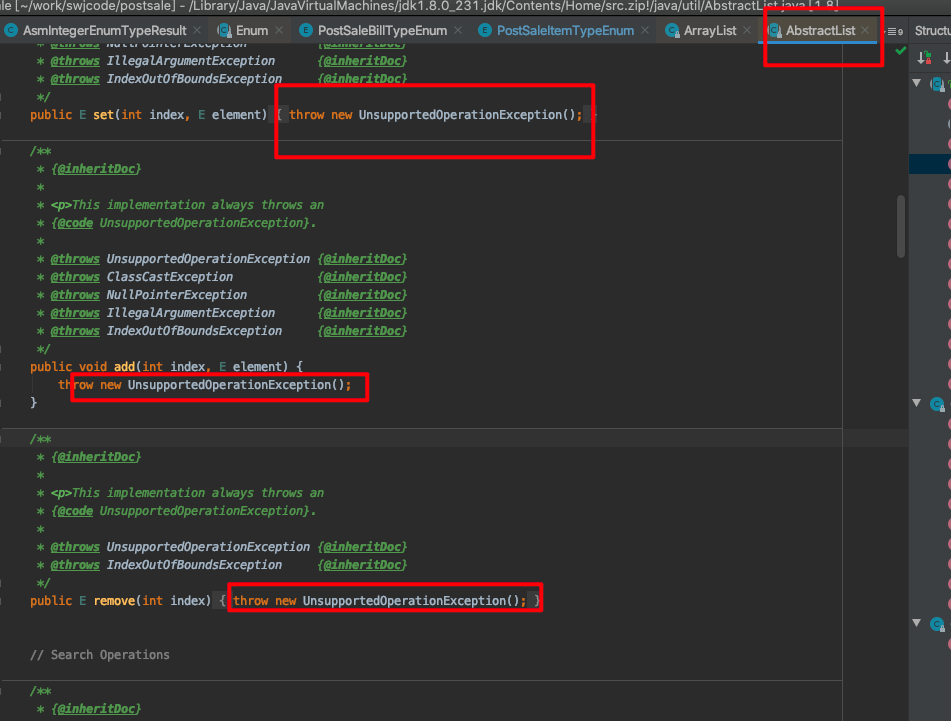

- 泛型的命名规范，一些通用的习惯性约束常用的就是 E：集合泛型；T：普通的对象泛型；K：键类型的泛型；V：用于值类型的泛型；大部分都是这几种基本是够用了，如果不够用，可以参考jdk的函数式接口定义的几种泛型的字母：U，R等，这些不确定的，但是常规的约束都是这样命名

- 泛型的边界，一个泛型一般情况下是可以表示所有的类型的对象的，但是我们可以制定泛型的上下边界，使得我们的泛型的取值是某个类的子类，或者是某个类的父类。如 T extend A 就指定了泛型T的父类是A，也就是给泛型设定了上限，除了泛型的上限，还有泛型的下限也是可以限定，或者多个边界

  > 我们看一下，上限的demo，只需要看红框中的就可以
  >
  > 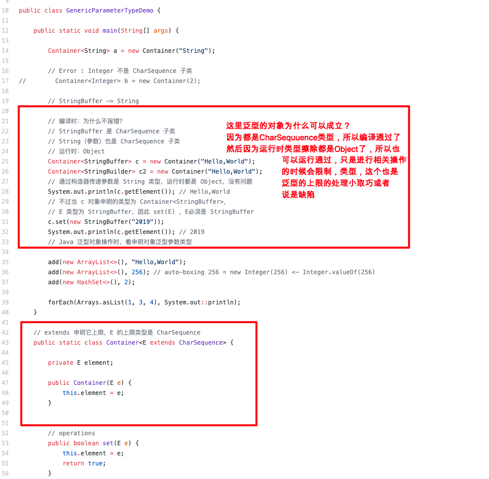
  >
  > 上面的红框为什么可以编译并且执行呢？因为，String跟StringBuffer都是CharSequence对象的子类。所以编译的时候没问题，在运行的时候也是没问题的，因为编译通过后在运行的时候入参都变成了Object对象了，不过，如果我们进行相关的操作的时候，在运行的时候就会有所限制；假如，加的具体参数一个整数一个字符串的，我们用来进行整数的运算之类的，我们尽管可以编译通过，但是到了执行的时候，就无法执行就会抛异常了。这个就是泛型的一个设计缺陷了，后面在集合的时候有出来一些方法处理这个缺陷。

  泛型的多边界，就是同时对一个泛型有多个限制，例如：同时是A，B，C的子类，还需要是D的父类等

  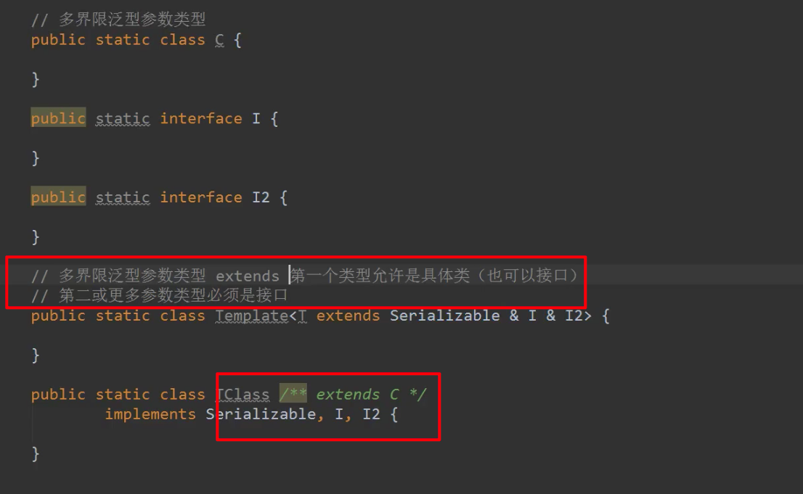

  上图的demo就是泛型T需要是Serializable的子类，I的子类，I2的子类，但是这个定义需要注意一点就是，T的继承的父类的第一个子类允许是具体类也可以是接口，但是从第二个开始就一定必须是接口了（这个跟我们普通的实现类是一样的，单继承多实现，只能继承一个类，可以实现多个接口，其实同样是java8之后，可以接口有默认实现类之后，这个限制其实意义不太大，多实现=多继承了）。在我们的具体类中，如果第一个上限的对象是类的话就是继承，如果第一个是接口的话就全部上限都用来实现。这个多界限，对我们的入参对象的限制有点大，如果限制这么多其实可以直接固定是一个类对象更为方便，个人觉得；

- java通配符“?”，以及跟泛型的不同之处

  > java的通配符"?"总体的用法是跟泛型类似，就是用来表示通用的对象，目前很少用到了。而且对比于泛型更建议使用泛型而不是通配符，有些情况会导致编译异常，如下图，实际上是正确的代码，但是编译不通过
  >
  > 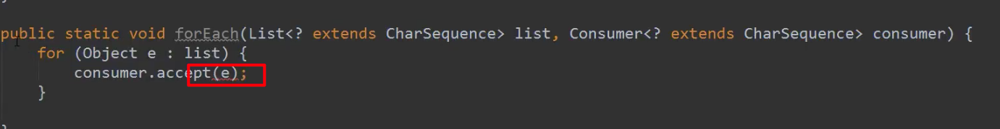
  >
  > 尽管说通配符的用处越来越少，很多时候可以直接使用Object来替换使用，但是个别情况下通配符可能会更为适合一些。就是当一个入参有限制（特别注意是有上限或者下限，总之就是有限制，不然就是直接Object活着Type得了），然后这个入参的范围不固定可以是例如：Integer，Long，Short等类型，这个时候使用泛型的话入参类型就是固定了不方便，使用Object的话又没有限制，这个情况下通配符的意义就来了<? extends Number>，这种方式就是比较合适，当然这种情况下直接用Number也是可以的，总而言之，知道一下通配符就好了。目前基本是用不着，而且意义其实不大
  >
  > 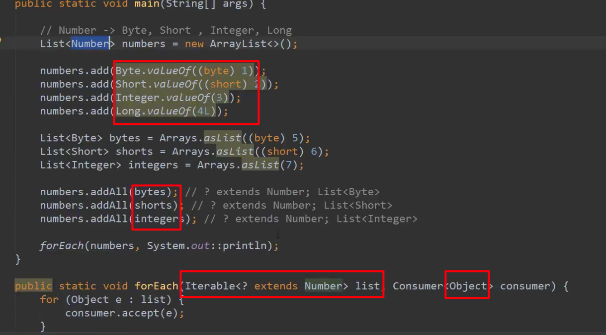
  >
  > 如果我们使用通配符，需要注意一下跟Object的运行时或者编译的时候的冲突，如果不加限制，在运行的时候“？”其实就是跟Object等价了
  >
  > 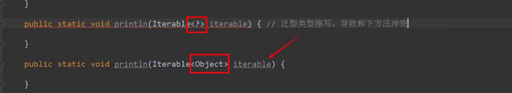
  >
  > 而且使用通配符还有要注意的点，就是下限extends跟上限super的使用区别，读取数据使用下限的，写数据使用上限，具体看demo
  >
  > 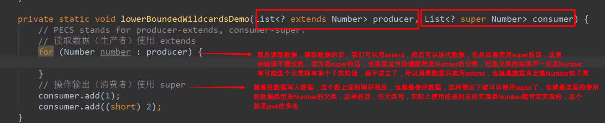

- 泛型的使用

  >##### 泛型的使用有三种：泛型类，泛型接口，泛型方法
  >
  >基于这篇文章总结：https://blog.csdn.net/s10461/article/details/53941091
  >
  >可以看这个补充一下：https://segmentfault.com/a/1190000022687633
  >
  >##### 泛型接口：
  >
  >我们日常使用中，比较常用的就是泛型接口或者泛型类了，函数式接口Function，Supplier，Predicate等都是泛型接口，也是我们平时使用最多的泛型接口。（但是留意了一下，我们日常写的代码极少使用泛型，可能跟抽象类使用一样，就是功能性框架开发使用更多？用于定义一些通用性的方法或者使用方式，但是实际上我们日常的开发也是可以充分使用泛型的，就是一些通用方法或者处理，不过这个有前提，泛型的操作对象跟属性无关才行）
  >
  >跟泛型类一样，泛型接口的使用都是类似的，只是泛型接口使用的时候指定类型，然后还要指定对应的实现类，就像List<String> list = new ArrayList();
  >
  >或者另一种方式，子类去实现泛型接口，这又有两种方式，一种是子类还是泛型类，另一种是子类是具体类的实现类，如果是泛型类的子类使用，就跟泛型类一样在使用的时候指定类型或者不指定就是通用类型
  >
  >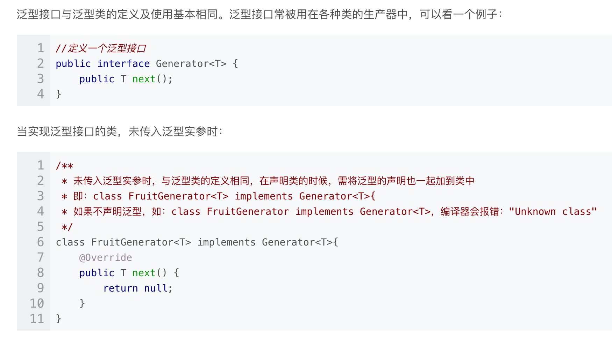
  >
  >指定类型的泛型接口实现类
  >
  >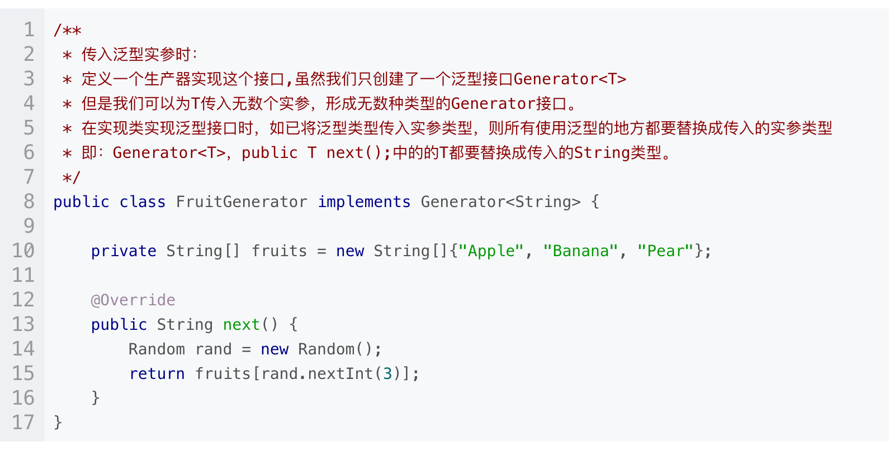
  >
  >##### 泛型类：
  >
  >就像我们使用List<String> 这种就是泛型类了，泛型类也是很经常使用到的比较方便的使用泛型的方式了（只是以前一直没有留意到泛型的使用总结）。一个泛型类的定义都是 修饰词 ``` class 类名<T> (){ private T value; } ``` 这种方式，具体看下面实例
  >
  >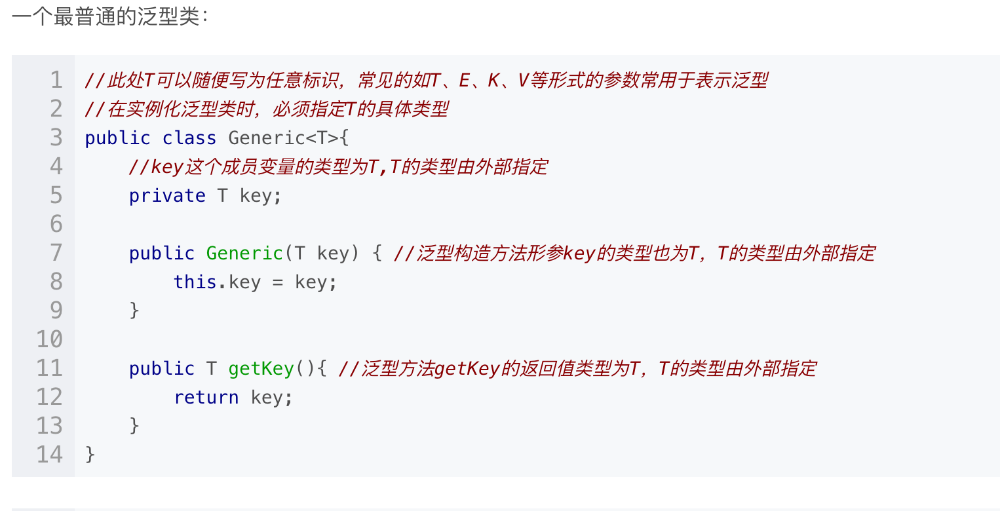
  >
  >这个泛型类的使用，我们一般是类声明的时候指定类型，然后构造出对应类型的对象。当然也可以在构造泛型类的时候不指定类型，这样的话我们的类就是一个通用类型了
  >
  >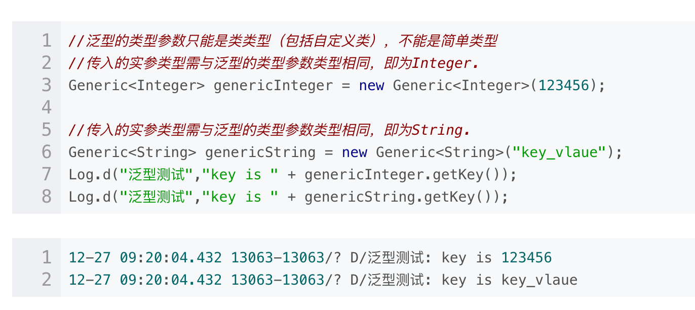
  >
  >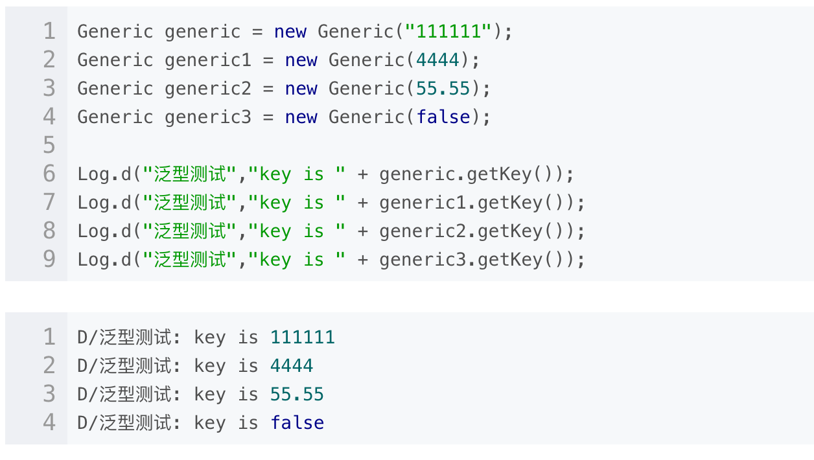
  >
  >##### 泛型方法
  >
  >泛型的方法的话，目前业务开发我觉得是唯一可能快速使用上的泛型的使用方式了。我们可以抽象一些通用的方法来进行指定的逻辑处理（一个思考，泛型方法是不是类似我们的模版设计模式？也不太一样，模版设计模式是执行一样的逻辑，然后注重的流程，泛型方法是兼容不同类型的对象注重类型？）
  >
  >我们使用的时候要注意，泛型类或者泛型接口跟我们泛型方法是不一样的，泛型类/接口 中的方法的泛型表示T其实一旦泛型类中指明了类型之后也就是实例化之后就是指定类型的对象了，不是泛型了，也就是我们使用泛型类或者接口中的定义的泛型在使用的时候都不是泛型。但是，我们的泛型方法是在我们使用的时候指定类型的，这个更为复杂一些
  >
  >泛型方法的定义/使用
  >
  >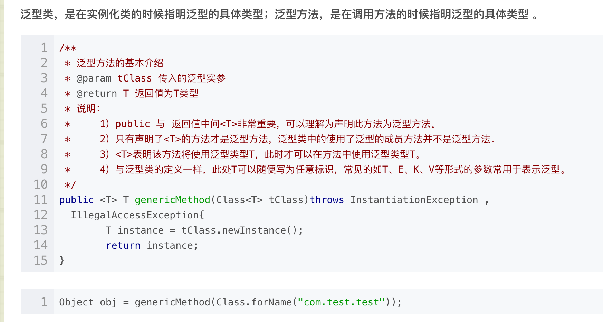
  >
  >我们可以留意到，如果我们使用泛型类的时候，就是入参的时候指定泛型字母，然后在泛型方法中使用到泛型类中的繁星字母就不算泛型了，就是一个正常对象使用。但是泛型方法中，我们如果想指定一个大写字母T是泛型，我们还需要在方法前面也就是范围修饰词后面用<T> 这种方式来指定，如果是多个泛型<T,R,U>这种方式来进行声明一下，不然仅仅是方法中使用一个大写字母，编译器会默认是一个java对象，会编译不通过的
  >
  >看一个泛型使用大全demo
  >
  >```java
  >   public class Generic<T>{     
  >        private T key;
  >     		public Generic(T key) {
  >        this.key = key;
  >    }
  >
  >    //我想说的其实是这个，虽然在方法中使用了泛型，但是这并不是一个泛型方法。
  >    //这只是类中一个普通的成员方法，只不过他的返回值是在声明泛型类已经声明过的泛型。
  >    //所以在这个方法中才可以继续使用 T 这个泛型。
  >    public T getKey(){
  >        return key;
  >    }
  >
  >    /**
  >     * 这个方法显然是有问题的，在编译器会给我们提示这样的错误信息"cannot reslove symbol E"
  >     * 因为在类的声明中并未声明泛型E，所以在使用E做形参和返回值类型时，编译器会无法识别。
  >    public E setKey(E key){
  >         this.key = keu
  >    }
  >    */
  >}
  >
  >/** 
  > * 这才是一个真正的泛型方法。
  > * 首先在public与返回值之间的<T>必不可少，这表明这是一个泛型方法，并且声明了一个泛型T
  > * 这个T可以出现在这个泛型方法的任意位置.
  > * 泛型的数量也可以为任意多个 
  > *    如：public <T,K> K showKeyName(Generic<T> container){
  > *        ...
  > *        }
  > */
  >public <T> T showKeyName(Generic<T> container){
  >    System.out.println("container key :" + container.getKey());
  >    //当然这个例子举的不太合适，只是为了说明泛型方法的特性。
  >    T test = container.getKey();
  >    return test;
  >}
  >
  >//这也不是一个泛型方法，这就是一个普通的方法，只是使用了Generic<Number>这个泛型类做形参而已。
  >public void showKeyValue1(Generic<Number> obj){
  >    Log.d("泛型测试","key value is " + obj.getKey());
  >}
  >
  >//这也不是一个泛型方法，这也是一个普通的方法，只不过使用了泛型通配符?
  >//同时这也印证了泛型通配符章节所描述的，?是一种类型实参，可以看做为Number等所有类的父类
  >public void showKeyValue2(Generic<?> obj){
  >    Log.d("泛型测试","key value is " + obj.getKey());
  >}
  >
  > /**
  > * 这个方法是有问题的，编译器会为我们提示错误信息："UnKnown class 'E' "
  > * 虽然我们声明了<T>,也表明了这是一个可以处理泛型的类型的泛型方法。
  > * 但是只声明了泛型类型T，并未声明泛型类型E，因此编译器并不知道该如何处理E这个类型。
  >public <T> T showKeyName(Generic<E> container){
  >    ...
  >}  
  >*/
  >
  >/**
  > * 这个方法也是有问题的，编译器会为我们提示错误信息："UnKnown class 'T' "
  > * 对于编译器来说T这个类型并未项目中声明过，因此编译也不知道该如何编译这个类。
  > * 所以这也不是一个正确的泛型方法声明。
  >public void showkey(T genericObj){
  >
  >}
  >*/
  >
  >public static void main(String[] args) {}
  >```
  >
  >##### 泛型方法与可变参数
  >
  >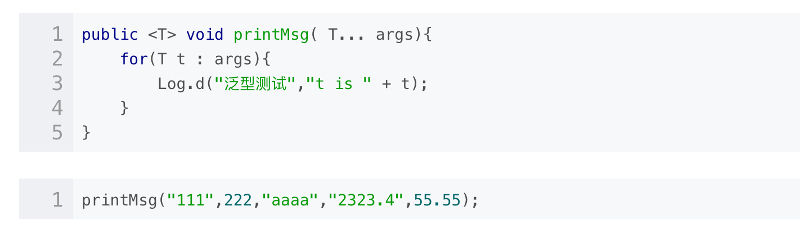
  >
  >

####  6.java9模块化

模块化作为java9版本更新引入的主要新功能，就是为了将我们的应用更加灵活一些，更好的维护（但是对开发人员的要求更高一些，需要了解jdk各个模块的功能点，不然就可能无法好好的使用这个模块化的特性了）

**模块化的动机：**

> 1. 大型应用的功能模块可以更加灵活（前提是java基础好）
> 2. 增加模块中的类型检测速度，两个原因一个是java9的扫描机制变更了，还有就是引入的模块更为精确了而且少了
> 3. 瘦身了jdk的体制，主要是我们可以更具我们要的功能引入对应的模块

**模块化的特性：**

> 1. 模块化之间存在依赖传递，a依赖b，如果b依赖了c也就同时将c依赖进来了
>
> 2. 模块的依赖解析会以树状来进行，顶层依赖到中间，然后中间的再有依赖会继续被加载然后解析
>
>    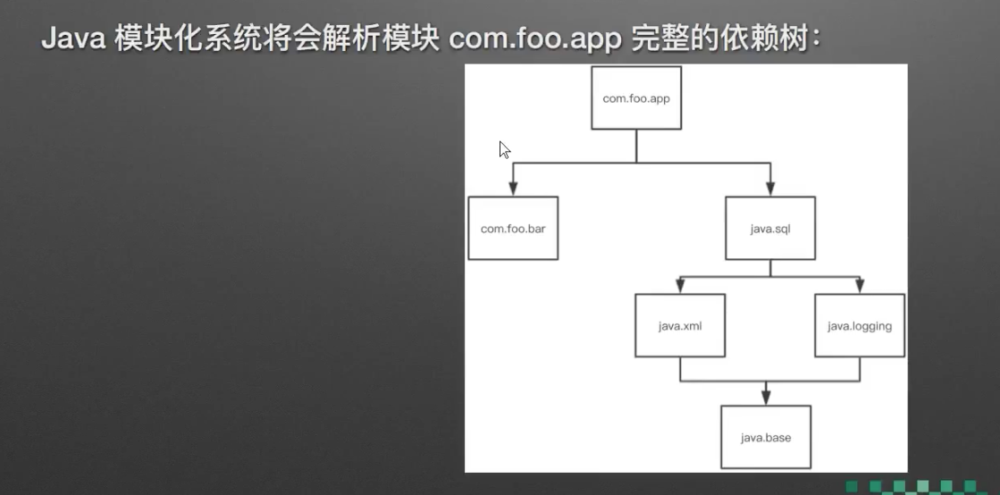
>
>    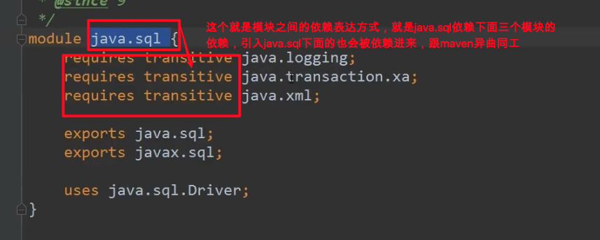
>
> 3. 模块化迁移
>
>    关于模块化的迁移，工作量会非常大，但是收益会比较小，风险也大所以迁移需要非常谨慎，需要根据模块化的特性来确定是否需要模块化编程
>
>    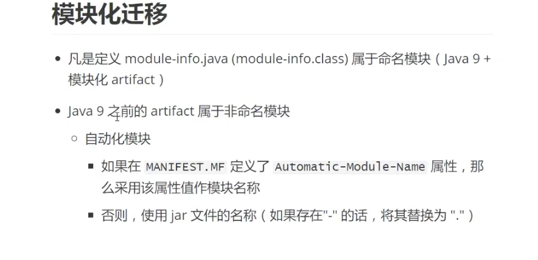
>
>    

我们前面说的类的修饰词，如果是public，在java9之前只要是引入了都可以用了，但是在java9模块化之后，我们想引入还需要先将对应的模块引入进来我们的包中才能使用。有点类似vue的部件化

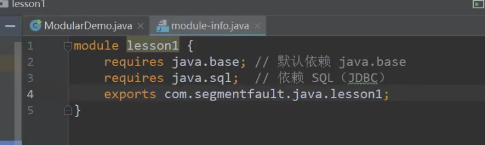

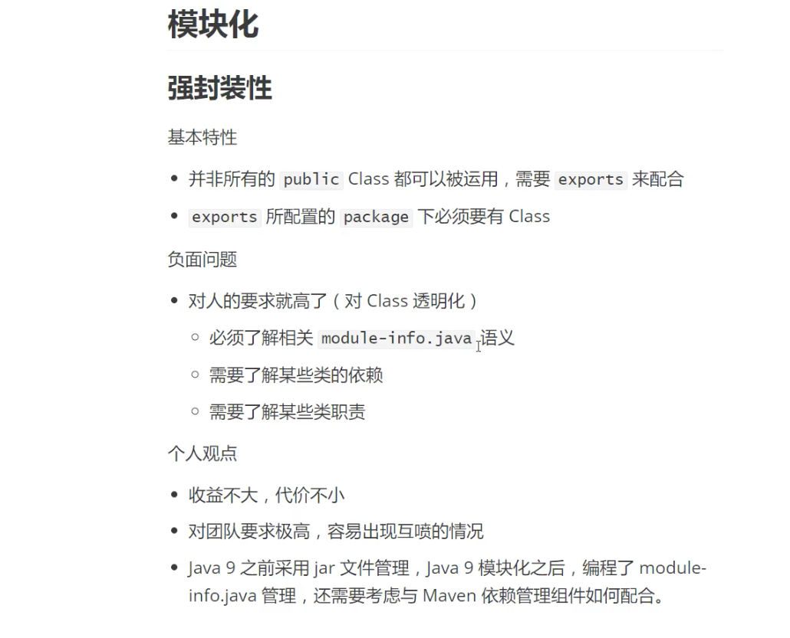

#### 7.java枚举

- java枚举类的前身就是一个java最终类，java最终类内部属性构造自身对象，将构造方法私有化，就是该类无法通过外部创建，我们只能使用通过自身构造的静态对象属性使用对应的类对象。通过这样的方式，我们构造的枚举类的对象，只能是我们内部提供的对象属性，一旦我们将该类在外部作为入参或者使用的时候，就限定死这个类的对象了，就是类中构造的对象。

  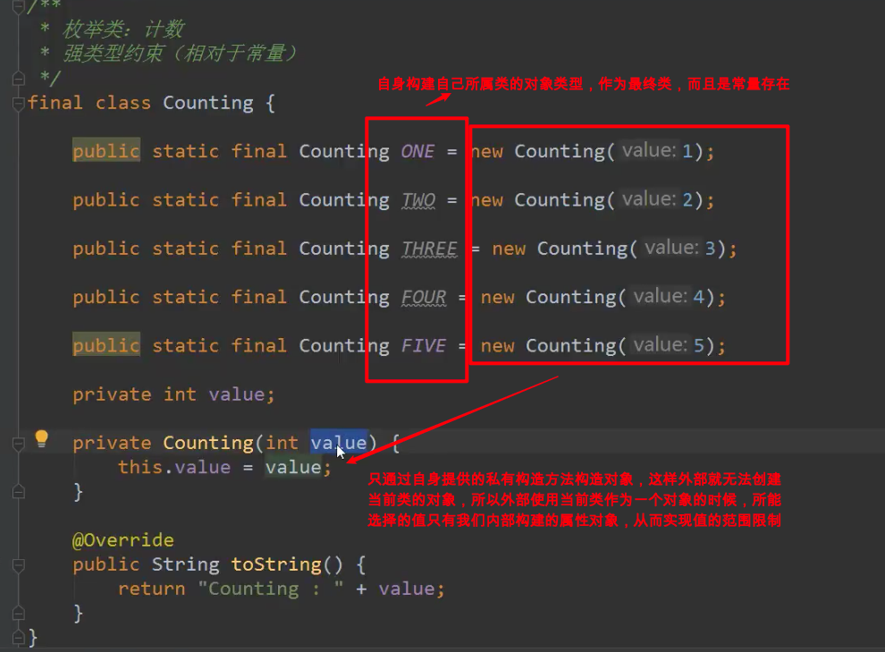

  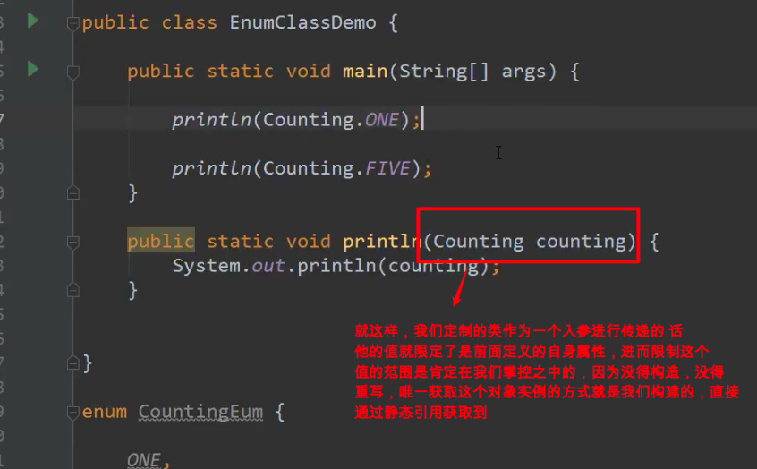

- 上面的枚举的前身，java最终类。后来就进化成了一种新的类型，java枚举了。通过上面的类，可以清晰认识到枚举的用处就是一个类对象，但是这个类对象的范围是限定的。只有我们在枚举类内部定义了属性，外部使用枚举类的话只能使用我们定义的属性对象。很多情况下，枚举类就是作为一个容器对象使用，装载一些属性值（不仅仅是常量，我们日常使用用枚举就是使用其常量，但是每一个枚举类的属性都可以是一个类，然后我们限定该类的实现，使用枚举的时候也就获取到对应的实现对象，用来实现传递我们的功能对象）

- 所有的枚举类都是Enum的子类，尽管没有明显实现或者继承，因为枚举这个制定类型的类，都是默认都是Eunm的子类

- 我们定义枚举类在编译的时候，java虚拟机会自动给每一个枚举类字节码提升，添加一个方法values()，这个方法是用来获取当前的枚举类的所有的定义的属性对象的。我们常用的通过枚举的code获取枚举的value很多时候就是通过获取枚举对象的所有的定义的对象，然后遍历匹配获取，如下图：（字节码提升就是，就是变更原来的java类的字节码，添加或者删除我们的原来的java文件编译后的字节码文件，使其功能发生一定的变更，最常用的Spring就是通过字节码提升来进行动态代理

  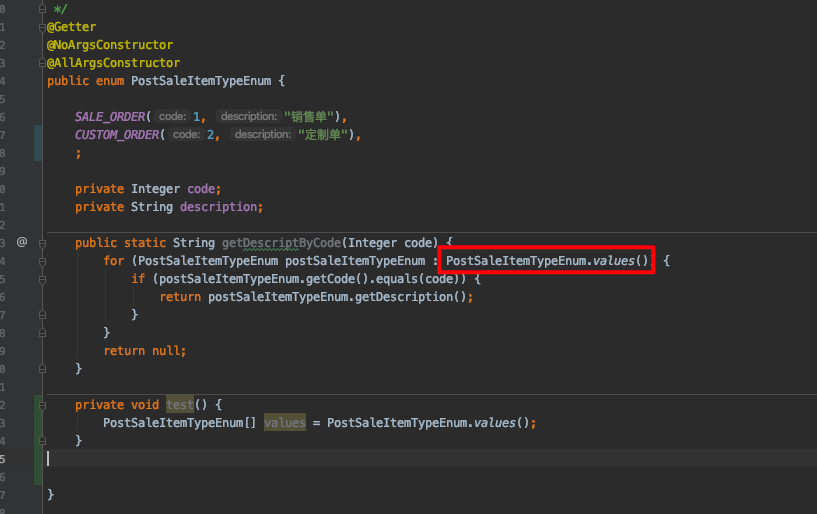

  上图就是为什么我们能够使用这种方式来获取枚举对应code的value的原理了，当然可以通过自己写方法来进行遍历获取，但是没必要java编译的时候默认就帮我们生成了。我们自己写一个枚举的遍历方法，就没那么容易了，因为这是遍历一个类的对象属性，我们只能通过反射的方式进行获取所有的属性，然后提取成一个数组，再去进行遍历匹配

  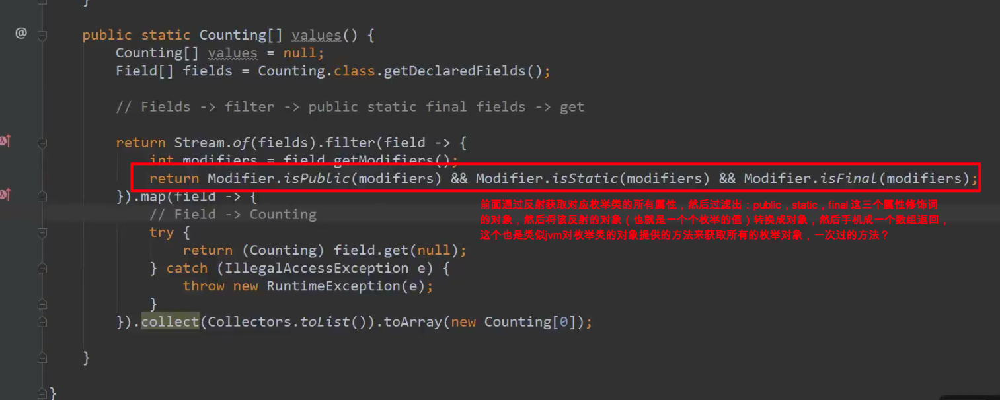

- 枚举类都是最终类final 类，枚举类的成员变量是 public static final 属性的，每一个枚举类都有values()方法，这是java的字节码提升自动生成的方法，用于遍历枚举的所有的属性

- 枚举的构造方法都是默认private的，而且枚举的元素定义其实是等同于 public static final EnumA A = new EnumA(构造方法入参)的，我们定义的时候可以等价于 A(构造方法入参)；

  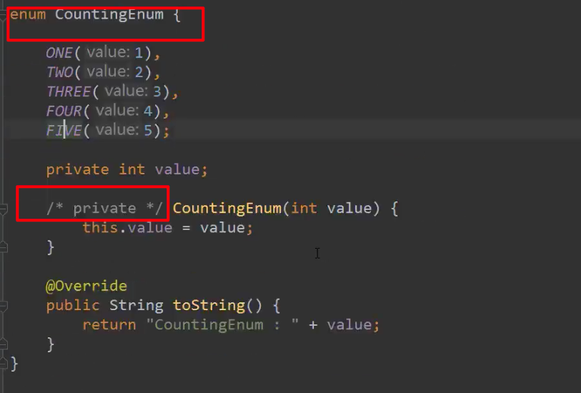

- 尽管我们现在使用的更多是枚举，基本上用不上枚举类这种自定义限定范围的枚举类了，但是比较一下这两者，我们可以发现，枚举类还可以拥有抽象方法的，还可以实现接口的，等一些特性，平常不太了解的特性，说不定以后设计的时候可以用得到枚举类的抽象方法，用于每一个特性属性有一个单独的方法实现

  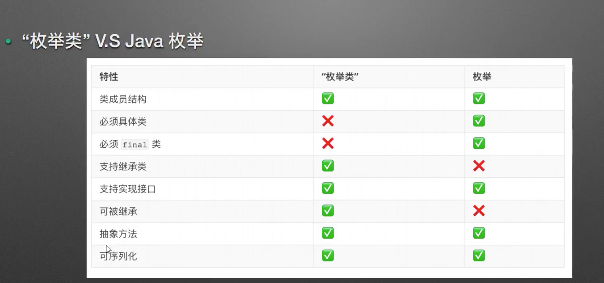

  看一下枚举中有个抽象方法的每个枚举值的处理

  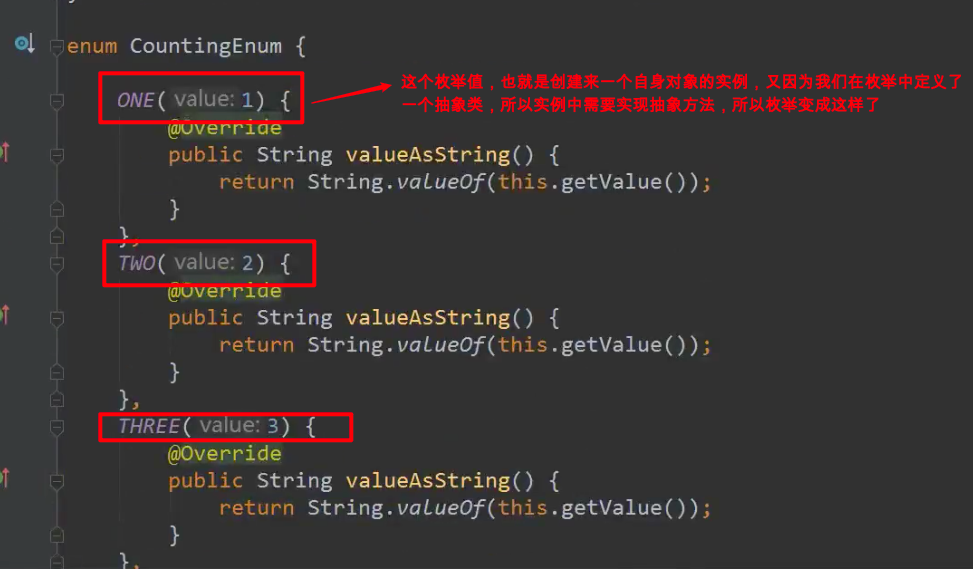

  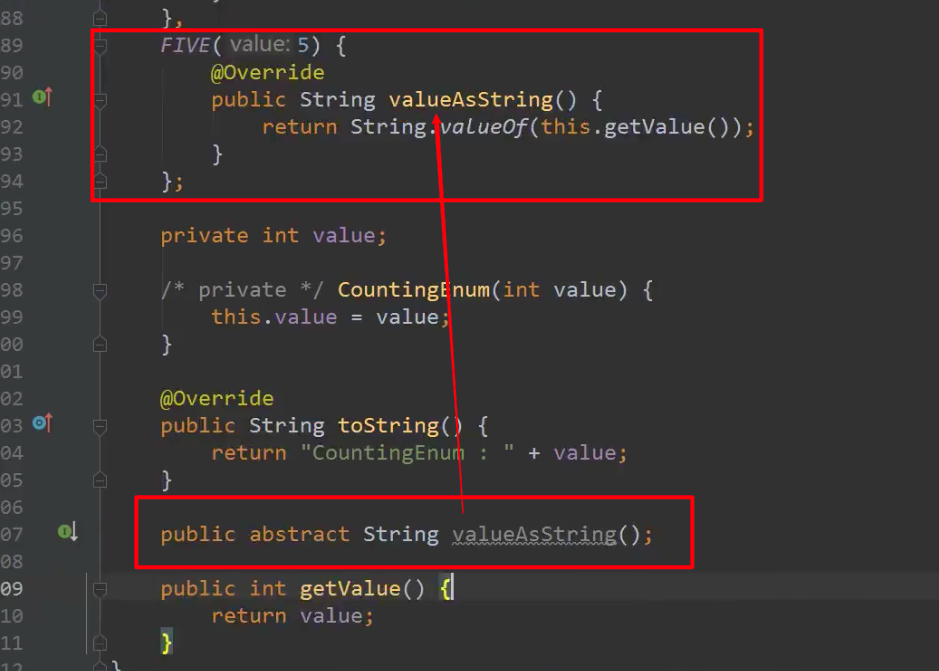

  


