# java集合

### java集合框架介绍

- 集合框架就是一个用来展示和操作集合的统一架构，能够通过框架的api进行集合独立操作

- 集合框架的优势：

  > 1. 集合操作数据对比直接操作单个对象而言，最明显的优势就是批量操作IO，这个能够提升操作的效率
  > 2. 减少编程批量数据的处理，直接使用集合框架的api
  > 3. 框架的重用，统一化操作，不然使用方各自一套操作框架对于开发而言学习成本高

- 集合框架的常用接口（也就是通用的集合子类）

  > 1. java.util.Set
  > 2. java.util.List
  > 3. java.util.SortSet
  > 4. java.util.NavigableSet 这个是jdk6开始的一个有序集合

- 集合的元素数量

  > 集合的元素数量是有限的，集合的数据数量容量的长度值是Integer的，既然是Integer就是有限的，整数的长度是2的-32次到2的32次方（一个整数4个字节，一个字节8位）；所以集合的数量最大也是到2的32次方个，一旦超过之后size的值就会变成2的-32次方了。
  >
  > 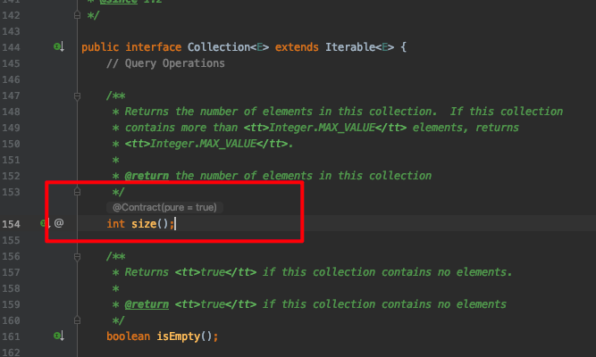
  >
  > 既然使用整数作为集合size值，导致集合的数量有限，那为什么不用Long或者double这种更大的类型呢？
  >
  > 因为Long类型跟double类型都不是线程安全的数据类型，使用的话可能导致计算不准。因为double跟Long的组成是上下两个4字节的组成的高地位的数据，总之就是结构导致线程不安全；而且java的一开始的设计就是32位系统设计的，向下兼容的原因就是一直保留着这个长度，绝大部分情况都是够用的了，超过这个数量级的集合计算时间都是个问题了。（需要注意的是，既然说了java一开始是为32系统设计的，所以默认的java虚拟机的内存最大只支持4G，如果想更充分使用64位的系统大内存，就需要使用后来的64系统的虚拟机jvm了，这个高版本的似乎都是了）

- 我们常说，ArrayList有序可以重复，HashSet无序不可重复，为什么有时候HashSet使用的时候是有序？

  > HashSet是有序的话，这个是一种不复杂的操作的偶然错觉，底层是无序的
  >
  > 

- java内置集合Queue以及Deque也是Collection的子类，而且Queue是单向队列，Deque是双向队列。在Collection中的add()方法已经声明了一个抽象接口，为什么这两个子类中还要重复声明一下呢？

  > 这个我们抛开Queue的使用，看一看为什么jdk这样设计。
  >
  > 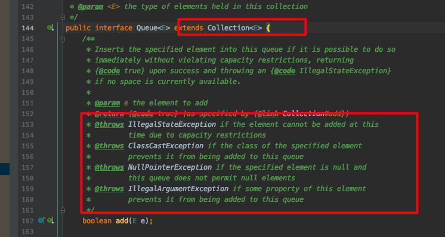
  >
  > 
  >
  > 两个都是接口，按照一般的子类接口，这个直接使用父类的接口就好了，子类接口中不需要再声明一次，那么为什么这两个接口都要声明呢？
  >
  > 先来确定一件事，javadoc文档的用处是干什么的呢？第一就是声明介绍这个接口或者方法的用处以及使用方式，第二就是通过javadoc文档来进行一些常规的约定（就是类似spring的约定优于配置一样）
  >
  > 明白了javadoc的两种意义之后，我们来看一下，Collection接口跟Queue两个接口的的声明，尽管都是接口都没有实现，如果没有声明的话其实现类实现了的话就是直接使用Collection中的add()方法的，但是Collection中的声明比Queue多了一个异常的声明不支持的操作声明。这个就是Queue跟Collection的区别了，Queue的接口的实现类是支持修改操作的才不会抛出这个异常。这个也就是说明了一些Queue的特性支持操作的，Collection的add()存在不支持的操作说明是不支持add这个操作
  >
  > 一个发散思考：
  >
  > 写代码的时候，遇到第三方api的时候或者jdk的api的时候，是否可以更深入思考一下？去看一下对应api的所有方法，然后看一些有哪些？然后就是比较一下以及为什么它们需要这样设计，当前前提是比较好的库才去思考分析

- java的Set以及HashMap的关系

> HashSet的底层实现，其实就是基于HashMap的，基本上HashSet的所有操作都是在操作HashSet中的一个HashMap对象，只不过就是HashSet是一维的HashMap是二维，HashSet只是使用到了Map集合的Key来当容器。我们对HashSet的操作，最后都是操作HashMap容器。具体来看一下HashSet的几个方法
>
> 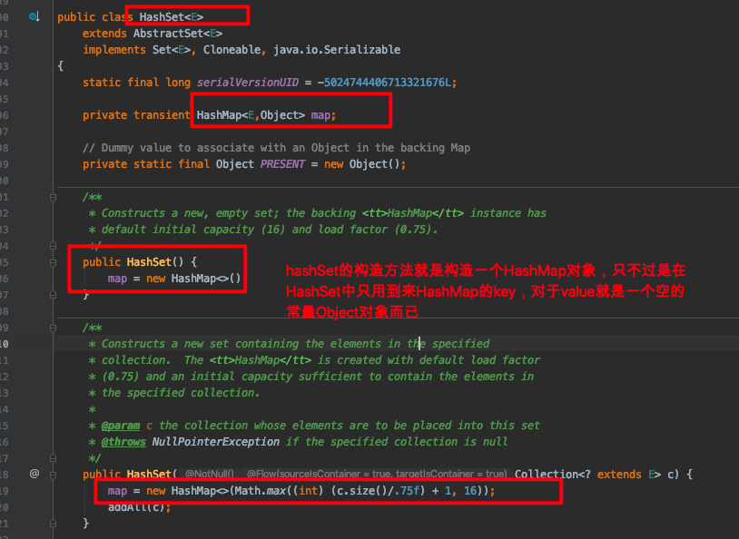
>
> 再简单看一下HashSet的几个常用方法的实现
>
> 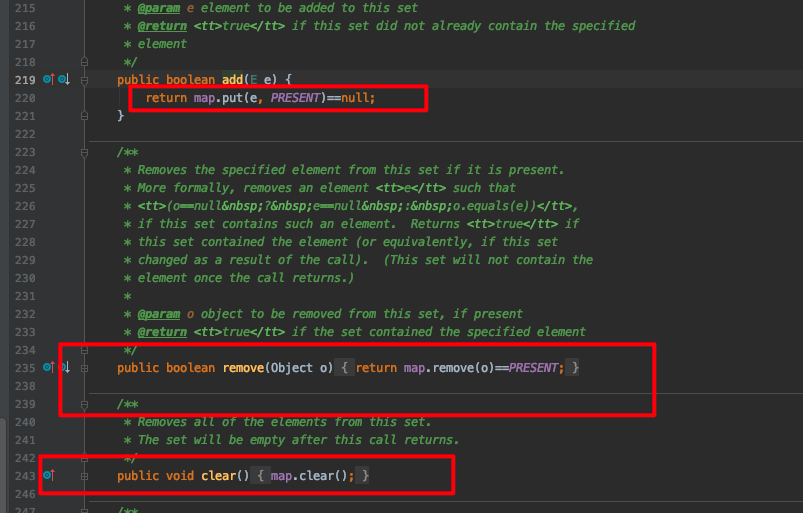

- 几种比较常见集合的比较

> 
>
> 对于应该选择哪个集合来使用，可以看一下这个比较对比的表。说明一下FIFO指的是Frist In First Out 先进先出，LIFO指的是后进先出。
>
> 在表里面可以看到，java的线程不安全跟线程安全对应的集合，还有是否允许重复值，是否支持随机访问等，还有就是访问速度等，这个根据需求使用，不过大部分情况下基本上都是用的ArrayList，以及HashSet，特别高并发的时候需要注意多线程使用的线程安全问题

- 我门常用的ArrayList跟Vector的集合比较

> 这个的话，就是比较老生常谈的问题了。两个集合的最大的区别在于，Vector是线程安全的，ArrayList是线程不安全的，对于接口的父类以及实现的方法都是一样的
>
> 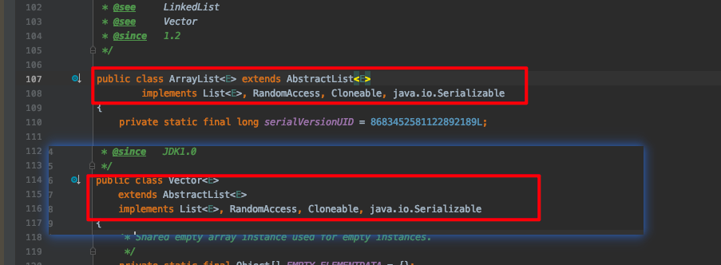
>
> 我们再去看一下Vector的源码，可以发现对比ArrayList，Vector的集合操作方法基本上都添加了同步关键字synchronized，这个就是这两个集合的最基本的区别
>
> 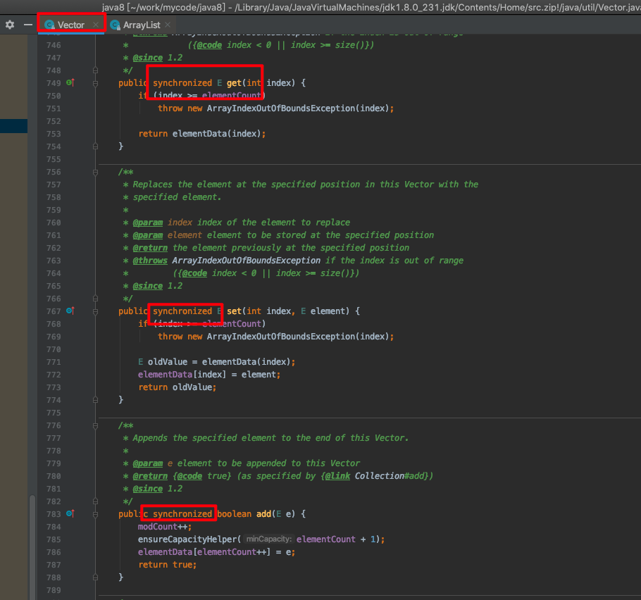
>
> 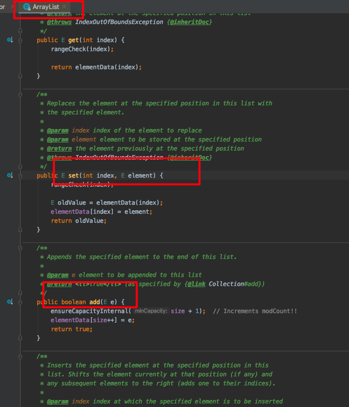

- HashMap跟Hashtable比较

> 这两者有好几个方面的区别，主要有两个，第一个就是线程安全（HashMap线程不安全，Hashtable线程安全），第二个就是key-value的能否为空（HashMap都可以为空，Hashtable都不可以为空）。当然还有很多细节方面的不一样
>
> 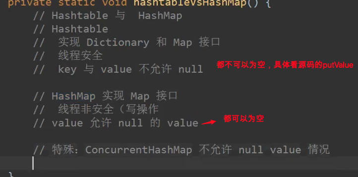
>
> 更为具体的，直接参考网上的文章即可：https://www.cnblogs.com/williamjie/p/9099141.html，这里先不深入记录，这些都是比较基础的，但是容易忘记对比使用比较少，而且Hashtable基本上被淘汰了，没多大意义
>
> 这里延伸一个问题，为什么在HashMap中key-vaule都允许为空，但是ConcurrentHashMap不允许为空？这个问题主要是，这个是并发Map需要注意线程安全方面的问题，如果一个值为空是存在两种情况的，一种是确实是null，另一种也可以是线程不可见。所以一旦允许key为空了，这个处理就比较麻烦了，因为存在两种情况。所以这个子类Map不允许key为null

- 为什么Map种的get(Obejct obj);方法的入参是Object，但是构造的时候是使用泛型呢？

> 其实不仅仅是Map中的get方法，同时还有remove()，equals()，方法等都是使用的Object作为入参类型，而不是构造Map的时候指定的泛型作为key入参。
>
> 网上查询了一下（对应文章：https://forgkan.gitee.io/2017/04/28/java/why-map-get-parameter-type-is-object/），主要问题就是设计如果是泛型的话，会有一些问题，更多的是因为通用性等各种问题，我们很多使用只需要比较key的equals()值是不是想等就可以了，不一定需要类型是一致
>
> 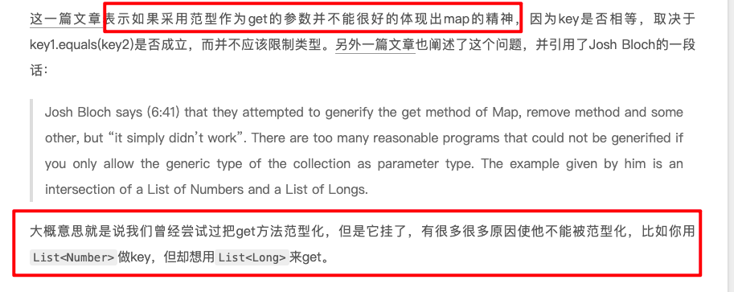
>
> 所以同理也是，Map中的一些常用的remove()，equals()方法都是使用的Object作为入参，对于这个知识点需要以后注意一下，我们使用Map的时候，尽管构建的时候是根据泛型来的，但是get()的时候是可以跳过类型的，直接入参我们想要获取的key的值就可以了，没有类型一说。可以灵活使用，但是也要避开这个坑，如果两个Map的key类型不一样，但是在调用get方法取值的时机，如果不区分两个map来同时获取是有可能两个map都获取到对应的值，这个时候有可能会产生冲突，需要注意一下
>
> 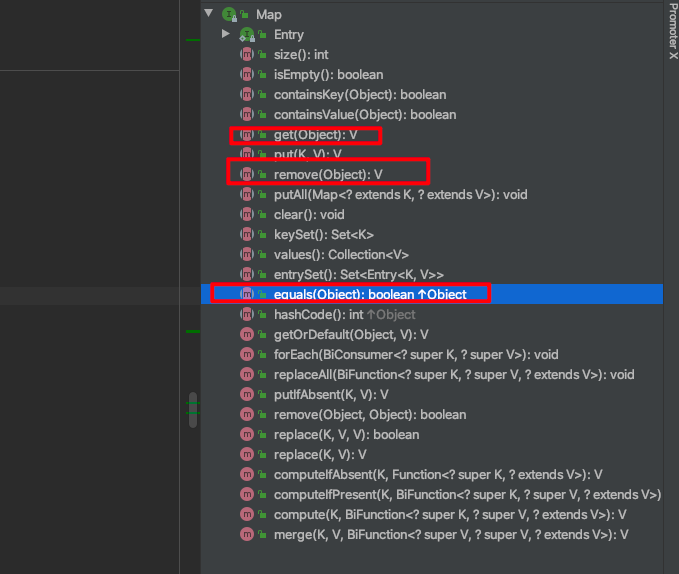

- 关于集合克隆

> 常规的对象克隆有两种，一种是浅克隆一种深克隆，浅克隆是创建一个对象，但是这个对象的底层指向还是原来的对象，就是数据还是原先的集合。深度克隆就是完全创建一个新的对象，这个对象跟原来的对象没有关系，唯一的关系就是值是一样的
>
> 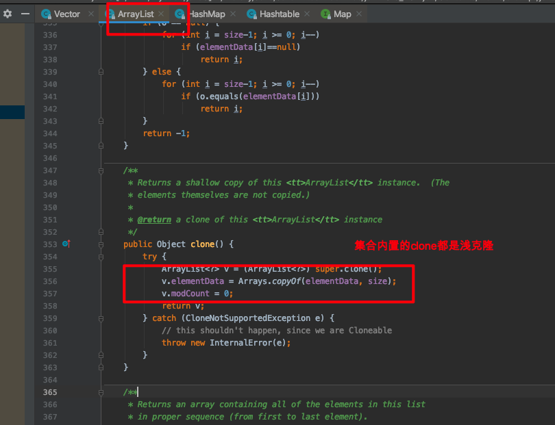
>
> 我们集合提供的一些克隆方法一半都是浅克隆，所以想要实现深度克隆需要注意一下方式，主要有两种，就是克隆的时候创建一个新的对象去承载原来的数值，另一种就是通过序列化的方式，通过序列之后，然后再将数据反序列化就会生成一个新的对象了，这种方式也是深度克隆
>
> 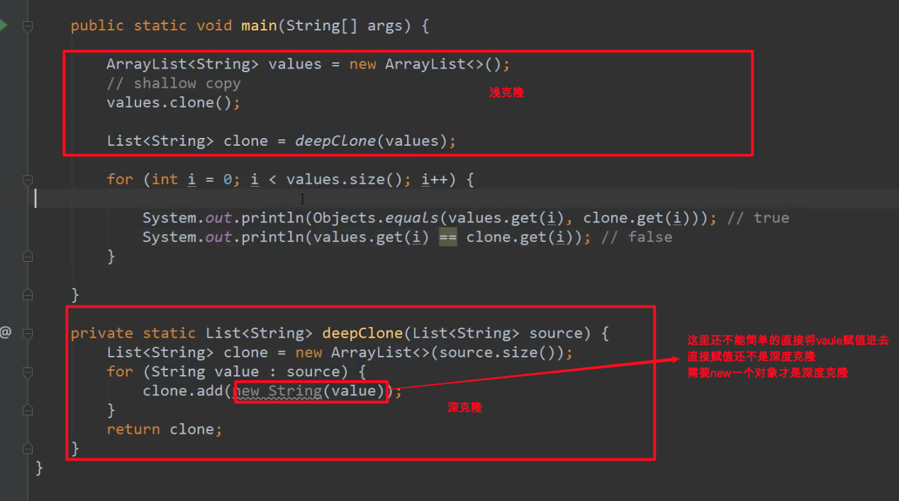
>
> 序列化的方式深度克隆的实现，底层原理就是将数据转化成序列化的结果，然后再反序列化成对应的类型，这个过程就是值操作就跟原来的浅克隆分开了（浅克隆底层数据引用还是原先的对象）
>
> 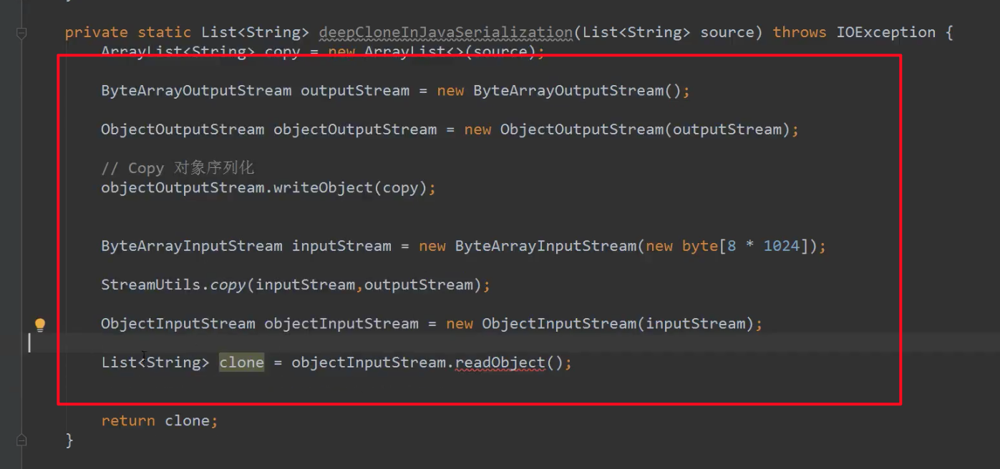

- Java迭代器

>什么是java 的迭代器呢？什么是java的分割迭代器呢？
>
>java 的迭代器是java集合提供的一个访问集合数据的方式，或者说是一个游标，不同的集合有不同的迭代器实现，但是一样的是只是我们访问集合的一个索引，迭代器的结果变更不会改变原来的集合数据，可以理解为一个映射，只是这个映射是用来遍历读取集合的数据
>
>说明一下，java迭代器的跟java枚举类的使用目的都是用来遍历数据的，不过目前java 枚举类已经被淘汰了，更多的是使用java迭代器

- java 集合的底层接口说Collection，但是Map并没有实现Collection接口，那么Map是不是集合？

> 首先来说一下集合的定义，就是一个数据的容器，然后我们通过集合对应的框架来进行集合的相关操作。那么Map符合吗？
>
> 当然符合，我们常说的集合Collection只是集合的一维的集合，Map是二维的，所以Map就没有实现Collection的接口，当然是不是集合跟有没有实现Collection接口没有强制说明或者约束的。只是所有的一维集合都是实现了Collection接口，但是没有实现的Map也是集合

### 集合框架高级使用

- 集合的创建方式

> 1.可以使用集合的构造方法，也就是使用new 的方式来创建集合对象
>
> 2.使用集合工具类Collctions的方法来创建集合
>
> 3.java9之后可以使用集合的of()方法来创建一个集合对象

- 集合的抽象类AbstractList

> 抽象类中的所有的操作方法都是不可编辑的，AbstractList有很多子类，所有的AbstractList的子类要是想要编辑方法可以操作的话都需要重写对应的方法，例如add()方法等
>
> 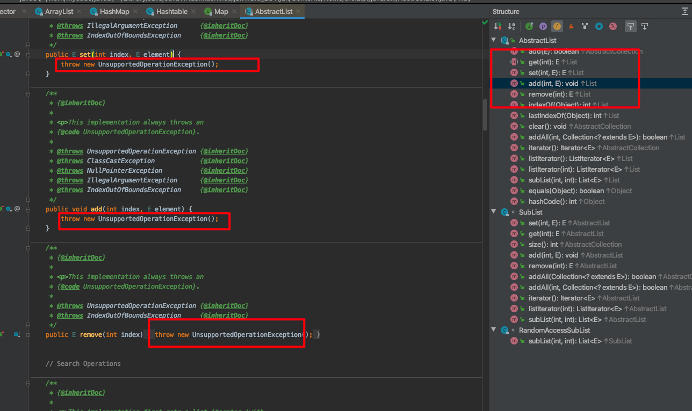
>
> 如果子类没有重写对应的编辑方法，那么其子类都是只读的，如果进行写操作就会抛异常
>
> 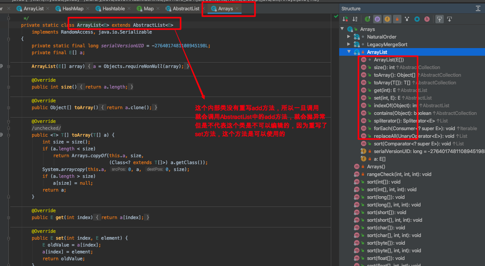
>
> 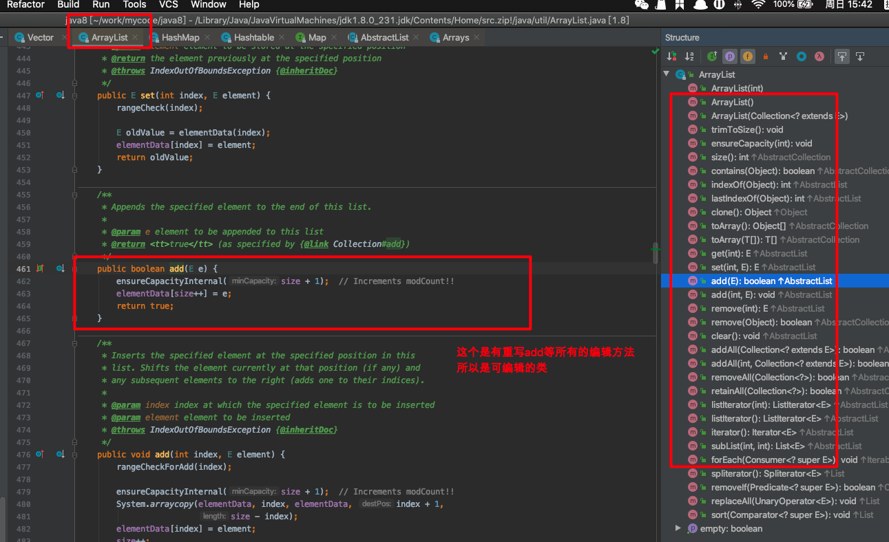

- 数组的长度

> 集合跟数组相比，集合的长度不是固定的，可以一致添加数据，但是数组的不是，数组的长度是固定的，如果想添加元素就需要创建一个新的数组将数据转移过去后再进行操作。尽管数组是不可变长度的，但是数组的元素是可以替换的
>
> PS：数据自身的api的数组复制一样是浅复制的，Array.copy()
>
> 基于集合跟数组，开发中尽量不要使用数组这个容器，尽可能使用集合对象，集合提供的元素操作方法更多而且更加灵活方便

- 集合框架几个使用建议

> 1.我们使用集合的时候，如果接口的返回值是一个集合对象的话，就算接口的计算结果是null，不允许直接返回空，要返回一个空集合。如果是使用别人的接口返回值是一个集合的话，要习惯性的先做非空判断（严于律己，宽以待人）
>
> 2.关于方法的入参如果是一个集合的话，如果没有意外的话，参数类型不允许是集合的具体实现类。就像我们平时写的接口入参是一个集合我们都是写List<String> ,Map<k, v>，这种接口方式来声明入参，基本上不会有接口的集合入参是ArrayList，LinkList，HashSet这种具体的实现类。这是非常非常非常不建议的，因为几个原因
>
> - 我们java都是面向接口编程，所以最好的方式方法的入参都是接口类型
> - 面向接口跟具体实现类，这样的方法更加具备抽象性，我们的入参可以是接口的所有的实现类，不用适配每一种实现类
> - 还有就是开发设计的原则是 宽进严出，跟上面1说的，严于律己，宽以待人一样原理，接口尽可能通用
> - 所以方法入参是一个集合的时候，入参类型的优先级是：Iterable > Collection > List/Set ,基本上不存在接口入参是一个集合是直接声明具体接口实现类ArrayList，HashSet这些的。而且，我们平时开发中，从我们学习java开始，我们潜意识或者默认的写法接口入参是集合的话都是声明的 List<Object> 这种接口类型了，只是之前没留意到这个细节，或者说根本就没有去思考过这个问题
>
> 3.java集合框架工具类Collections有很多非常实用的方法，例如将集合转换成枚举对象，各种创建集合的方法，还有空集合，不可编辑集合等，以后需要用到集合的一些方法的时候，多留意一下集合工具类有没有提供先

- 集合包装类

> 这个词还是第一次听说，之前对于包装类所有的感知就是对一个对象进行包装，但是没有试过对一个集合进行包装或者说基本上都是使用的原声的集合对象，没有使用过原生的集合对象的包装类，那么这个集合包装类有哪些呢？直接来集合工具类Collections的方法看一下方法
>
> 
>
> 看看这个线程安全的集合包装类对象，跟父类的List的方法基本上都一样，就是部分方法重写了。
>
> 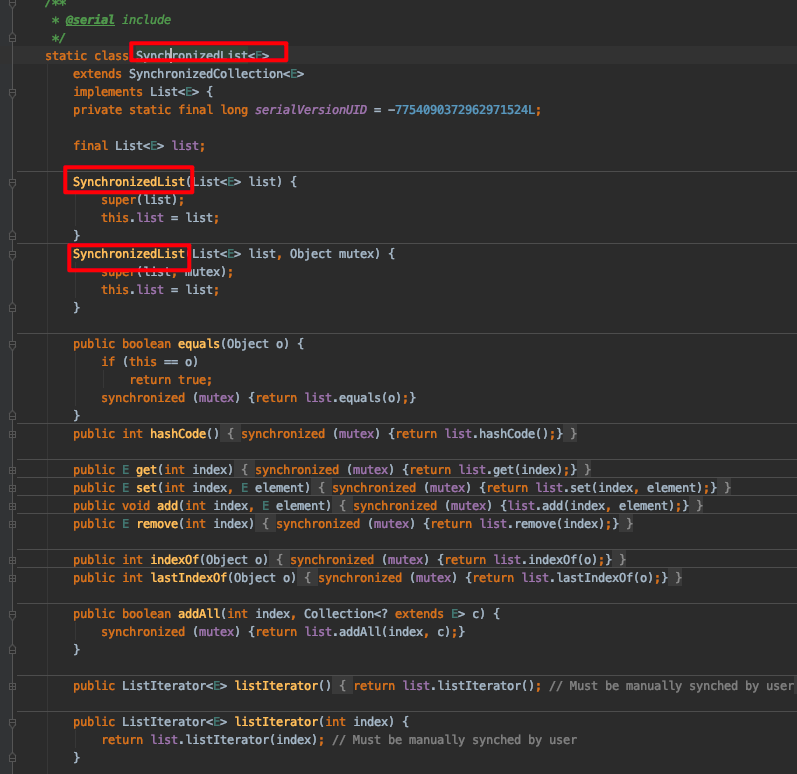
>
> 这样看来其实集合包装类就是集合的子类重写了方法，就是java的多态的实现

- java 集合的泛型

> Java的泛型都是一样的，编译的时候有类型，但是在运行的时候泛型都是会被擦除的，当作一个Object类型对象使用
>
> 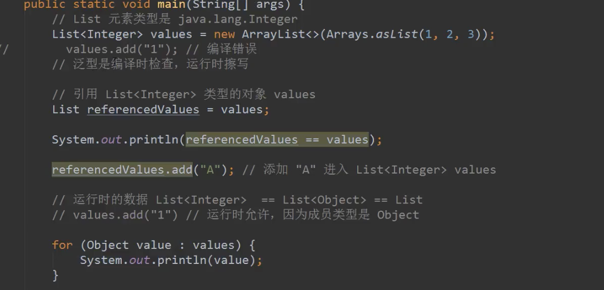
>
> 既然java有泛型擦除，自然会导致java的使用会有一个风险破坏java的强类型特性。绕过编译器的编译，在运行的时候进行一些特殊的操作，这种操作尽管可以，但是有些情况下会导致程序出现异常。那么java集合工具类提供了一个java集合类型校验方法，用来防止java泛型的这个风险
>
> 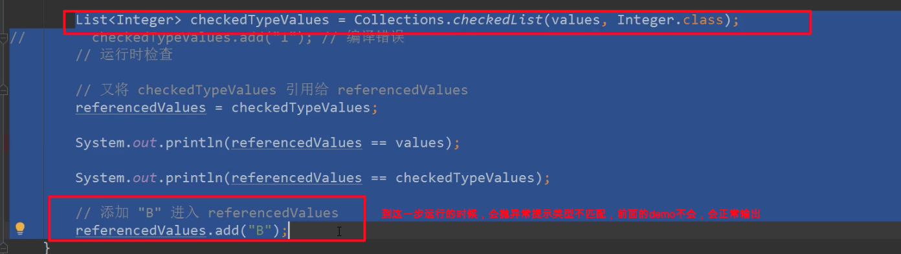
>
> 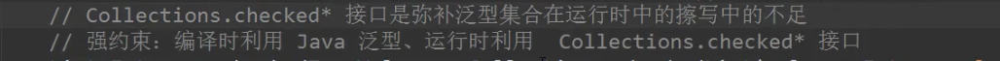

- java的强引用，弱引用是什么？

> java的强弱引用这个主要用于java的GC也就是垃圾回收的判断，在java中有一个引用计数的回收机制，也是跟netty中的引用计数回收对象一样，就是判断内存空间的对象还有没有引用的，有的话就不回收一旦没有的话就会被回收器回收掉。
>
> 强引用就是，这个对象正常的创建 也就是new Object()的方式创建对象，弱引用就是这个对象引用比较弱，GC检测到根据内存情况判断是否回收，内存空间足够就不回收，不够就回进行回收

##### java中重写HashCode有什么意义？

> 这个的话，意义还是很大的。最重要的一个使用场景就是，使用HashMap的时候，如果Map的key是一个自定义对象的话，如果这个自定义对象没有重写hashCode()方法以及equals()方法的话，添加一个自定义对象进入Map的时候，然后获取对象的话是会出现问题的。因为如果没有重写自定义对象的hashCode()方法的话，自定义对象的hashCode值是直接获取Object对象中默认的生成方式生产的HashCode，一个自定义对象的值一样，但是其hashCode是不一样的，如果用new 出来的属性值一样的对象去取值的话，就获取不到，这样是有问题的。
>
> 说一下为什么会获取不到：
>
> 1. 第一就是，如果我们不重写hashCode()方法的话，就是用默认的Obejct对象的hashCode()方法来获取对应的对象值，那么这默认的Object的hashCode值是什么呢？有3种说法，因为这个方法的底层是调用C语言之类的进行生成的，就参考了一下网上的说法
>
>    1) 默认的Object的hashCode的值是jvm的16进制的内存地址，就是对象的引用地址《结果得分：1分，总分10分》
>
>    2) jdk中没有默认的hashCode()方法的实现，因为底层是JVM用的是C/C++写的，真正的内存管理在JVM的native中，所以返回的是C/C++中的生成的对应的数值《结果得分：4分》
>
>    3) 满分答案：
>
>    进入到Java的底层代码的，查看对应的C语言方法，可以知道生成hashCode有5种方式，默认的方式是使用`Marsaglia XOR-Shift` 算法。简单点说5种方法不同版本的实现还有所不同，在openJdk8中是：
>
>    默认算法是：JDK8 的默认hashCode的计算方法是通过和当前线程有关的一个随机数+三个确定值，运用Marsaglia's xorshift scheme随机数算法得到的一个随机数
>
>    第二种：返回一个Park-Miller伪随机数生成器生成的随机数
>
>    第三种：将对象的内存地址，做移位运算后与一个随机数进行异或得到结果
>
>    第四种：返回固定的1
>
>    第五种：返回一个自增序列的当前值
>
>    第六种：返回当前对象的内存地址
>
> 2. 第二个原因就是，HashMap的底层原理有关
>
>    HashMap的数据保存，底层是基于Hash表来实现的，这样的原因是我们通过key的值获取到key对应的HashCode值作为索引，然后取值的时候也是同理，通过key的hashCode来计算值，如果有多个值的话再去使用equals()方法去比较具体的值。
>
>    如果我们不重写自定义对象hashCode()方法的话，属性值一样的对象，我们后面创建一样的对象去作为key获取Map中的值的话，通过key也就是一个新的对象但是属性值一样的（正常使用过程中key都是也就是我们作为key去map中取值都是获取的或者计算的结果的跟存的底层位置不一样）去获取Map中的值的话，是无法获取到的，因为这个新的对象使用默认的Object中的hashCode()方法也就是默认的算法的话，属性一样的两个对象是不一样的。所以获取不到值。
>
> 3. 还有一个问题，重写了hashCode方法也要重写对应的equals()方法
>
>    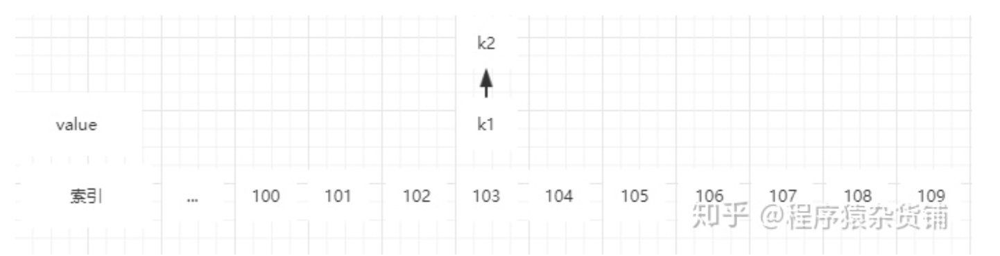
>
>    为什么呢？看上面的图，我们hashMap的同一个索引是可以存有多个值的，而且不同的对象根据相同的生成hashCode的算法也可能会生成相同的hashCode，也就是说我们不同对象的计算结果的hashCode是存在一样的而且还不少。这个时候获取值就需要进一步计算了，我们就会获取同一个位置的所有值的key去调用equals()方法比较，如果key跟我们入参的一样的话，才取出来。然后这样一来，我们只是重写了hashCode()方法的话，没有重写equals()方法也会导致key的比较使用Object中的默认equals()方法，这个默认方法也是跟16进制内存位置，比较的是 a == b，所以因为是new的对象也是不一样的，也会导致获取不到值
>
>    （ps：补充说明一下equeals()方法底层逻辑，如果没有重写的话，Object中的equals()方法就是直接 == 也就是比较两个对象的16进制内存地址。这里需要注意的一点就是，我们平常在项目中使用String的值比较直接用equals()方法，为什么16进制地址不一样的还是true呢？这个因为java.lang.String这个对象内部已经重写了equals()方法，这个方法先是比较16进制位置是不是相等是的话直接true不是的话再去比较每一个char字符是不是相等
>
>    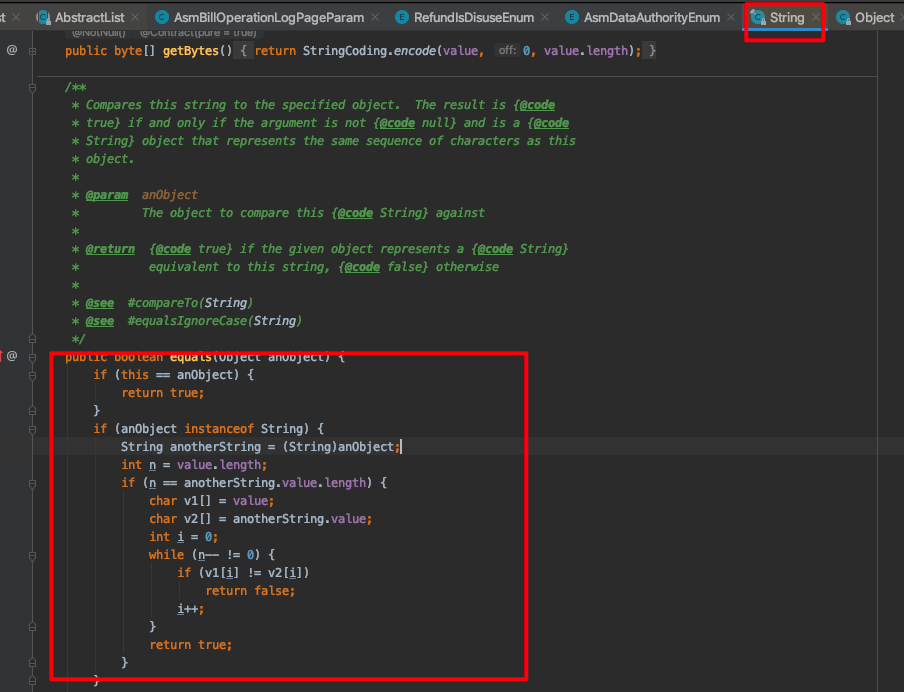
>
>    ）
>
> 4. 一些其他原因hashCode()方法跟equals()方法要同时重写
>
>    1. 因为我们业务上可能判断两个对象是不是想等的判断方式是有指定逻辑的，我们重写了equals方法之后，可以按照我们自定义的比较是否相等的方式判断两个对象是否相等，如业务上需要1等于2情况出现的时候可以用（尽管用的少，但是可以知道一下）
>    2. 如果两个对象的equals()相等，那么hashCode也要相等，不然无法成立，因为同一类型的对象比较结果一样，那么hashCode也一样比较合适
>    3. 其他
>
> 5. 总之重写java对象的hashCode方法的意义在于使用对象在涉及hashCode值使用的集合，会在涉及hashCode值进行相关运算的场景都要重写，不然后面程序中使用值一样的对象进行处理的时候hashCode不一样引起异常

- java集合遍历的时候出现并发修改异常场景处理

> 我们遍历List集合的时候，如果使用for循环去遍历，然后遍历的元素在集合中remove()会抛异常，并发修改异常
>
> 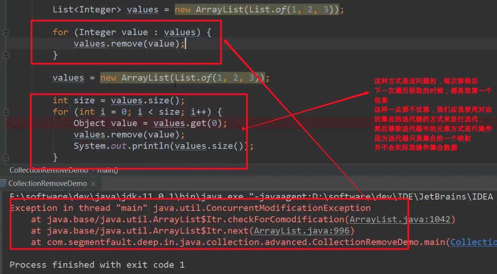
>
> 正确的遍历一处集合中的元素的方式是通过集合的迭代器去操作，如下图，为什么可以这样呢？因为集合内部提供的迭代器其实就是集合的元素的一个映射，我们遍历迭代器的元素不是直接访问集合，所以不会出现并发修改异常？（如果直接修改迭代器的值是不会影响原来的集合的，但是迭代器的方法中一旦有调用自身移除元素的方法，就会有影响）
>
> 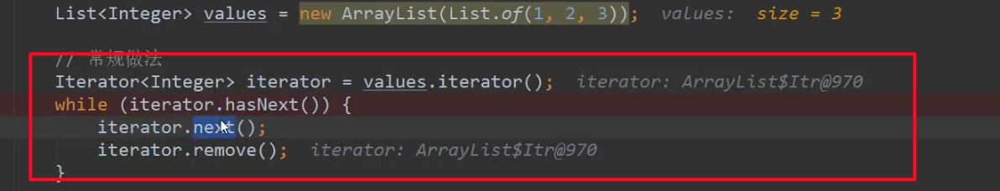
>
> ##### 为什么集合会出现并发修改异常呢？
>
> ​    参考文章：https://blog.csdn.net/w605283073/article/details/103108761
>
> - 参考一个案例，List集合的遍历然后remove元素会出现` ConcurrentModificationException`异常
>
>   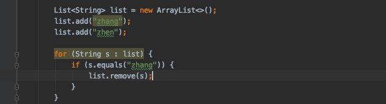
>
>   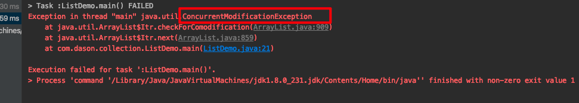
>
> - 回答这个问题，我们先来了解一下java的语法糖foreach循环的底层实现是什么？java给我们提供了非常方便的for()语法糖，用来进行集合的遍历，我们深究也就是反编译编译后的代码，就可以看到，foreach语法糖的遍历集合底层的实现是集合的迭代器来进行元素的遍历。也就是说，增强for循环底层还是调用我们的迭代器来实现遍历，如下图(下图圈2纠正一下，第一个if应该为while )：
>
>   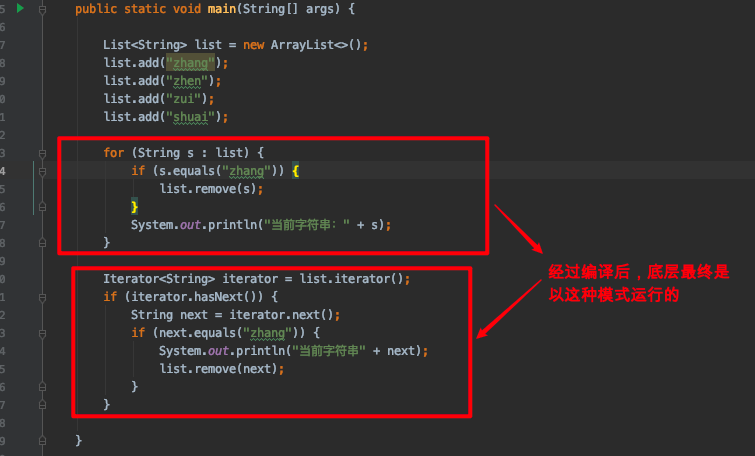
>
>   Ps：上图的第二红圈应为，是使用while()循环才行
>
>   
>
> - 知道了java的增强for循环的底层就是通过集合的迭代器来进行遍历后，继续深入这个`ConcurrentModificationException` 这个异常的发生地方，其实就是在java的迭代器中的校验集合的并发操作的一个校验方法中。这个方法是在内部迭代器对象的next()方法调用的，也就是获取下一个元素的时候调用的一个校验方法
>
>   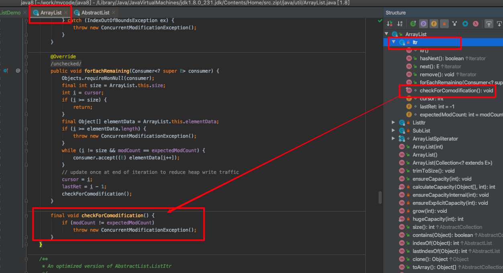
>
>   然后我们发现，该方法的判断条件是获取下一个元素的时候modCount跟expectModCount这两个值不一致，就会进行异常的抛出，
>
>   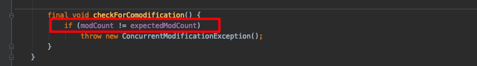
>
>   看一下这两个值分别代表什么意思，modCount指的是修改的元素位置，expectModCount指的是期待或者说计划中的修改的位置值。
>
>   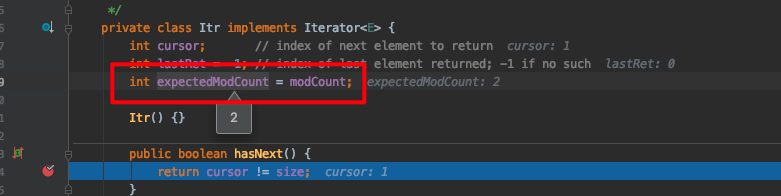
>
>   在构造这个迭代器的时候，这两个值就会被赋值元素的个数，也就是说有两个元素的话，这里就是2，也就是默认值
>
>   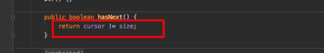
>
>   再看一下迭代器中的hasNext()方法其实就是用当前位置的迭代器游标的位置，跟整个集合的长度，也就是元素个数的比较，如果游标的值等于长度值，就返回fasle就是没有下一个元素了。
>
>   基于上面几个方法的介绍，我们可以进入到具体的异常分析：
>
>   1）为什么会出现并发修改异常：`ConcurrentModificationException` 
>
>   
>
>   如上图，我们遍历的时候，如果到第二个元素的时候，就回去调用list.remove()方法，这个方法是集合ArrayList中的方法，我们进入ArrayList中的remove(Object obj);方法
>
>   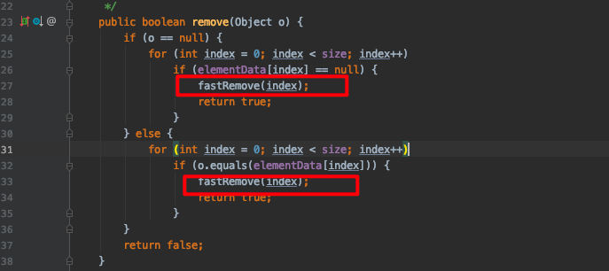
>
>   这个方法最终调用的fastRemove()方法来进行元素的移除
>
>   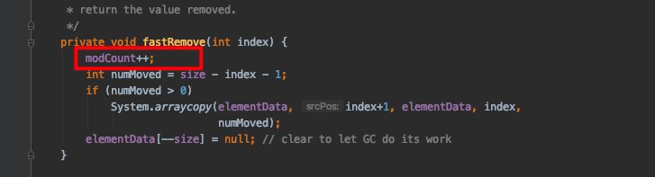
>
>   进入这个方法我们发现，这个方法会将modCount这个值+1，这样一来，这个值就目前就会=3了，然后这个时候集合的size=1，然后游标cursor=3，就是调用hasNext()方法的时候是返回true的，就会进入到next()方法中获取元素，进入next()方法的时候就会调用`checkForComodification（）`方法来进行modCount == exceptModCount的比较了，因为这个时候modCount = 3 了，所以不等，校验不通过，就抛出异常
>
>   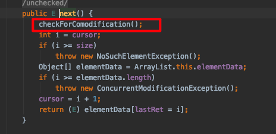
>
>   2）为什么集合两个元素的时候，我们移除第一个元素的时候不会抛出并发修改异常？
>
>   进入循环的时候，会先进入hasNext()方法来进行判断是否存在下一个值
>
>   
>
>   如上图，如果集合有两个元素，我们将第一个元素移除后，游标的位置cursor的值由0变成1了，这个时候由因为本来集合的元素的size = 2，但是移除了一个后size = 1了，所以这里就返回false了，就是循环终止了。就没有往下走调用next()方法，就会进行modCount == excepModCount 的比较，就不会出现并发修改异常。需要注意的是，只有两个元素，并且移除第一个元素的时候会出现这种情况，如果是超过两个元素，移除第一个的话，还是会抛出并发修改异常的，因为会进入next()方法；
>
>   3）为什么只有两个元素的时候，会进入三次next()方法呢？
>
>   
>
>   正常情况下，我们这个迭代器如果两个，元素的话，我们进行遍历的时候，就会调用前两次hasNext()方法是校验通过返回值是true的，第三次进入这个方法就返回false，不会再去调用我们的next()方法了。
>
>   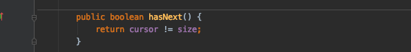
>
>   但是，因为我们在移除第二个元素的时候，modCount的值+1，同时cursor = 2，正常情况下 cursor == size了，这个就返回fasle，但是因为我们移除了一个元素，所以size的值变成1，游标cursor变成了2，所以这个方法返回值变成true，这样一来就以为会有下一个元素存在，就会调用next()方法，然后就进入到了我们的校验方法，进而抛异常
>
>   4）为什么我们不调用list.remove(Object)方法，直接调用迭代器的iterator.remove()方法，就不会出现这个异常，而且能够移除元素呢？
>
>   具体实现为：
>
>   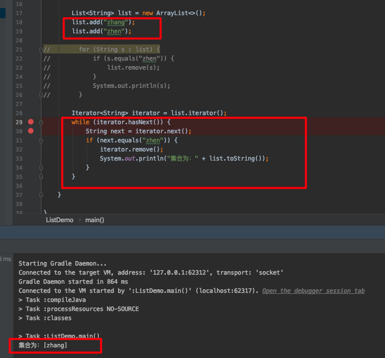
>
>   为什么不抛异常，因为在迭代器的移除元素中，同时会将modCount 以及 expectModCount两个值重新赋值成一样的，如下图，所以上面的校验问题就处理了
>
>   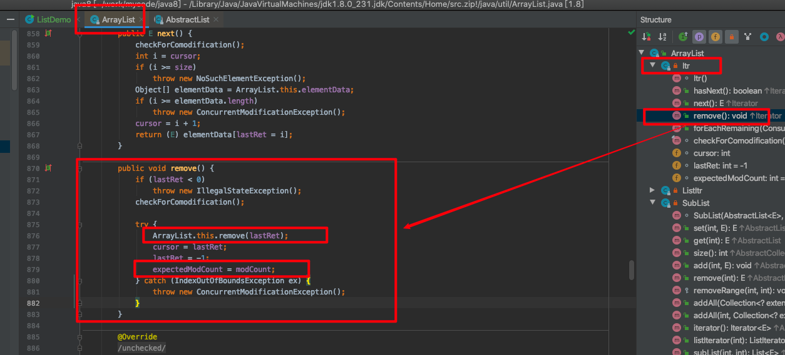
>
>   
>
>   
>
>   5) 除了使用iterator.remove()方法外，还可以调用List.removeIf(Predicate)方法来优雅移除符合条件的元素，这个跟迭代器移除有什么区别呢？（这个还是idea自动提示这样写）
>
>   - 除了上面的说的，我们不允许通过forEach方式进行集合元素的remove()操作，应该使用迭代器进行迭代，然后使用迭代器对象去移除集合的元素
>
>   - 我们对集合的add()操作，remove()操作如果在迭代器中调用next()方法之前也会出现该异常
>
>   - 除了上面的两个需要注意的点之外，我们可以直接使用集合内部提供的removeIf()方法来进行元素的移除，为什么这个方法就不会出现异常，主要是我们看一下这个方法的底层
>
>     
>
>     这个方法在forEach中移除元素是没有问题的，看看最终的实现
>
>     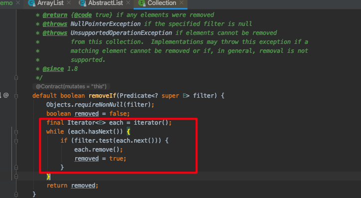
>
>     可以看到集合内部的removeIf()方法最终还是会获取当前的集合的迭代器对象，然后再遍历一次迭代器对象元素，调用迭代器中的remove()方法来移除元素，所以最终调用的方法就是跟我们上面的处理方案是一样的，只是封装了一层
>
> ##### 是不是所有的集合在forEach遍历中移除元素都是发生并发修改异常呢？
>
> - 不是的，就像我们常用说的线程安全的CopyOnWriteArrayList集合就不会出现这个问题，也可以说集合的两个机制的异常处理方式的区别Fail-Fast是会出现并发修改异常，Fail-Safe是不会出现的，如下图
>
>   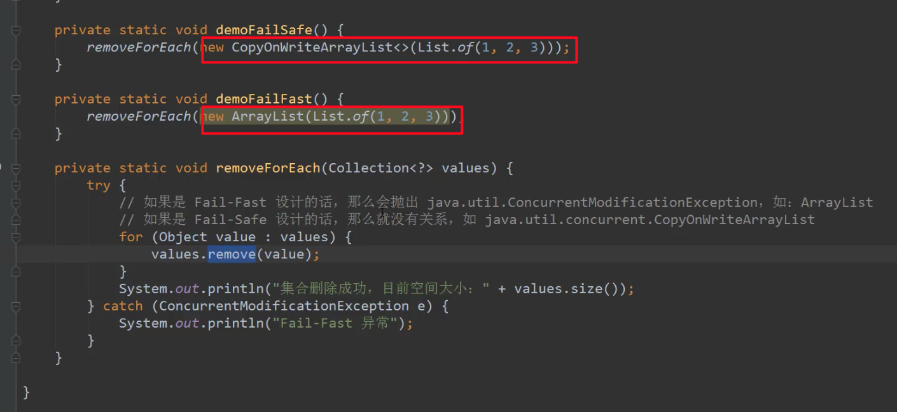
>
>   为什么**CopyOnWriteArrayList** 不会出现呢？例如该集合的add()方法
>
>   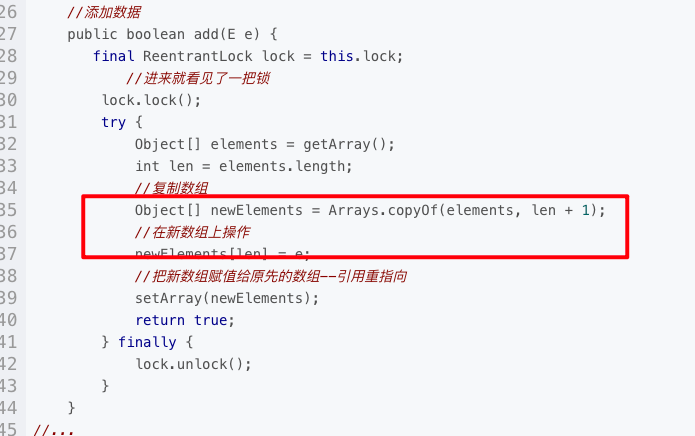
>
> ##### 使用迭代器使用遍历集合操作一些注意点
>
> - 如下图，这些问题也是需要好好注意一下的
>
>   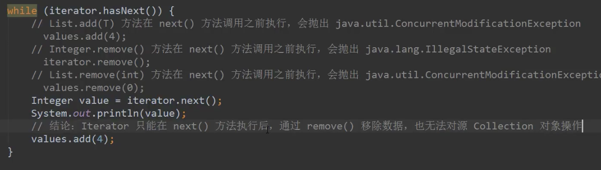
>
>   总之就是：我们使用迭代器来对集合的元素进行操作的时候，要在迭代器iterator.next()方法之后，获取对应的迭代再去对集合进行add()/remove()等操作，不然会出现并发修改异常或者非常操作异常
>
>   下图在调用next()方法之前去调用集合的add()方法
>
>   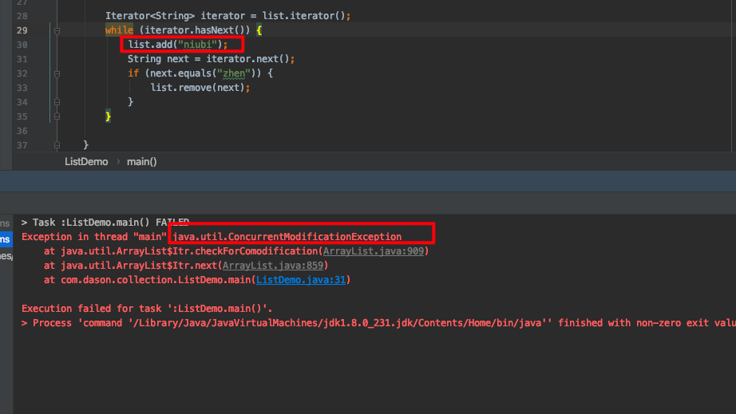
>
>   看了一下，主要原因是我们的迭代器的modCount的值是=集合元素数量的随着集合元素个数变化，然后expectModCount=初始化集合迭代器的元素数量，如果一开始是2个元素，这个值就是2，但是modCount=3了，就是出现并发修改异常
>
>   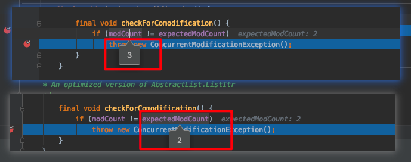
>
>   同理，如果在next()方法调用之前变更原油的集合List的元素，不管是添加还是移除都会出现modCount != expectModCount的情况，就会在next()方法中校验不通过抛异常

- 为什么hashCode()方法是一个比较重的方法呢？

> 因为hashCode()方法的底层还是需要去运算得到一个对应的结果的，需要走一遍默认的算法，是每一个对象的值都要去计算的。如果是重写了，获取的方法值就是跟我们对象的值一起计算出来的。所以等于每一个对象的hashCode获取都要计算。
>
> 然后equals()就相对简单一些，如果没有重写就是直接比较16进制的内存位置，如果重写了一般都是遍历元素的每一个char来进行比较，也是相对消耗性能的；
>
> equals()跟hashCode()方法都是一起重写的，所以说都是一个比较重的方法了